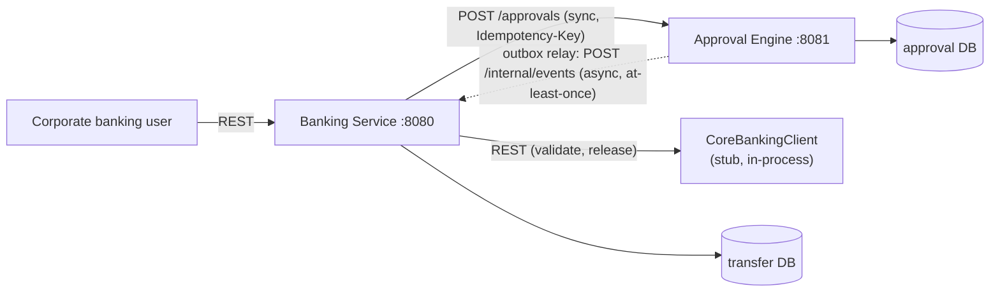

# High-Level Design — Transfer Approval System

## Thesis

Two independently deployable services, hard ownership split: **Banking Service owns what a
transfer means** (validation, policy resolution, release orchestration); **Approval Engine
owns how an approval progresses** (generic maker-checker workflow, state, concurrency, audit,
expiry). Neither writes the other's database — they coordinate over sync REST commands and an
async outbox for lifecycle events.

## Context / Deployment

What `docker-compose.yml` runs: one Postgres container (two databases: `approval`, `transfer`)
and the two Spring Boot services.

Production would add: API Gateway/WAF, load balancing, N horizontally-scaled instances per
service — omitted here; doesn't change the ownership or consistency model.

## Ownership

| Concern | Owner |
|---|---|
| Transfer semantics, validation, duplicate detection | Banking |
| Policy resolution (threshold → approvals required) | Banking |
| Policy snapshot persistence | Approval Engine |
| Workflow state, guards, concurrency | Approval Engine |
| Audit, SLA expiry, outbox | Approval Engine |
| Release orchestration + release idempotency | Banking |
| Balance/limit authority, money movement | Core Banking (stub) |

`Core Banking (stub)` is a further-back, stubbed ledger/settlement dependency — not the
`Banking Service` above it; the naming mirrors the real digital-banking-in-front-of-core-banking
pattern deliberately.

## Communication & Failure Behavior

| Flow | Pattern | If unavailable |
|---|---|---|
| Client → Banking | REST sync | Fails fast, retryable |
| Banking → Engine (create) | REST sync + `Idempotency-Key` | Retry same key, no duplicate workflow |
| Engine → Banking (lifecycle events) | Outbox + polling relay | Event durable in DB, relay retries |
| Banking → Core Banking (release) | REST sync, idempotent by `transferId` | Stays `RELEASE_PENDING`, retried |

**Consistency:** strong/transactional within each service; **eventually consistent across the
boundary** — no distributed transaction, outbox is the seam that makes partial failure safe.
Resilience is asymmetric by design: Engine down breaks `submit()` synchronously (blocking call
on the critical path); Banking down does **not** break approve/reject/cancel — the engine's
state machine never depends on Banking's reachability, only async delivery does.

## NFRs

- **Idempotency:** `Idempotency-Key` on submission/create (replay or `409
  IDEMPOTENCY_CONFLICT` on mismatch); decisions idempotent per `(request_id, actor_id)`;
  release idempotent on `transferId`.
- **Concurrency:** every competing transition resolves via one guarded UPDATE plus a
  quorum-counting row lock — mechanism and tests in the LLD's "Concurrency" section.
- **Partial failure:** state + audit + outbox commit atomically in one local transaction;
  delivery is separate and retried — a crash never loses a decision, only delays notification.

## Named Gap

**No funds hold between validation and release** — balance is checked once at submission, not
reserved until release, so two large concurrent transfers on one account can both pass
validation and later both release, overspending the real balance. Fix would be a
`CoreBankingClient.hold()`/free protocol; not built given the time budget, named here rather
than left for a reviewer to find.

## Trade-offs

- YAML workflow over hardcoded state machine — transitions change without a redeploy; no rule
  engine built around it.
- DB outbox over a broker — right-sized for this volume; remains the durable seam under a
  broker later.
- Core Banking as a stubbed in-process interface, not a third service — assignment allows
  mocking it.
- Seams (YAML, policy snapshot, opaque payload) over generalization machinery — no tenant
  registry, no plugin framework.

## Extensibility (Not Built)

Three seams would let a second workflow-driven domain plug in without engine changes: a new
YAML file per request type, a domain-specific `PolicyResolver` producing the same
`ApprovalPolicy` shape, and the opaque JSONB `payload` the engine never inspects. Structural
only — not exercised by a second tenant.

## Assumptions / Out of Scope

| In scope | Out of scope |
|---|---|
| Two services, Postgres, docker-compose | Real broker, real core banking, real auth |
| REST sync commands, outbox async events | UI, multi-region, multi-currency, delegation |
| OCC + row-lock concurrency, audit, expiry | Dynamic workflow/policy config, tenant registry |
| Idempotent submission/create/release | BPMN/Temporal/Camunda, second tenant |
| — | Funds hold/reservation (named gap above) |
