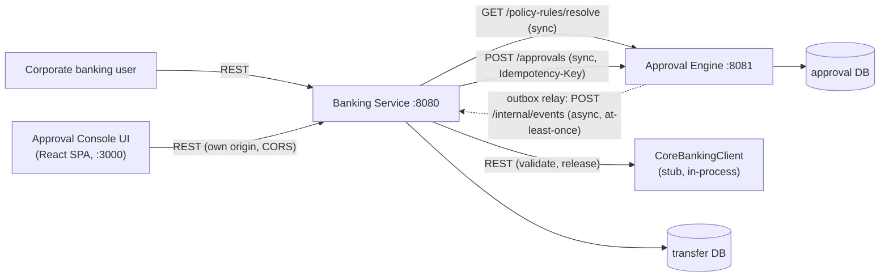

# High-Level Design — Transfer Approval System

## Thesis

Two independently deployable services, hard ownership split: **Banking Service owns what a
transfer means** (validation, release orchestration); **Approval Engine owns how an approval
progresses** (workflow catalog, policy rules, state, concurrency, audit, expiry). Neither writes
the other's database — they coordinate over sync REST commands and an async outbox for
lifecycle events.

## Context / Deployment

What `docker-compose.yml` runs: one Postgres container (two databases: `approval`, `transfer`)
and the two Spring Boot services.

The UI is a reviewer convenience, not a graded deliverable — it talks only to Banking Service,
which proxies engine reads under `/ui-api/**`; no new service-to-service contract.

Production would add: API Gateway/WAF, load balancing, N horizontally-scaled instances per
service — omitted here; doesn't change the ownership or consistency model.

## Ownership

| Concern | Owner |
|---|---|
| Transfer semantics, validation, duplicate detection | Banking |
| Policy rules (amount range → workflow) + resolution | Approval Engine |
| Policy snapshot persistence | Approval Engine |
| Workflow state, guards, concurrency | Approval Engine |
| Audit, SLA expiry, outbox | Approval Engine |
| Release orchestration + release idempotency | Banking |
| Balance/limit authority, money movement | Core Banking (stub) |

`Core Banking (stub)` is a further-back, stubbed ledger/settlement dependency — not the
`Banking Service` above it; the naming mirrors the real digital-banking-in-front-of-core-banking
pattern deliberately.

Policy lives entirely in Approval Engine as an editable `policy_rule` table (amount range →
`workflowId`/`workflowVersion`) — Banking's `PolicyResolver` is a thin HTTP call to `GET
/policy-rules/resolve`. Required-approvals count and eligible role are attributes of the
resolved workflow's own `approve` transition, not a separate policy object — one source of
truth, in the service that already owns the workflow catalog those rules route to.

## Communication & Failure Behavior

| Flow | Pattern | If unavailable |
|---|---|---|
| Client → Banking | REST sync | Fails fast, retryable |
| Banking → Engine (policy resolve) | REST sync | Fails fast; submission never starts a workflow un-costed |
| Banking → Engine (create) | REST sync + `Idempotency-Key` | Retry same key, no duplicate workflow |
| Engine → Banking (lifecycle events) | Outbox + polling relay | Event durable in DB, relay retries |
| Banking → Core Banking (release) | REST sync, idempotent by `transferId` | Stays `RELEASE_PENDING`, retried |

**Consistency:** strong/transactional within each service; **eventually consistent across the
boundary** — no distributed transaction, outbox is the seam that makes partial failure safe.
Resilience is asymmetric by design: Engine down breaks `submit()` synchronously (blocking call
on the critical path); Banking down does **not** break approve/reject/cancel — the engine's
state machine never depends on Banking's reachability, only async delivery does.

## NFRs

- **Idempotency:** `Idempotency-Key` on submission/create (replay or `409
  IDEMPOTENCY_CONFLICT` on mismatch); decisions idempotent per `(request_id, actor_id, state)`;
  release idempotent on `transferId`.
- **Concurrency:** every competing transition resolves via one guarded UPDATE plus a
  quorum-counting row lock — mechanism and tests in the LLD's "Concurrency" section.
- **Partial failure:** state + audit + outbox commit atomically in one local transaction;
  delivery is separate and retried — a crash never loses a decision, only delays notification.

## Named Gaps

**No funds hold between validation and release** — balance is checked once at submission, not
reserved until release, so two large concurrent transfers on one account can both pass
validation and later both release, overspending the real balance. Fix would be a
`CoreBankingClient.hold()`/free protocol; not built given the time budget, named here rather
than left for a reviewer to find.

**Maker notification is a stub, not a real channel.** `ExpirySweeper` transitions an un-actioned
request to `EXPIRED` and emits `ApprovalExpired`; Banking Service's `ApprovalEventListener`
consumes it, sets the transfer to `EXPIRED`, and calls `NotificationClient.notifyMaker(...)` —
also wired on `ApprovalRejected` (not on `ApprovalCancelled`: the maker caused that one
themselves). Per the assignment's explicit allowance, `LoggingNotificationClient` only logs;
swapping in real email/SMS is a one-class change behind the same interface.

## Trade-offs

- YAML workflow over hardcoded state machine — transitions change without a redeploy; no rule
  engine built around it.
- DB outbox over a broker — right-sized for this volume; remains the durable seam under a
  broker later.
- Core Banking as a stubbed in-process interface, not a third service — assignment allows
  mocking it.
- Seams (YAML, policy snapshot, opaque payload) over generalization machinery — no tenant
  registry, no plugin framework.

## Extensibility (Built and Verified)

A second workflow-driven domain — `privileged-access`, a 3-stage security/manager/compliance
review with its own roles and quorum per stage — runs through the same engine with zero engine
code changes: just a new YAML file, its own `policy_rule`-equivalent caller, and the opaque
JSONB `payload` the engine never inspects. Verified end-to-end with its own concurrency test
(`PrivilegedAccessConcurrencyTest`), not just asserted from the transfer workflows' shape.

## Assumptions / Out of Scope

| In scope | Out of scope |
|---|---|
| Two services, Postgres, docker-compose | Real broker, real core banking, real auth |
| REST sync commands, outbox async events | Multi-region, multi-currency, delegation |
| OCC + row-lock concurrency, audit, expiry | Tenant registry, BPMN/Temporal/Camunda |
| Idempotent submission/create/release | Funds hold/reservation (named gap above) |
| Editable policy rules, versioned workflows | — |
| A second workflow domain (privileged-access) | — |

A demo React console (`approval-console-ui`) is included for reviewer convenience but isn't a
graded deliverable — see Context/Deployment. It doesn't add auth: it forwards the same
trusted `X-Actor-Id`/`X-Actor-Role` headers the API already accepts.
