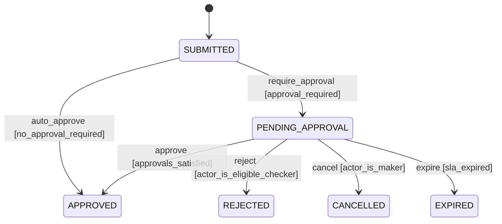
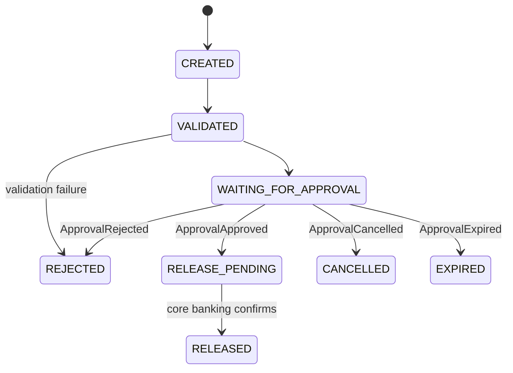
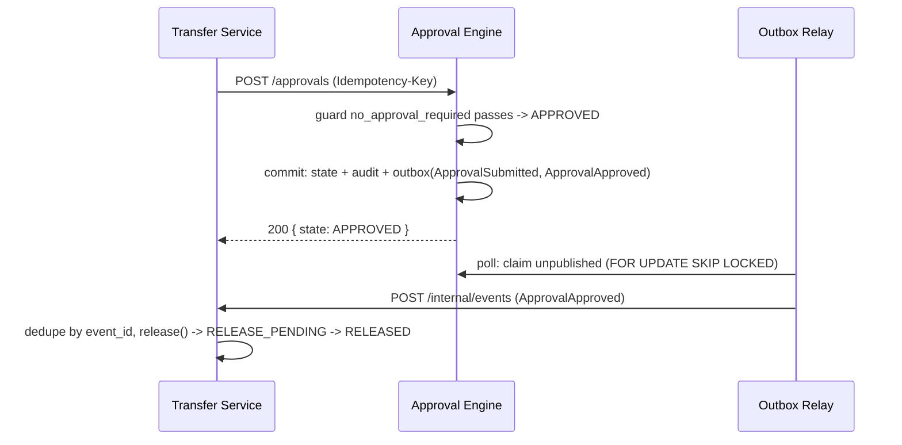
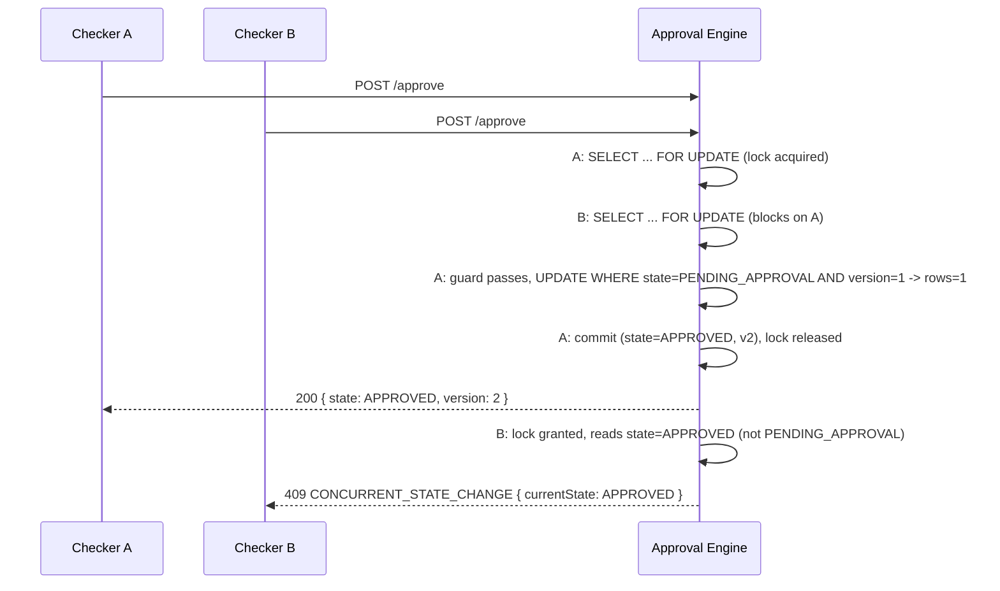

# Low-Level Design — Transfer Approval System

## Approval State Machine (Engine)

`APPROVED` means the approval requirement is satisfied — not that money has moved.



## Transfer Release Lifecycle (Transfer Service)



`WAITING_FOR_APPROVAL` mirrors the engine's `PENDING_APPROVAL` but is not shared state —
each event applies only if Transfer is still in the expected state (a lost race is a logged
no-op). No `RELEASE_FAILED`: a transient core-banking failure retries in place.

## Workflow Definition (`approval-engine/src/main/resources/workflow/transfer-approval.yaml`)

```yaml
name: transfer-approval
version: 1
states: [SUBMITTED, PENDING_APPROVAL, APPROVED, REJECTED, CANCELLED, EXPIRED]
initialState: SUBMITTED
transitions:
  - name: auto_approve
    from: SUBMITTED
    to: APPROVED
    guard: no_approval_required
  - name: require_approval
    from: SUBMITTED
    to: PENDING_APPROVAL
    guard: approval_required
  - name: approve
    from: PENDING_APPROVAL
    to: APPROVED
    guard: approvals_satisfied
  - name: reject
    from: PENDING_APPROVAL
    to: REJECTED
    guard: actor_is_eligible_checker
  - name: cancel
    from: PENDING_APPROVAL
    to: CANCELLED
    guard: actor_is_maker
  - name: expire
    from: PENDING_APPROVAL
    to: EXPIRED
    guard: sla_expired
```

Loaded once at startup into a `Map<(fromState, event), Transition>`; guards are a small fixed
Java registry looked up by name — no expression language, no runtime reconfiguration.

## Policy Contract

`PolicyResolver.resolve(amountMinorUnits) -> ApprovalPolicy{requiredApprovals, eligibleRoles,
makerCanApprove}` — resolved once in Transfer at submission, frozen into the engine's
`policy_snapshot` (JSONB), never re-resolved; a later policy change never re-judges an
in-flight request.

## API Contracts

**`POST /approvals`** (Engine; header `Idempotency-Key`)
```json
// Request
{
  "requestId": "transfer-abc123", "requestType": "TRANSFER_APPROVAL",
  "makerId": "maker-1", "requiredApprovals": 2,
  "eligibleRoles": ["TRANSFER_CHECKER"], "makerCanApprove": false,
  "payloadJson": "{\"transferId\":\"abc123\",\"amount\":500000}",
  "expiresAt": "2026-08-26T10:00:00Z"
}
// 200 Response
{ "requestId": "transfer-abc123", "state": "PENDING_APPROVAL", "version": 1 }
```

**`POST /approvals/{id}/approve`** (no `Idempotency-Key` — idempotent per `(request_id,
actor_id)`)
```json
// Request                         // 200 Response
{ "actorId": "checker-1",          { "requestId": "transfer-abc123",
  "actorRole": "TRANSFER_CHECKER" }  "state": "APPROVED", "version": 2 }
```
```json
// 409 CONCURRENT_STATE_CHANGE           // 409 INVALID_STATE_TRANSITION
{ "code": "CONCURRENT_STATE_CHANGE",     { "code": "INVALID_STATE_TRANSITION",
  "requestId": "transfer-abc123",          "requestId": "transfer-abc123",
  "currentState": "APPROVED",              "currentState": "APPROVED",
  "requestedAction": null }                "requestedAction": "approve" }
```
`reject`/`cancel` share this shape (`ActorCommandDto`/`ApprovalResponseDto`/`ErrorResponseDto`);
`GET /approvals/{id}` returns `ApprovalResponseDto`.

**`POST /transfers`** (Transfer; header `Idempotency-Key`) — creates and submits in one call.
```json
// Request
{ "makerId": "maker-1", "fromAccount": "ACC-1", "toAccount": "ACC-2",
  "amountMinorUnits": 500000, "currency": "USD" }
// 200 Response
{ "transferId": "abc123", "state": "WAITING_FOR_APPROVAL" }
```
`GET /transfers/{id}` returns `TransferResponseDto`. Internal webhook `POST /internal/events`
(`X-Event-Id`, `X-Event-Type` headers; body `{"requestId": "..."}`) is the relay's delivery
endpoint, not client-facing.

## Data Model

```
-- approval DB
approval_request(request_id PK, request_type, state, version, maker_id,
                  policy_snapshot jsonb, payload jsonb, created_at, expires_at)
approval_decision(decision_id PK, request_id, actor_id, actor_role, decision,
                   created_at, UNIQUE(request_id, actor_id))
audit_log(audit_id PK, request_id, actor_id, actor_role, action,
          previous_state, new_state, created_at, metadata)
idempotency_key(idem_key PK, command_type, request_id, request_hash, result jsonb, created_at)
outbox(event_id PK, request_id, event_type, event_version, payload jsonb,
       created_at, published_at, claimed_at)

-- transfer DB
transfer(transfer_id PK, maker_id, from_account, to_account, amount_minor_units,
         currency, state, approval_request_id, idempotency_key UNIQUE,
         expires_at, created_at)
processed_event(event_id PK, processed_at)
```

## Sequence Diagrams

**Auto-release (0 approvals required)**



**Multi-approver — the race diagram** (Checker A, Checker B approve concurrently, `required=1`;
ground truth: `ApprovalConcurrencyTest.twoCheckersApprovingSimultaneously_exactlyOneWins`)



The row lock serializes quorum *counting* (needed for N>1); the guarded UPDATE's version check
is what actually decides the winner and is what the sweeper below races against with no lock.

**Expiry vs. approve** (optimistic race, no row lock on the sweeper's path; ground truth:
`ExpiryVersusApproveConcurrencyTest.approveVersusExpire_exactlyOneWins`)

```mermaid
sequenceDiagram
    participant S as Expiry Sweeper
    participant C as Checker
    participant E as Approval Engine
    S->>E: expireOne(id, expectedVersion=1)
    C->>E: POST /approve
    par concurrently
        E->>E: UPDATE WHERE state=PENDING_APPROVAL AND version=1 -> EXPIRED
    and
        E->>E: UPDATE WHERE state=PENDING_APPROVAL AND version=1 -> APPROVED
    end
    Note over E: exactly one UPDATE affects rows=1; the other rows=0 -> no-op / 409
```

## Concurrency / Race Handling

Every competing transition resolves through one guarded conditional UPDATE:

```sql
UPDATE approval_request
   SET state = :new_state, version = version + 1
 WHERE request_id = :id AND state = :expected_state AND version = :expected_version;
-- rows = 1 -> won ; rows = 0 -> lost race or illegal transition
```

On `rows = 0` the whole transaction rolls back (decision insert, audit, outbox — all of it);
re-reading current state then classifies the failure: `409 CONCURRENT_STATE_CHANGE` if it was a
legal predecessor, `409 INVALID_STATE_TRANSITION` if it could never have led here. Quorum
counting additionally takes a `SELECT ... FOR UPDATE` row lock (`ApprovalCommandService.
loadOrThrow`) — a deliberate exception to "no explicit locks," since counting committed
decisions is an aggregate read the guarded UPDATE alone can't protect. Evidence:
`ApprovalConcurrencyTest`, `ExpiryVersusApproveConcurrencyTest`.

## Failure Semantics

| Failure | Behavior |
|---|---|
| Engine unreachable during `submit()` | Fails synchronously; retry with same `Idempotency-Key` |
| Transfer unreachable during approve/reject/cancel | Engine still transitions/audits; only delivery delays |
| Relay crashes mid-publish | Row stays `claimed_at`-set; reclaimed after 30s |
| Duplicate event delivery | `processed_event(event_id)` dedupe — no-op replay |
| Core banking release fails | Stays `RELEASE_PENDING`, retried with same `transferId` |
| Lost race (approve/reject/cancel/expire) | Transaction rolls back; `409` or logged sweeper no-op |
