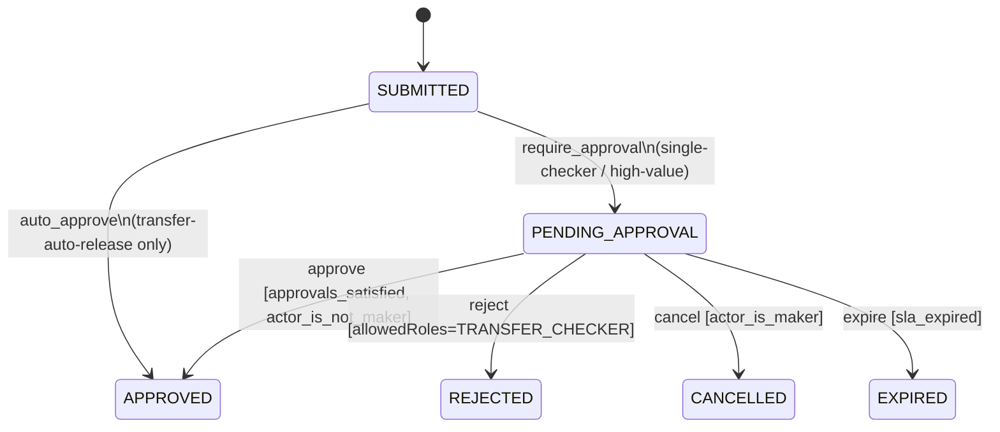
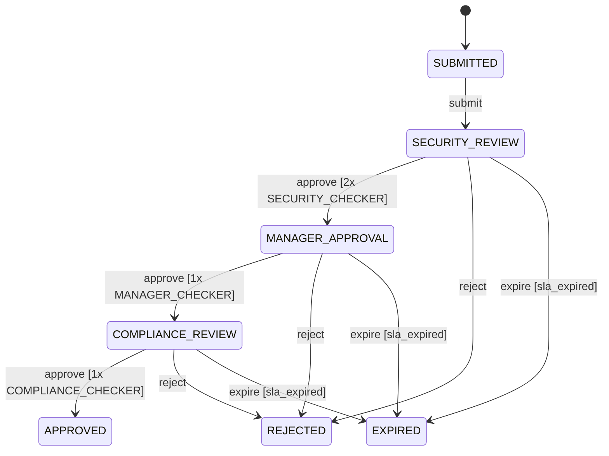
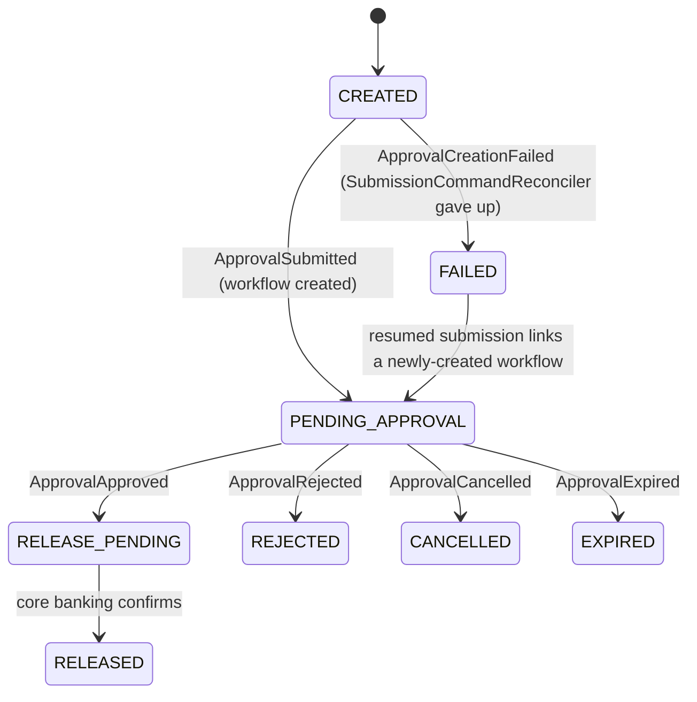
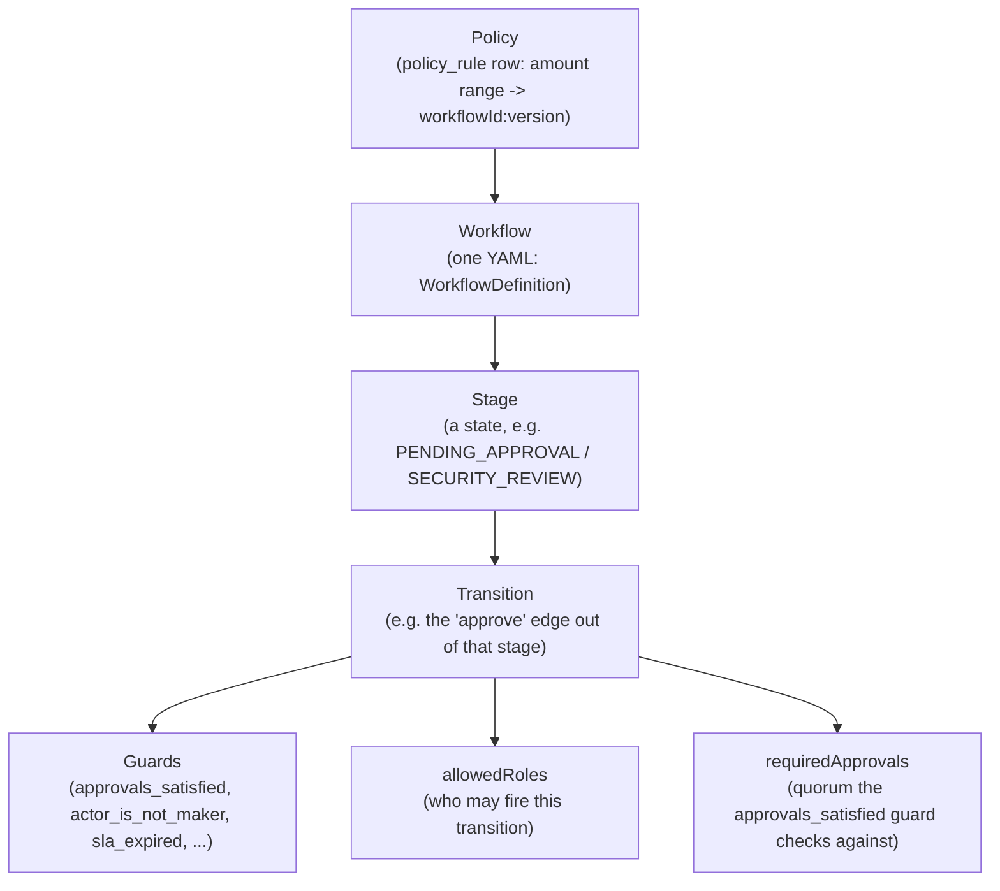
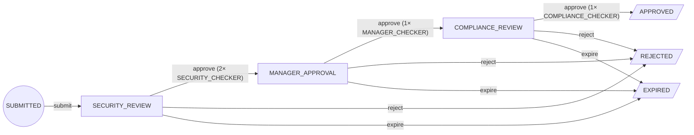
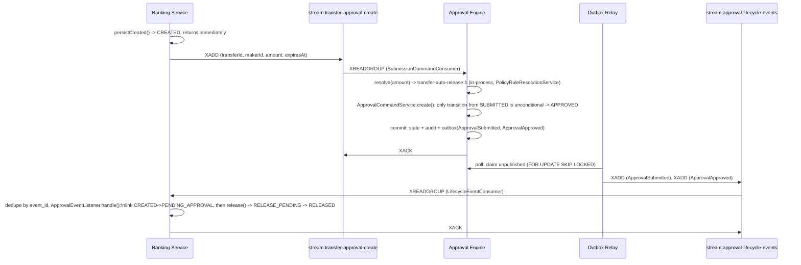
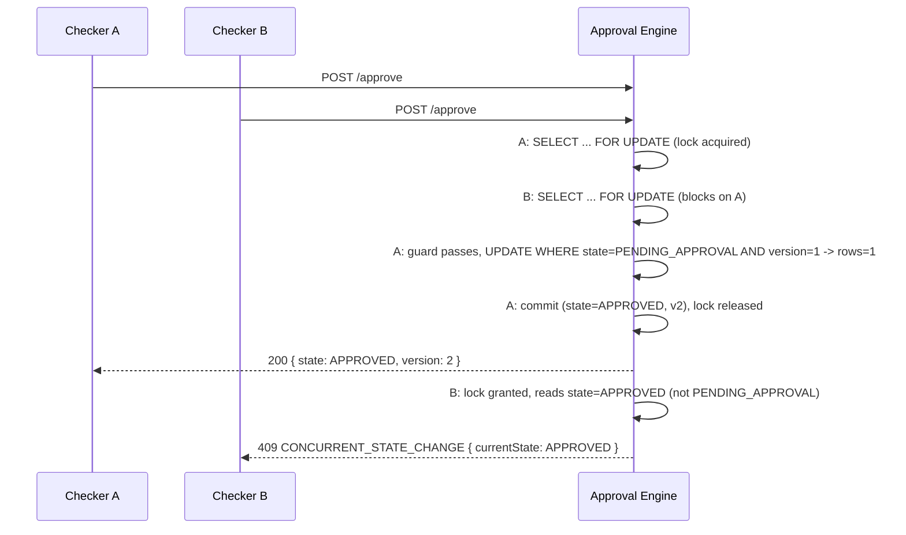
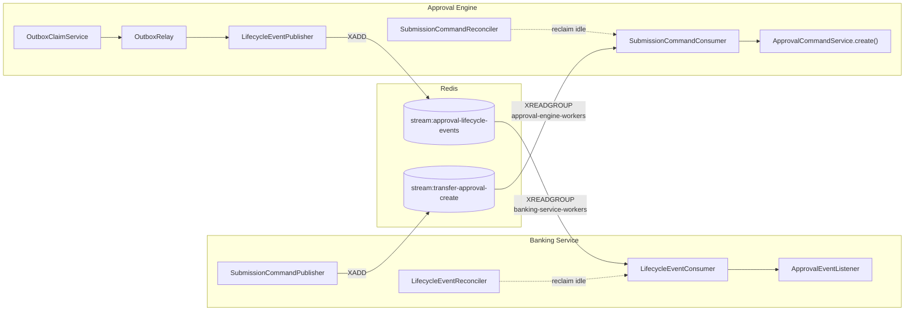

# Low-Level Design — Transfer Approval System

This document is weighted toward **Approval Engine** — the piece that has to be generic, concurrent-safe,
and provably correct — over Banking Service, which is comparatively simple orchestration. Part I below
is the fast orientation: read it once, in order, and you have the whole story. Part II is the deep
implementation record: precise enough to rebuild the engine from, organized for reference rather than
linear reading — jump to whatever section you need.

## Part I — Orientation

### Executive Summary

Approval Engine is a generic, workflow-driven state machine that decides whether a request needs zero,
one, or several rounds of human sign-off before it can proceed — and enforces that decision correctly
under concurrent load. It knows nothing about transfers, accounts, or currencies; it only knows states,
transitions, roles, and quorum, all declared in YAML and looked up by name at runtime. Banking Service is
the only caller today, but the engine has already proven itself domain-independent: a second, structurally
different workflow — a 3-stage security → manager → compliance review, `privileged-access` — runs through
the identical engine with zero engine code changes, and is now the live routing target for the bank's
highest-value transfers, not just an isolated test. Everything after this page specifies that engine's
implementation precisely enough to rebuild it, with the test that proves each non-obvious claim named
alongside it.

### System Context

Two independently deployable Spring Boot services, one Postgres database each, coordinating only over
two Redis Streams — never a direct call between them. **Banking Service** owns what a transfer *means*
(submission, validation, release). **Approval Engine** — this document's subject — owns how an approval
*progresses*: it receives a creation command naming an amount, resolves which workflow applies, and from
then on runs that workflow's states and transitions until the request reaches a terminal state, emitting
events Banking reacts to. Full HLD: `hld.md`. Banking Service's own internals (transfer persistence,
release orchestration, Core Banking integration) are covered there and in the Transfer Release Lifecycle
section below, not elaborated further here.

### Core Architecture

Five concepts nest strictly, and nothing sits outside this hierarchy:

```text
Policy (an amount range -> workflowId:version)
   -> Workflow (one YAML file -> WorkflowDefinition)
         -> Stage (a state, e.g. PENDING_APPROVAL / SECURITY_REVIEW)
               -> Transition (e.g. the "approve" edge out of that stage)
                     -> Guards (approvals_satisfied, actor_is_not_maker, sla_expired, ...)
                     -> allowedRoles (who may fire this transition)
                     -> requiredApprovals (quorum, per-transition, not per-workflow)
```

A **Policy** row picks a workflow; it has no opinion on stages, roles, or quorum. Everything below
**Workflow** is that workflow's own business, declared once in its YAML. This is the one hierarchy
every section in Part II either implements or extends — see Workflow Definitions for the full
worked example, and the Domain Model for its Java shape.

### End-to-End Happy Path

One concrete story, once, in plain language — the detailed sequence diagrams in Part II cover the races
and edge cases; this is just the path with nothing going wrong. A maker submits an AED 30,000 transfer:

1. Banking persists it as `CREATED` and returns immediately — submission is asynchronous.
2. Banking publishes a creation command to Redis; Approval Engine consumes it moments later.
3. The engine resolves AED 30,000 against `policy_rule` → `transfer-single-checker:1`, and creates an
   approval request on `SUBMITTED`, which unconditionally advances to `PENDING_APPROVAL`.
4. A checker approves. The engine checks their role, checks they aren't the maker, records the decision,
   confirms quorum (1 of 1) is met, and transitions the request to `APPROVED` — all inside one guarded,
   version-checked database update.
5. The engine emits `ApprovalApproved`; Banking consumes it and moves the transfer to `RELEASE_PENDING`.
6. Banking calls Core Banking, which confirms; the transfer becomes `RELEASED`.

Every step above is a pointer into Part II: step 3 is Workflow Definitions + Policy Contract, step 4 is
Command Execution Pipeline + Concurrency, steps 2/3/5 are Redis Stream Delivery, and the whole path end
to end is the first Sequence Diagram.

### Key Design Decisions

**One hierarchy, no special-casing.** Every tier — auto-release, single-checker, high-value, and the
structurally different 3-stage `privileged-access` — is an instance of the same Policy → Workflow →
Stage → Transition shape above. There is no `if` branching on amount or tier anywhere inside the engine;
routing happens once, before the engine, by picking which YAML to instantiate.

**Every race resolves through one mechanism.** Two checkers approving at once, a maker cancelling while
a checker approves, an SLA sweep racing an approval — all of it goes through a single guarded conditional
`UPDATE ... WHERE state = ? AND version = ?`. Exactly one caller wins; every loser's entire transaction
rolls back and is classified as a clean `409`, never a partial write. Quorum *counting* is the one
deliberate exception, taking a short row lock, because tallying committed votes is an aggregate read the
guarded update alone can't protect.

**Workflow snapshots make versioning safe for free.** Every request freezes the *entire resolved*
`WorkflowDefinition` into its own row at creation time. A workflow can be edited or a new version
published, and no request already in flight is affected — `privileged-access` went from requiring 1
security approval to 2 this way, with no migration and no engine change.

**Every external dependency is a stubbed interface, not a special case.** Core Banking, notifications,
and (today) the caller-supplied actor identity are all seams the engine or Banking talks to through a
narrow interface, swappable for a real implementation without touching the state machine.

**Honesty about what isn't proven.** This document names two things most write-ups this size would
leave implicit: the one sequence (`privileged-access` end to end, crossing both services) that isn't
backed by any test, and the one crash window (Banking's submission publish) that has no automatic
recovery. Both are called out at the point in Part II where they're most relevant, not buried.

## Part II — Implementation Detail

## Approval State Machine (Engine)

`APPROVED` means the approval requirement is satisfied — not that money has moved.



Shown merged for readability; `transfer-auto-release` only has the top edge,
`transfer-single-checker`/`transfer-high-value` only have the bottom five — no single workflow
contains both (see Workflow Definitions below). `privileged-access:2` does not fit this merge at
all: it
has its own 3-stage chain, each stage its own role and quorum, shown separately below since it's
now the live routing target for the highest transfer tier.



`privileged-access:2` — the workflow ≥ AED 100,000 transfers route to (see Policy Contract). Each
stage is its own `PENDING_APPROVAL`-equivalent: Transfer's own lifecycle below still only sees
generic `PENDING_APPROVAL` throughout — it has no visibility into which of the three review
stages the engine is currently on, only whether it's still pending or has reached a terminal
state. `cancel` has no edge here (unlike the transfer workflows) since a privileged-access
request has no maker in the transfer sense to withdraw it.

## Transfer Release Lifecycle (Banking Service)



`PENDING_APPROVAL` mirrors the engine's own `PENDING_APPROVAL` but is not shared state --
each event applies only if Transfer is still in the expected state (a lost race is a logged
no-op).

**The `CREATED` window.** `CREATED` is the transfer's state for the brief async gap between
`POST /transfers` returning and its creation command being consumed off
`stream:transfer-approval-create` (`approvalRequestId` still `null`) — normally sub-second to a
few seconds, longer only if Approval Engine is down, in which case the command simply waits in
the stream (see HLD's Consistency Model) rather than the request failing. `FAILED` is not
necessarily terminal: resuming with the same
`Idempotency-Key` (`TransferSubmissionService.resumeIfNeeded`) republishes the creation command,
and `ApprovalEventListener` links the resulting workflow exactly as it would from `CREATED`. No
`RELEASE_FAILED`: a transient core-banking failure retries in place.

`FAILED` is deliberately generic for its one current cause (workflow creation giving up); if a
second failure mode ever needs a terminal state, split by cause (e.g. add `RELEASE_FAILED`)
rather than overload this one with a reason code.

## Approval Lifecycle ↔ Transfer Lifecycle — How They Correspond

These are two independent state machines, not one shared one: Approval Engine never queries
Transfer's state, and Transfer never queries the engine's beyond consuming its events. The table
below is the explicit mapping a reader would otherwise have to reconstruct by cross-referencing
the two diagrams above against the event names in the Redis Stream Delivery section:

| Approval Engine transition | Event(s) emitted | Transfer reacts (`ApprovalEventListener`) |
|---|---|---|
| Workflow created, lands on `PENDING_APPROVAL` (single-checker / high-value / privileged-access) | `ApprovalSubmitted` | `CREATED` → `PENDING_APPROVAL` (links `approvalRequestId`) |
| Workflow created, lands on `APPROVED` directly (`transfer-auto-release`'s only transition) | `ApprovalSubmitted`, then `ApprovalApproved` — both from the same creation | `CREATED` → `PENDING_APPROVAL` → `RELEASE_PENDING` → (core banking confirms) → `RELEASED` |
| `PENDING_APPROVAL` → `APPROVED` (quorum met) | `ApprovalApproved` | `PENDING_APPROVAL` → `RELEASE_PENDING` → `RELEASED` |
| `PENDING_APPROVAL` → `REJECTED` | `ApprovalRejected` | `PENDING_APPROVAL` → `REJECTED`; maker notified |
| `PENDING_APPROVAL` → `CANCELLED` | `ApprovalCancelled` | `PENDING_APPROVAL` → `CANCELLED` (no notification — the maker caused it) |
| `PENDING_APPROVAL` → `EXPIRED` (`ExpirySweeper`) | `ApprovalExpired` | `PENDING_APPROVAL` → `EXPIRED`; maker notified |
| Workflow never created (`SubmissionCommandReconciler` gives up) | `ApprovalCreationFailed` | `CREATED` → `FAILED`; maker notified |

Notably, `ApprovalCommandService.create()` writes `ApprovalSubmitted` unconditionally on every
creation — even `transfer-auto-release`, whose YAML only declares an `APPROVED` event — which is
why Transfer always sees `CREATED → PENDING_APPROVAL` before `RELEASE_PENDING`; there is no code
path straight from `CREATED` to `RELEASE_PENDING`. Every reaction above is also conditional on
Transfer still being in the expected state, so at-least-once redelivery is always a no-op, never
a duplicate state change or notification.

## Workflow Definitions (one fixed-shape YAML per tier, not guard-branching in one workflow)

Every workflow YAML under `approval-engine/src/main/resources/workflow/definitions/` declares
its own states, transitions, and per-transition `allowedRoles`/`requiredApprovals` — routing
between tiers happens *before* the engine, by picking which workflow to instantiate (see Policy
Contract below), not by a guard branching inside one shared workflow. The five concepts this
section and the next both lean on nest strictly, top to bottom:



A **Policy** row only ever picks a `(workflowId, workflowVersion)` pair — it has no opinion on
stages, transitions, guards, or quorum. Everything below **Workflow** in this hierarchy is that
workflow's own business, declared once in its YAML and looked up by name at runtime, never
computed from the policy that routed to it. `requiredApprovals` in particular is a field on
`Transition` itself (Java: `Transition.requiredApprovals(): Integer`; YAML: `requiredApprovals:`
under the transition) — not a workflow-level or policy-level setting. Absent/`null` means the
transition is unconditional (`transfer-auto-release`'s only transition has none); any positive
integer N means the `approvals_satisfied` guard (`ctx.currentApprovalCount() >=
ctx.requiredApprovals()`) blocks that transition until N decisions matching `allowedRoles` have
been recorded for the *current* stage. Because it's per-transition, not per-workflow, a single
workflow can demand a different N at each stage — `privileged-access` requires 2 at
`SECURITY_REVIEW` but only 1 at each of `MANAGER_APPROVAL` and `COMPLIANCE_REVIEW` — with no
special-casing anywhere in the engine.

| Workflow (`workflowId:version`) | Amount tier (AED) | States | `approve` requires |
|---|---|---|---|
| `transfer-auto-release:1` | < 5,000 | SUBMITTED → APPROVED | 0 approvals (unconditional transition) |
| `transfer-single-checker:1` | 5,000 – 49,999.99 | + PENDING_APPROVAL, REJECTED, CANCELLED, EXPIRED | 1 × `TRANSFER_CHECKER` |
| `transfer-high-value:1` | 50,000 – 99,999.99 | same shape as single-checker | 2 × `TRANSFER_CHECKER` |
| `privileged-access:2` | ≥ 100,000 | SUBMITTED → SECURITY_REVIEW → MANAGER_APPROVAL → COMPLIANCE_REVIEW → APPROVED | 2 × `SECURITY_CHECKER`, then 1 × `MANAGER_CHECKER`, then 1 × `COMPLIANCE_CHECKER` |

All definitions load once at startup into a `WorkflowRegistry` keyed by `(workflowId, version)`;
guards (`approvals_satisfied`, `actor_is_maker`, `actor_is_not_maker`, `sla_expired`) are a small
fixed Java registry looked up by name — no expression language, no runtime reconfiguration. Role
eligibility is declarative (`allowedRoles` on the transition), not a guard function.

### A concrete example: `privileged-access:2`

The table above is a summary; the actual contract is the YAML file itself
(`approval-engine/src/main/resources/workflow/definitions/privileged-access-v2.yaml`), unabridged:

```yaml
name: privileged-access
version: 2
initialState: SUBMITTED
terminalStates: [APPROVED, REJECTED, EXPIRED]

states:
  - id: SUBMITTED
    label: Submitted
  - id: SECURITY_REVIEW
    label: Security Review
  - id: MANAGER_APPROVAL
    label: Manager Approval
  - id: COMPLIANCE_REVIEW
    label: Compliance Review
  - id: APPROVED
    label: Approved
  - id: REJECTED
    label: Rejected
  - id: EXPIRED
    label: Expired

transitions:
  - name: submit
    from: SUBMITTED
    to: SECURITY_REVIEW
    guards: []
  - name: approve
    from: SECURITY_REVIEW
    to: MANAGER_APPROVAL
    guards: [approvals_satisfied, actor_is_not_maker]
    allowedRoles: [SECURITY_CHECKER]
    requiredApprovals: 2
  - name: approve
    from: MANAGER_APPROVAL
    to: COMPLIANCE_REVIEW
    guards: [approvals_satisfied, actor_is_not_maker]
    allowedRoles: [MANAGER_CHECKER]
    requiredApprovals: 1
  - name: approve
    from: COMPLIANCE_REVIEW
    to: APPROVED
    guards: [approvals_satisfied, actor_is_not_maker]
    allowedRoles: [COMPLIANCE_CHECKER]
    requiredApprovals: 1
  - name: reject
    from: SECURITY_REVIEW
    to: REJECTED
    allowedRoles: [SECURITY_CHECKER]
  - name: reject
    from: MANAGER_APPROVAL
    to: REJECTED
    allowedRoles: [MANAGER_CHECKER]
  - name: reject
    from: COMPLIANCE_REVIEW
    to: REJECTED
    allowedRoles: [COMPLIANCE_CHECKER]
  - name: expire
    from: SECURITY_REVIEW
    to: EXPIRED
    guards: [sla_expired]
  - name: expire
    from: MANAGER_APPROVAL
    to: EXPIRED
    guards: [sla_expired]
  - name: expire
    from: COMPLIANCE_REVIEW
    to: EXPIRED
    guards: [sla_expired]

events:
  APPROVED: [ApprovalApproved]
  REJECTED: [ApprovalRejected]
  EXPIRED: [ApprovalExpired]
```

**What versioning actually looks like.** `privileged-access.yaml` (v1) and `privileged-access-v2.yaml`
(v2) are byte-identical except for two lines: `version: 1` → `version: 2`, and `SECURITY_REVIEW`'s
`approve` transition's `requiredApprovals: 1` → `requiredApprovals: 2`. That's the entire cost of
tightening the top tier's quorum — no engine change, no migration of requests already mid-flight
against v1, because each request's `policy_snapshot` embeds its own resolved `WorkflowDefinition`
verbatim at creation time. `privileged-access` is the only workflow with more than one version today;
`transfer-single-checker` and `transfer-high-value` are separate workflow *names*; each still only has
one version.

### Transition table (derived from the YAML above)

This is the same 10 transitions the YAML declares, read straight down instead of scattered across a
file — the exact table a reader would produce by hand-transcribing the YAML, nothing more:

| Transition | From | To | Guards | Allowed roles | Requires |
|---|---|---|---|---|---|
| `submit` | SUBMITTED | SECURITY_REVIEW | — | — | — |
| `approve` | SECURITY_REVIEW | MANAGER_APPROVAL | `approvals_satisfied`, `actor_is_not_maker` | SECURITY_CHECKER | 2 |
| `approve` | MANAGER_APPROVAL | COMPLIANCE_REVIEW | `approvals_satisfied`, `actor_is_not_maker` | MANAGER_CHECKER | 1 |
| `approve` | COMPLIANCE_REVIEW | APPROVED | `approvals_satisfied`, `actor_is_not_maker` | COMPLIANCE_CHECKER | 1 |
| `reject` | SECURITY_REVIEW | REJECTED | — | SECURITY_CHECKER | — |
| `reject` | MANAGER_APPROVAL | REJECTED | — | MANAGER_CHECKER | — |
| `reject` | COMPLIANCE_REVIEW | REJECTED | — | COMPLIANCE_CHECKER | — |
| `expire` | SECURITY_REVIEW | EXPIRED | `sla_expired` | — | — |
| `expire` | MANAGER_APPROVAL | EXPIRED | `sla_expired` | — | — |
| `expire` | COMPLIANCE_REVIEW | EXPIRED | `sla_expired` | — | — |

Reading it straight down surfaces what the YAML alone doesn't make obvious: `approve` appears three
times with three different `allowedRoles`/quorum pairs, never once with a guard branching on amount or
tier — and there is no `cancel` row at all, a real absence in the table rather than a claim in prose.
(`transfer-auto-release`, `transfer-single-checker`, and `transfer-high-value` are simpler — 1 and 5
transitions respectively — and are already fully covered by the tier-summary table above; this
worked-example treatment is for the one workflow complex enough to need it.)

### Flow diagram (derived from the table above)



Every edge in this diagram is one row in the table above; every row in the table is one `transitions:`
entry in the YAML. Nothing here was drawn free-hand and then checked against the file — it's the same
fact, presented three ways, in decreasing order of abstraction.

### Startup validation

A workflow YAML that parses is not automatically a workflow YAML that's *accepted*.
`YamlWorkflowLoader.validate()` runs six checks against every loaded definition, all at application
startup, all before any request can be created against it:

1. `initialState` must be one of the declared `states`.
2. Every `terminalStates` entry must also be one of the declared `states` — a nonexistent state named
   here fails startup rather than silently never matching anything at runtime.
3. Every transition's `from` and `to` must both be declared `states` — no transition can point at a
   state that doesn't exist.
4. No two transitions may share the same `(name, from)` pair — this is the load-time guarantee that
   makes transition selection unambiguous (see Command Execution Pipeline below).
5. `requiredApprovals`, when present, must be `>= 1` — a quorum of zero would be nonsensical (that's
   what an unconditional transition, `requiredApprovals: null`, is for).
6. Every declared state must be *either* terminal with no outgoing transitions, *or* non-terminal with
   at least one — a state that is both, or neither, fails startup.

`WorkflowRegistry` adds two more, at the registry level rather than per-file: no two files may resolve
to the same `(workflowId, version)` key, and the classpath glob must match at least one file. Beyond
that, every guard name referenced anywhere is resolved against `GuardRegistry` once at startup too (see
above) — an unknown guard name is exactly as fatal as an unknown state.

**Fixed, not just named.** This document previously flagged that `terminalStates` entries were never
checked against declared `states` — check 2 above closes that gap. Evidence:
`WorkflowLoaderTest.terminalStateNotDeclaredInStatesFailsFast`, using the fixture
`workflow/invalid-terminal-state-not-declared.yaml`.

## Domain Model (Approval Engine)

The workflow YAML and the transition table above are the *configuration*; this is the Java shape that
configuration loads into, plus the entities each request actually persists as.

**Workflow model** (`workflow/` package) — plain records, no behavior beyond what's shown:
```java
public record WorkflowDefinition(
        String name, int version, List<StateDef> states, String initialState,
        Set<String> terminalStates, List<Transition> transitions,
        Map<String, List<String>> events)

public record StateDef(String id, String label)

public record Transition(String name, String from, String to, List<String> guards,
                          List<String> allowedRoles, Integer requiredApprovals)
```

**Request-scoped entities** (`domain/` package) — one row per table per request, per decision, per
audit line, per outbox event:
```text
ApprovalRequest    requestId, requestType, state, version, makerId, policySnapshot (jsonb),
                   payload (jsonb, opaque), createdAt, expiresAt, workflowId, workflowVersion

ApprovalDecision   decisionId, requestId, actorId, actorRole, state,
                   decision (enum: APPROVE | REJECT), createdAt
                   -- UNIQUE(requestId, actorId, state)

AuditLog           auditId, requestId, actorId, actorRole, action,
                   previousState, newState, createdAt, metadata

OutboxEvent        eventId, requestId, eventType, eventVersion, payload (jsonb),
                   createdAt, publishedAt, claimedAt
```

**`PolicySnapshot`** — `record PolicySnapshot(String policyVersion, WorkflowDefinition workflow)` — is
the field that makes versioning safe: it embeds the entire *resolved* `WorkflowDefinition` verbatim,
not a reference to one. `ApprovalCommandService` always reads a request's workflow from this embedded
snapshot, never from the live `WorkflowRegistry` — which is exactly why a registry change can never
retroactively alter a request already in flight.

**How they relate:**
```text
ApprovalRequest
   └─ policySnapshot: PolicySnapshot
                          └─ workflow: WorkflowDefinition   (a frozen copy, not a live reference)
                                          └─ transitions: List<Transition>

ApprovalDecision  ─┐
AuditLog          ─┼─ each references ApprovalRequest only by requestId — no JPA @ManyToOne, no FK
OutboxEvent       ─┘   enforced at the DB level (see Data Model below for the schema this implies)
```

### Package map

```text
com/visionbank/approval/
├── domain/     — JPA entities & value objects: ApprovalRequest, ApprovalDecision, AuditLog,
│                 OutboxEvent, IdempotencyRecord, PolicySnapshot (+ its jsonb AttributeConverter)
├── repository/ — Spring Data JPA repositories, one per entity above
├── workflow/   — the engine itself: WorkflowDefinition/Transition (model), YamlWorkflowLoader
│                 (parsing + validation), WorkflowRegistry/WorkflowConfig (loading, DI wiring),
│                 Guard/GuardRegistry/GuardContext/StandardGuards (guard predicates)
├── service/    — ApprovalCommandService (create/approve/reject/cancel), ExpirySweeper/
│                 ExpiryTransitionService (SLA sweep), OutboxRelay/OutboxClaimService
│                 (outbox → Redis), the service-layer exception hierarchy
├── policy/     — PolicyRule, PolicyRuleRepository, PolicyRuleResolutionService,
│                 PolicyRuleController, PolicyRuleSeeder
├── messaging/  — LifecycleEventPublisher, ApprovalEvent, RedisStreamConfig/Names,
│                 SubmissionCommandConsumer/Reconciler
└── web/        — ApprovalController, WorkflowController, ApiExceptionHandler, web/dto/*
```

Reading this list top to bottom is roughly the dependency order a rebuild would follow: `workflow/`
first (nothing else means anything without a definition to hold), then `domain/`+`repository/` (what a
request persists as), then `service/` (the one class, `ApprovalCommandService`, that ties workflow and
domain together), then `policy/`, `messaging/`, `web/` last.

## Policy Contract

`policy_rule(id PK, min_amount_minor_units, max_amount_minor_units nullable, workflow_id,
workflow_version)` — an editable table in Approval Engine, not a formula in Banking. `GET
/policy-rules/resolve?amountMinorUnits=N` returns the first row covering `N` as `{workflowId,
workflowVersion}` (404 `POLICY_RULE_NOT_FOUND` if none covers it). Seeded once from
`application.yml`'s three ceiling values (AED 5,000 / 50,000 / 100,000 minor units) into the four
rows in the table above — the last of which points at `privileged-access:2` instead of another
transfer-shaped workflow; editable afterward via `PUT /policy-rules`, no redeploy.

Policy resolution now happens in-process inside Approval Engine's `SubmissionCommandConsumer`
(via `PolicyRuleResolutionService`) when it consumes the creation command off
`stream:transfer-approval-create` — not a synchronous call out of Banking Service. Banking's
`PolicyResolver`/`ApprovalEngineClient.resolvePolicy()` classes still exist in source but have
zero callers (dead code, left in place). Required-approvals count and eligible role aren't a
separate policy object on the wire; they're the resolved workflow's own `approve` transition
(`requiredApprovals`, `allowedRoles`), frozen into `policy_snapshot` (embeds the full
`WorkflowDefinition`) at creation and never re-resolved.

**A precision worth stating exactly.** "The engine is domain-independent" is the recurring claim
across this document and `hld.md`, and it's true of everything below Policy in the hierarchy
(§Workflow Definitions) — but `PolicyRuleResolutionService.resolve(long amountMinorUnits)` does take
one numeric input and route on it, so the engine is not *entirely* blind to every value that reaches
it. The precise claim isn't "the engine knows nothing about transfer/business attributes" — it's
narrower and still true: **the engine never interprets transfer semantics** (it has no concept of an
account, a currency, a maker, a balance; `payload` stays opaque JSON it never parses) — **it evaluates
one generic numeric policy dimension (a `long` threshold) to select a workflow, and that dimension
happens to be called `amountMinorUnits` because that's the only domain this system has wired to it
so far.** `privileged-access` reuses the identical `policy_rule` mechanism keyed on the same numeric
dimension, which is the actual evidence for domain-independence — not that the engine takes no input
at all, but that the one input it does take is generic enough for an unrelated domain to reuse
verbatim.

**Fixed, not just named: `PUT /policy-rules` rejects overlapping ranges.** This document previously
flagged that `PolicyRuleController.replaceAll()` deleted every existing row and blindly inserted
whatever the request body contained, with no check that ranges were non-overlapping. It now checks
every pair of incoming rules for overlap (inclusive bounds, nullable `max` treated as unbounded) via
`requireNonOverlapping()` *before* touching the table — a rejected `PUT` leaves existing rows
untouched — and throws `InvalidRequestException` on the first overlapping pair found, mapped to
`400 INVALID_REQUEST` by the same `ApiExceptionHandler` convention used elsewhere. Resolution itself
was always deterministic even when ranges overlapped (`findAllByOrderByMinAmountMinorUnitsAsc().filter
(covers).findFirst()` — lowest `min` that covers the amount always won, never an arbitrary row order);
this closes the write-time gap that could previously let an operator mis-configure two rules to
silently shadow one another. Evidence:
`PolicyRuleControllerTest.listReturnsSeededDefaultsThenPutReplacesThenResolveUsesTheNewRules`
(appended scenario), which also asserts the rejected `PUT` left the table unchanged.

## API Contracts

**`GET /policy-rules/resolve?amountMinorUnits=N`** (Engine) → `{ "workflowId": "transfer-single-checker", "workflowVersion": 1 }`, or `404 POLICY_RULE_NOT_FOUND`.

**`POST /approvals`** (Engine; header `Idempotency-Key`) — caller names the already-resolved workflow, not a policy shape.
```json
// Request
{
  "requestId": "abc123", "requestType": "TRANSFER_APPROVAL", "makerId": "maker-1",
  "workflowId": "transfer-single-checker", "workflowVersion": 1, "policyVersion": "v1",
  "payloadJson": "{\"transferId\":\"abc123\",\"amount\":500000}",
  "expiresAt": "2026-08-26T10:00:00Z"
}
// 200 Response
{ "requestId": "abc123", "state": "PENDING_APPROVAL", "version": 1 }
```

**A gap worth naming: `policyVersion` is a vestigial field, not a meaningful value.** It's
`@NotBlank` on `CreateApprovalRequestDto`, gets frozen into `PolicySnapshot` verbatim, and is
persisted inside the `policy_snapshot` jsonb blob — so it genuinely exists and is validated as
present. But trace where its *value* comes from: the real production caller,
`SubmissionCommandConsumer` (and its retry path, `SubmissionCommandReconciler`), doesn't derive it
from anything — both independently hardcode the literal string `"v1"`. `policy_rule` has no version
or hash column to derive a real one from; `PolicyResolutionDto` (what policy resolution actually
returns) carries only `{workflowId, workflowVersion}`, never a policy version. And once stored, it is
never read back — no guard, no transition, no API response (`GET /approvals/{id}`,
`/workflow-view`, or the `ApprovalRequestSummaryDto` list all omit it), and no test asserts on it.
It is write-only, and every request created through the real path gets the identical hardcoded value.
This is a leftover from an earlier design shape where policy itself was expected to carry a
version independent of the workflow it resolved to; today `workflowVersion` alone carries that
information, and `policyVersion` carries none. Worth either wiring it to something real (e.g. a hash
or version of the resolving `policy_rule` row) or removing it, rather than leaving a field that looks
meaningful in every example but is provably inert.

**`POST /approvals/{id}/approve`** (no `Idempotency-Key` — idempotent per `(request_id,
actor_id, state)`). `id` here is the same value as `requestId` above — for a transfer, that's
literally the transfer's own `transferId` (`TransferSubmissionService` passes it straight
through as the engine's `requestId`; the engine never adds a prefix).
```json
// Request                         // 200 Response
{ "actorId": "checker-1",          { "requestId": "abc123",
  "actorRole": "TRANSFER_CHECKER" }  "state": "APPROVED", "version": 2 }
```
```json
// 409 CONCURRENT_STATE_CHANGE           // 409 INVALID_STATE_TRANSITION
{ "code": "CONCURRENT_STATE_CHANGE",     { "code": "INVALID_STATE_TRANSITION",
  "requestId": "abc123",                   "requestId": "abc123",
  "currentState": "APPROVED",              "currentState": "APPROVED",
  "requestedAction": null }                "requestedAction": "approve" }
```
`reject`/`cancel` share this shape (`ActorCommandDto`/`ApprovalResponseDto`/`ErrorResponseDto`);
`GET /approvals/{id}` returns `ApprovalResponseDto`. `GET /approvals?status={all|pending|
completed}&mine={bool}` (header `X-Actor-Role`, required when `mine=true`, else `400
INVALID_REQUEST`) lists `ApprovalRequestSummaryDto`s, server-side filtered to what that role can
currently act on — the `mine=true` row in the error table below refers to this endpoint.

**`GET /workflows`** (Engine) — lists every registered `(workflowId, version)` from the
`WorkflowRegistry`:
```json
[ { "workflowId": "privileged-access", "version": 2, "stateCount": 7 }, ... ]
```
**`GET /workflows/{workflowId}/{version}`** — the full definition: `initialState`, `terminalStates`,
every state, and every transition (`name`, `from`, `to`, `guards`, `allowedRoles`,
`requiredApprovals`) — the JSON equivalent of the YAML shown under Workflow Definitions above.

**`GET /approvals/{id}/workflow-view`** — the contract the Approval Console UI is actually built on:
per-stage progress plus which actions are legal *right now*, with live quorum counts.
```json
{ "workflowId": "privileged-access", "workflowVersion": 2, "currentState": "MANAGER_APPROVAL",
  "terminalStates": ["APPROVED", "REJECTED", "EXPIRED"],
  "stages": [
    { "id": "SECURITY_REVIEW", "label": "Security Review", "status": "COMPLETED",
      "requiredApprovals": 2, "completedApprovals": 2, "approvals": ["..."] },
    { "id": "MANAGER_APPROVAL", "label": "Manager Approval", "status": "IN_PROGRESS",
      "requiredApprovals": 1, "completedApprovals": 0, "approvals": [] }
  ],
  "availableActions": [
    { "name": "approve", "allowedRoles": ["MANAGER_CHECKER"], "requiredApprovals": 1, "currentApprovals": 0 },
    { "name": "reject", "allowedRoles": ["MANAGER_CHECKER"], "requiredApprovals": null, "currentApprovals": null }
  ] }
```
`currentApprovals` is computed live from `approval_decision`, not stored — the UI never has to
reconstruct quorum progress itself; it just renders what this endpoint returns.

| Error `code` | HTTP | When |
|---|---|---|
| `CONCURRENT_STATE_CHANGE` | 409 | Guarded UPDATE lost the race; action was legal, someone else won it first |
| `INVALID_STATE_TRANSITION` | 409 | Action was never legal from any state that could reach the current one |
| `IDEMPOTENCY_CONFLICT` | 409 | Same `Idempotency-Key`/`requestId` replayed with a different body |
| `FORBIDDEN_ACTION` | 403 | Actor role not eligible for this transition (or maker self-approving) |
| `NOT_FOUND` / `WORKFLOW_NOT_FOUND` / `POLICY_RULE_NOT_FOUND` | 404 | Unknown request / workflow / no policy rule covers the amount |
| `INVALID_REQUEST` | 400 | e.g. `mine=true` without `X-Actor-Role` |

**`POST /transfers`** (Banking; header `Idempotency-Key`) — creates and submits in one call;
submission itself is asynchronous (see Redis Stream Delivery below), so the response reflects
only that the row was created, not that a workflow exists yet.
```json
// Request
{ "makerId": "maker-1", "fromAccount": "ACC-1", "toAccount": "ACC-2",
  "amountMinorUnits": 500000, "currency": "AED" }
// 200 Response
{ "transferId": "abc123", "state": "CREATED" }
```
`GET /transfers/{id}` returns `TransferResponseDto`; poll it to observe `state` progress past
`CREATED` once the creation command is consumed off `stream:transfer-approval-create`.

## Data Model

```
-- approval DB
approval_request(request_id PK, request_type, state, version, maker_id,
                  workflow_id, workflow_version, policy_snapshot jsonb, payload jsonb,
                  created_at, expires_at)
approval_decision(decision_id PK, request_id, actor_id, actor_role, state, decision,
                   created_at, UNIQUE(request_id, actor_id, state))
audit_log(audit_id PK, request_id, actor_id, actor_role, action,
          previous_state, new_state, created_at, metadata)
idempotency_key(idem_key PK, command_type, request_id, request_hash, result jsonb, created_at)
outbox(event_id PK, request_id, event_type, event_version, payload jsonb,
       created_at, published_at, claimed_at)
policy_rule(id PK, min_amount_minor_units, max_amount_minor_units nullable,
            workflow_id, workflow_version)

-- transfer DB
transfer(transfer_id PK, maker_id, from_account, to_account, amount_minor_units,
         currency, state, approval_request_id, idempotency_key UNIQUE,
         expires_at, created_at)
processed_event(event_id PK, processed_at)
```

## Event Contracts

Every diagram above shows event *names* (`ApprovalApproved`, `ApprovalRejected`, ...) crossing the
service boundary; this is what's actually inside them on the wire — and it's thinner than the names
suggest.

**`eventType` values** come from a workflow's YAML `events:` map, keyed by the state a transition lands
on — e.g. `privileged-access-v2.yaml`'s `events: { APPROVED: [ApprovalApproved], REJECTED:
[ApprovalRejected], EXPIRED: [ApprovalExpired] }`. Two event types are the exceptions that don't come
from a YAML map at all: `ApprovalSubmitted` is written unconditionally by `create()` on every request
(§9 already covers why), and `ApprovalCreationFailed` is written by `SubmissionCommandReconciler` when
it gives up retrying, not by any workflow reaching a state.

**The outbox row's `payload` column** — the thing that actually gets published — is built by
`writeOutbox()` as a hand-built JSON string, not a serialized rich object:
```json
{"requestId":"abc123","eventType":"ApprovalApproved"}
```
That's the complete payload. There is no `actorId`, no `previousState`/`newState`, no timestamp inside
it (the row's own `createdAt` column carries that, separately) — and `requestId`/`eventType` here just
duplicate the outbox row's own columns of the same name.

**The Redis stream message** (`LifecycleEventPublisher.publish`, via `XADD`) carries exactly four
fields, copied straight from the outbox row with no enrichment at relay time:
```text
eventId, eventType, requestId, payload
```
So the full data a consumer receives for, say, `ApprovalApproved` is: an event id, the string
`"ApprovalApproved"`, the request id, and the payload shown above — which restates the same request id
and event type a second time. **A consumer that needs the actor, the previous/new state, or a
timestamp has to separately call the REST API** (`GET /approvals/{id}/workflow-view` or
`GET /approvals/{id}/audit`) — the event itself doesn't carry enough to reconstruct "who did what,
when" on its own. This is a real, current limitation rather than a documentation gap: richer event
payloads (actor, from/to state, occurredAt) would be a natural next step if a consumer other than
Banking's own `ApprovalEventListener` — which already has direct DB/API access — ever needed to react
to these events without querying back.

## Sequence Diagrams

**Auto-release (0 approvals required)**



**Multi-approver — quorum accumulation** (`transfer-high-value`, `required=2`; two *different*
checkers approve in sequence, no race — this is the actual dual-control path the assignment
names; ground truth: `ApprovalCommandServiceApproveTest.
firstOfTwoRequiredApprovalsRecordsWithoutTransitioning` +
`secondOfTwoRequiredApprovalsTransitionsToApproved`)

```mermaid
sequenceDiagram
    participant A as Checker A
    participant B as Checker B
    participant E as Approval Engine
    A->>E: POST /approve
    E->>E: SELECT ... FOR UPDATE; count=0 < required=2 -> guard fails, no state UPDATE
    E->>E: record decision (A, APPROVE); commit; count is now 1
    E-->>A: 200 { state: PENDING_APPROVAL, version: 1 }
    Note over E: still PENDING_APPROVAL -- quorum not yet met
    B->>E: POST /approve
    E->>E: SELECT ... FOR UPDATE; count=1 < required=2 still true at read time...
    E->>E: record decision (B, APPROVE); count is now 2 -> guard now passes
    E->>E: UPDATE WHERE state=PENDING_APPROVAL AND version=1 -> rows=1 (state=APPROVED, v2)
    E-->>B: 200 { state: APPROVED, version: 2 }
```

This is the path that actually exercises the `SELECT ... FOR UPDATE` quorum-counting lock
discussed below — a single approval never trips it alone, only the vote that completes quorum
does.

**Concurrent-approve race** (`required=1`; Checker A and Checker B race for the *same* single
slot; ground truth: `ApprovalConcurrencyTest.twoCheckersApprovingSimultaneously_exactlyOneWins`)



The row lock serializes quorum *counting* (needed for N>1, shown in the quorum diagram above);
the guarded UPDATE's version check is what actually decides the winner here and is what the
sweeper below races against with no lock.

**Expiry vs. approve** (optimistic race, no row lock on the sweeper's path; ground truth:
`ExpiryVersusApproveConcurrencyTest.approveVersusExpire_exactlyOneWins`)

```mermaid
sequenceDiagram
    participant S as Expiry Sweeper
    participant C as Checker
    participant E as Approval Engine
    S->>E: expireOne(id, expectedVersion=1)
    C->>E: POST /approve
    par concurrently
        E->>E: UPDATE WHERE state=PENDING_APPROVAL AND version=1 -> EXPIRED
    and
        E->>E: UPDATE WHERE state=PENDING_APPROVAL AND version=1 -> APPROVED
    end
    Note over E: exactly one UPDATE affects rows=1; the other rows=0 -> no-op / 409
```

**Privileged-access, end to end — expected flow, not test-covered** (unlike the four diagrams above,
no test exercises this path across the service boundary; see the caveat below)

```mermaid
sequenceDiagram
    participant M as Maker
    participant T as Banking Service
    participant Rd1 as stream:transfer-approval-create
    participant E as Approval Engine
    participant Sec as 2× Security Checkers
    participant Mgr as Manager Checker
    participant Cmp as Compliance Checker
    participant Rd2 as stream:approval-lifecycle-events
    participant CB as Core Banking

    M->>T: POST /transfers (amount >= AED 100,000)
    T->>T: persistCreated() -> CREATED, returns immediately
    T->>Rd1: XADD submission command
    Rd1->>E: XREADGROUP; resolve policy -> privileged-access:2
    E->>E: create(): SUBMITTED -> SECURITY_REVIEW; commit + outbox(ApprovalSubmitted)
    E->>Rd2: relay: XADD ApprovalSubmitted
    Rd2->>T: XREADGROUP -> CREATED -> PENDING_APPROVAL
    Sec->>E: POST /approve x2 (SECURITY_CHECKER)
    E->>E: 2nd vote completes quorum -> SECURITY_REVIEW -> MANAGER_APPROVAL
    Mgr->>E: POST /approve (MANAGER_CHECKER)
    E->>E: quorum 1/1 -> MANAGER_APPROVAL -> COMPLIANCE_REVIEW
    Cmp->>E: POST /approve (COMPLIANCE_CHECKER)
    E->>E: quorum 1/1 -> COMPLIANCE_REVIEW -> APPROVED; outbox(ApprovalApproved)
    E->>Rd2: relay: XADD ApprovalApproved
    Rd2->>T: XREADGROUP -> PENDING_APPROVAL -> RELEASE_PENDING
    T->>CB: release(transferId)
    CB-->>T: confirmed
    T->>T: RELEASE_PENDING -> RELEASED
```

**A gap worth naming, not papering over with the diagram above.** This is the one sequence in this
document that isn't backed by a test — every other diagram cites its ground-truth test by name;
this one can't, because none exists. `PrivilegedAccessWorkflowTest` and
`PrivilegedAccessConcurrencyTest` both prove the 3-stage chain inside the engine alone, stopping at
`APPROVED`; nothing in `banking-service`'s test suite drives a privileged-access request through
Banking to `RELEASED`. The diagram above is what the generic `ApprovalSubmitted`/`ApprovalApproved`
mechanism (§9) predicts should happen, composed from pieces each individually tested elsewhere — not
a flow this system has been shown to actually execute end to end. Treat it as a specification for a
test that doesn't exist yet, not as evidence.

## Command Execution Pipeline

The sequence diagrams above show *what* crosses the service boundary; this is *how* a single command
executes once it reaches `ApprovalCommandService` — the piece every guard, role check, and quorum rule
in §Workflow Definitions actually runs through. Using `approve()` as the representative case
(`ApprovalCommandService.java`):

```text
1.  loadOrThrow(requestId)           -- SELECT ... FOR UPDATE (row lock taken FIRST, before any check)
2.  find the "approve" transition out of the request's current state
       not found -> classifyRaceOrIllegal (409 CONCURRENT_STATE_CHANGE or INVALID_STATE_TRANSITION)
3.  check actor's role against the transition's allowedRoles
       ineligible -> 403 FORBIDDEN_ACTION (unless this actor already decided here -- harmless replay)
4.  run every guard except approvals_satisfied (e.g. actor_is_not_maker) against the actor
       fails -> 403 FORBIDDEN_ACTION
5.  check for an existing decision by (requestId, actorId, currentState)
       found -> return the prior result unchanged (idempotent replay, no new row)
6.  INSERT the decision row                      -- recorded BEFORE quorum is evaluated
7.  count approvals recorded for the current state
8.  evaluate approvals_satisfied with that fresh count
       unmet -> write audit "APPROVAL_RECORDED", return WITHOUT transitioning (still same state)
9.  guarded UPDATE ... WHERE state = current AND version = expected
       rows = 0 -> reclassify as a lost race or illegal transition, roll back everything above
10. write audit log entry (state -> new state)
11. fire outbox event(s) registered for the new state
12. return the updated view
```

Two details easy to get wrong by guessing instead of reading the code: the row lock is acquired
**first**, before role or guard checks, not just around the quorum count; and the decision is
**inserted before** quorum is evaluated, using the count including that just-inserted row — quorum
isn't checked against a stale snapshot. `reject()`/`cancel()` follow the same lock-first,
guarded-UPDATE-last shape but skip step 8 entirely (no `approvals_satisfied` — a single reject or
cancel is always unconditional once role/guard checks pass); `reject()` also checks step 5's replay
case *before* step 2's transition lookup, specifically so that re-rejecting an already-terminal
request classifies as an idempotent replay rather than a false `409`.

### Guard, role, and transition-selection semantics, formalized

Precise enough to reimplement from, not just to read:

**Guards are AND'd, and evaluation short-circuits.** Every guard named on a transition must return
`true`; the code is a plain loop that throws on the first failing guard, so remaining guards are never
evaluated once one fails. The one exception is `approvals_satisfied`, which step 4 above deliberately
skips and step 8 evaluates separately, afterward, with the real post-insert count — not because AND
semantics differ for it, but because evaluating it pre-insert would check a stale count.

**`allowedRoles` is OR'd — but each actor supplies exactly one role, not a set.** The check is
`allowedRoles.isEmpty() || allowedRoles.contains(actorRole)` against a single `actorRole` string passed
in the command; there is no concept of an actor holding multiple roles simultaneously in one request. An
*empty* `allowedRoles` list means "any role may fire this transition" (used by `reject`/`expire` in the
transfer workflows, which omit `allowedRoles` entirely) — it is not a typo or an oversight.

**Transition selection cannot be ambiguous, by construction.** `transitionsFrom(state)` filters the
workflow's transitions by `from == state` *before* the action name is even considered; the same action
name (`approve`) legitimately repeats across stages precisely because each occurrence has a different
`from`. `YamlWorkflowLoader` additionally rejects any workflow at load time that declares two
transitions with the same `(name, from)` pair, so `transitionsFrom(state).filter(name).findFirst()` is
guaranteed to find at most one match — "first" is never actually a choice among several.

**Why `actor_is_not_maker` is not redundant with `allowedRoles`.** These answer different questions:
`allowedRoles` asks *does this actor hold an eligible role*; `actor_is_not_maker` asks *is this actor
the same identity who created the request*. A person can hold `TRANSFER_CHECKER` and still be the
maker of this specific transfer — `allowedRoles` alone would let them approve their own submission.
Removing `actor_is_not_maker` because it looks redundant would silently reopen self-approval; the two
guards are orthogonal controls (role eligibility vs. separation-of-duties), not duplicate ones.

**Guard names are resolved eagerly at startup, not lazily at first use.** `WorkflowConfig` walks every
loaded workflow's every transition's every guard name against `GuardRegistry` once, at application
startup — a YAML referencing an unregistered guard name fails the container's startup, not a request
at runtime. The complete, current set of registered guards is exactly four: `approvals_satisfied`,
`actor_is_maker`, `actor_is_not_maker`, `sla_expired` (`StandardGuards`) — there is no expression
language or plugin mechanism; adding a fifth guard means adding a fifth `registry.register(...)` call
and redeploying.

**`approvals_satisfied` is stage-scoped despite its name not saying so.** The guard checks
`ctx.currentApprovalCount() >= ctx.requiredApprovals()`, and `currentApprovalCount()` is computed by
counting `approval_decision` rows for `(requestId, currentState)` — a vote recorded at `SECURITY_REVIEW`
never contributes to the count evaluated at `MANAGER_APPROVAL`. The behavior is already correct and
already stage-scoped; the name alone doesn't communicate that to a reader encountering it cold. A
clearer name (e.g. `stage_approvals_satisfied`) would be a documentation/naming improvement, not a
behavior change — noted here rather than renamed, since renaming is a code change and this document
only records facts about the code as it stands.

**Guards run while the request row lock is held — a constraint on what a guard may do, not just how
it's evaluated.** Every guard in `StandardGuards` today is a local, synchronous, deterministic
comparison against values already loaded into `GuardContext` — no network call, no second query, no
blocking I/O. That's what makes holding the row lock across guard evaluation (Command Execution
Pipeline, step 1 through step 4/8) safe: the critical section stays short regardless of how many
guards a transition names. This is an implicit property of the current guard set, not an enforced one —
`GuardRegistry.register()` accepts any `Guard` implementation, including a hypothetical future one that
calls out to another service. Stated as an explicit constraint for whoever adds guard #5: **a guard
evaluated under the request row lock must remain local, deterministic, and non-blocking; it must never
perform a network call or anything else that could hold the lock for an unbounded time.**

## Concurrency / Race Handling

Every competing transition resolves through one guarded conditional UPDATE:

```sql
UPDATE approval_request
   SET state = :new_state, version = version + 1
 WHERE request_id = :id AND state = :expected_state AND version = :expected_version;
-- rows = 1 -> won ; rows = 0 -> lost race or illegal transition
```

On `rows = 0` the whole transaction rolls back (decision insert, audit, outbox — all of it);
re-reading current state then classifies the failure: `409 CONCURRENT_STATE_CHANGE` if it was a
legal predecessor, `409 INVALID_STATE_TRANSITION` if it could never have led here. Quorum
counting additionally takes a `SELECT ... FOR UPDATE` row lock (`ApprovalCommandService.
loadOrThrow`) — a deliberate exception to "no explicit locks," since counting committed
decisions is an aggregate read the guarded UPDATE alone can't protect: without it, two
checkers can each count only their own still-uncommitted vote, both see quorum unmet, and a
request that actually has enough approvals is stranded in `PENDING_APPROVAL` forever. Evidence:
`ApprovalConcurrencyTest`, `ExpiryVersusApproveConcurrencyTest`.

**Why a lock, not a lock-free alternative:** considered and rejected for this contention shape
(at most `requiredApprovals` actors, one row, a millisecond-scale critical section):
*atomic counter column* (`UPDATE ... SET approvals_count = approvals_count + 1 RETURNING`) drops
the explicit lock but denormalizes the count against `approval_decision` as a second source of
truth that can drift; *`SERIALIZABLE` isolation + retry* trades a short wait for a full
abort-and-redo plus retry code, for contention this shallow; *splitting "record vote" from
"evaluate quorum" into two transactions* (the outbox philosophy used elsewhere here) closes the
race without a lock but turns a synchronous decision eventually-consistent for no real gain at
this scale. A `PESSIMISTIC_WRITE` held for one short cycle, on one row, contended by a handful
of actors, is the simplest option that's actually correct.

The same guarded UPDATE covers every other competing pair for free, with no special-casing per
transition — including the maker-cancel-vs-checker-approve race: `cancel` and `approve` are both
guarded transitions out of `PENDING_APPROVAL`, so whichever `UPDATE ... WHERE state =
'PENDING_APPROVAL' AND version = ?` commits first wins; the other affects 0 rows and is classified
the same way as any other lost race. Evidence: `ApprovalConcurrencyTest.
cancelVersusApprove_exactlyOneWins`. The console additionally hides an actor's own approve/reject
buttons once they've already decided the active stage (checked client-side against
`activeStage.approvals`) — a UX nicety, not a control: the server-side `UNIQUE(request_id,
actor_id, state)` constraint is what actually blocks a double decision (a second, contradictory
decision from the same actor gets `409 IDEMPOTENCY_CONFLICT`); the client guard just avoids
surfacing that as an error to someone who already knows they voted.

## Redis Stream Delivery

### Integration touch points

Redis is the only thing either service reaches over the network to the other — never a direct HTTP
call between them. Six components touch it, three per side, mirror images of each other:

| Component | Service | Touches | Role |
|---|---|---|---|
| `SubmissionCommandPublisher` | Banking | `stream:transfer-approval-create` | `XADD`s the creation command right after `persistCreated()` — the only write, no read |
| `SubmissionCommandConsumer` | Approval Engine | `stream:transfer-approval-create` | `XREADGROUP` (group `approval-engine-workers`); resolves policy and calls `ApprovalCommandService.create()`, then `XACK`s |
| `SubmissionCommandReconciler` | Approval Engine | `stream:transfer-approval-create` | `XPENDING`+`XCLAIM` anything idle > 30s; gives up after 3 attempts → publishes `ApprovalCreationFailed` |
| `OutboxClaimService` → `OutboxRelay` → `LifecycleEventPublisher` | Approval Engine | `stream:approval-lifecycle-events` | Claims committed `outbox` rows (`FOR UPDATE SKIP LOCKED`, every 2s) and `XADD`s them — the bridge from a local DB commit to a Redis message |
| `LifecycleEventConsumer` | Banking | `stream:approval-lifecycle-events` | `XREADGROUP` (group `banking-service-workers`); dedupes by `processed_event.event_id`, hands off to `ApprovalEventListener`, then `XACK`s |
| `LifecycleEventReconciler` | Banking | `stream:approval-lifecycle-events` | `XPENDING`+`XCLAIM` anything idle > 30s; logs loudly past 5 attempts (no equivalent failure state to move to, no DLQ) |



Only two components ever write to Redis (`SubmissionCommandPublisher`, `LifecycleEventPublisher`);
everything else either reads or reclaims. Neither reconciler talks to the other service directly —
each only ever re-drives its own stream, which is why an Engine outage can't wedge Banking's consumer
loop or vice versa.

Two streams, one consumer group each: `stream:transfer-approval-create` (`approval-engine-workers`)
and `stream:approval-lifecycle-events` (`banking-service-workers`). Both are at-least-once —
a message stays in the group's pending-entries list until `XACK`'d; `SubmissionCommandReconciler`
/ `LifecycleEventReconciler` reclaim anything idle past 30s via `XPENDING` + `XCLAIM` (the Redis-native
equivalent of `OutboxClaimService`'s `claimed_at` staleness window) and retry it. The submission
side additionally gives up after 3 delivery attempts, publishing `ApprovalCreationFailed` onto
the lifecycle stream so banking-service can move the transfer to `FAILED` and notify the maker —
the lifecycle side has no equivalent failure state to move to, so it logs loudly past 5 attempts
rather than silently dropping the message (a full dead-letter mechanism is out of scope).

Redelivery is safe everywhere it can happen because every consumer here was already idempotent
before Redis existed: `ApprovalCommandService.create()` by `(Idempotency-Key, body hash)`,
`ApprovalEventListener.handle()` by `processed_event.event_id`.

**A gap worth naming: the submission-side crash window has no automatic recovery.**
`TransferSubmissionService.submit()` commits the `CREATED` transfer row in one transaction, then calls
`SubmissionCommandPublisher` as a separate step afterward — deliberately, since a Redis call must never
sit inside an open DB transaction. A crash between that commit and the `XADD` leaves a `CREATED` row
with `approvalRequestId = null` and no message ever published; `SubmissionCommandReconciler` cannot
detect this, because it only reclaims messages that already exist in Redis's pending-entries list — it
has no code path that queries Postgres for orphaned rows. This is *not* an unrecoverable dead end:
`resumeIfNeeded()` republishes whenever `approvalRequestId == null` regardless of state, driven by the
same `Idempotency-Key`, and since the original `POST /transfers` caller never received their `200`
either (the crash happens before the response returns), a client retrying with that key — the documented
idempotent-retry contract — recovers it. But that recovery is client-initiated, not automatic: nothing
in this system proactively re-drives an orphaned `CREATED` row if the caller never retries. Banking has
no equivalent of the outbox pattern used on the Engine→Banking direction for exactly this reason — the
asymmetry is a deliberate trade-off (documented in `hld.md`'s trade-offs section as "no outbox needed"
for this direction), and this is the concrete cost of that trade-off, named rather than left implicit.

**A second, narrower gap found by inspection, not by design: outbox claim-batch ordering isn't
guaranteed.** `OutboxClaimService.claimBatch()` selects claimed ids ordered by `created_at ASC`, then
loads the rows via `outbox.findAllById(ids)` — Spring Data JPA does not guarantee `findAllById`
preserves the input id order. In principle this could let `OutboxRelay` publish two events for the same
request out of their creation order (e.g. `ApprovalApproved` before `ApprovalSubmitted` for
auto-release). In practice this does not currently cause the failure that ordering concern would
suggest: `ApprovalEventListener` treats `CREATED` as a valid predecessor state for *any* event type, not
only `PENDING_APPROVAL`, and links-then-processes within the same call — proven by
`ApprovalEventListenerTest.eventArrivingWhileStillCreatedLinksTheTransferThenProcessesIt`, which
delivers exactly this out-of-order scenario and asserts the transfer still reaches `RELEASED`. So: a
real ordering gap on the publish side, currently masked by defensive consumer-side state handling
rather than closed by a guarantee — worth fixing at the source (e.g. sorting the loaded rows by
`createdAt` before publishing) so correctness doesn't depend on the consumer continuing to compensate.

### Consumer acknowledgement rule

One rule, stated once, holds for both consumers: **`XACK` only ever follows a successful local
transaction commit, never precedes or races it.**

```text
XREADGROUP (message delivered, enters this consumer's pending-entries list)
   ↓
process the message inside a local DB transaction
   ↓
transaction commits successfully  ──►  XACK  (message leaves the pending list for good)
   ↓
transaction throws / fails        ──►  no XACK — message stays pending, exactly as if
                                        it were never processed
```

This is also why the publish side is deliberately the mirror image: **a Redis `XADD` always happens
outside of, and after, the DB transaction that caused it** — `OutboxRelay` only claims and publishes
rows that a prior transaction already committed to the `outbox` table; `SubmissionCommandPublisher`
publishes only after `persistCreated()` returns. Publishing is never inside the same transaction as the
write that motivated it, and acknowledging is never outside the transaction that processed it — get
either backwards and a crash at the wrong instant would either publish something that later rolls back,
or drop a message that was never actually applied.

## Failure Semantics

| Failure | Behavior |
|---|---|
| Engine unreachable during `submit()` | Transfer still reaches `CREATED` immediately; the creation command persists in `stream:transfer-approval-create` and `SubmissionCommandReconciler` retries it until Engine comes back, giving up only after `MAX_DELIVERY_ATTEMPTS` (3) — at which point the transfer moves to `FAILED` and the maker is notified |
| Banking Service unreachable during approve/reject/cancel | Engine still transitions/audits; only delivery delays |
| Relay crashes mid-publish | Row stays `claimed_at`-set; reclaimed after 30s |
| Duplicate event delivery | `processed_event(event_id)` dedupe — no-op replay |
| Core banking release fails | Stays `RELEASE_PENDING`, retried with same `transferId` |
| Lost race (approve/reject/cancel/expire) | Transaction rolls back; `409` or logged sweeper no-op |
