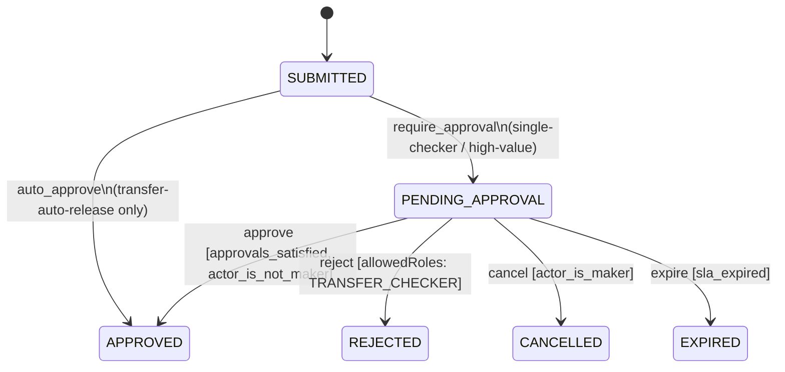
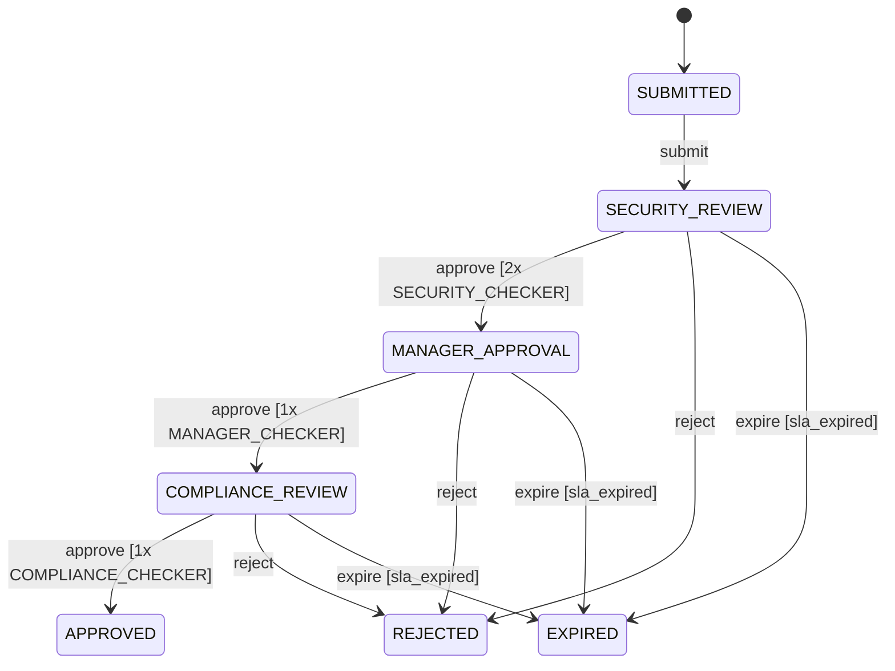
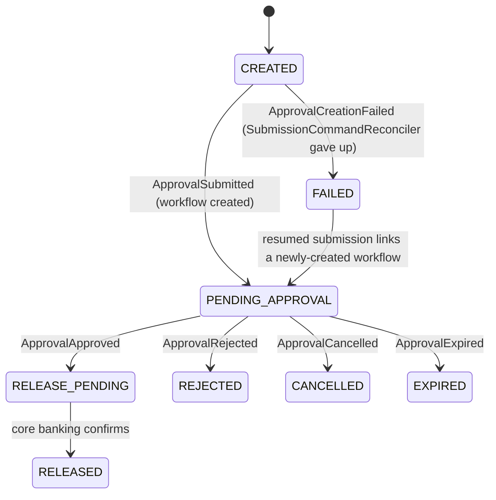
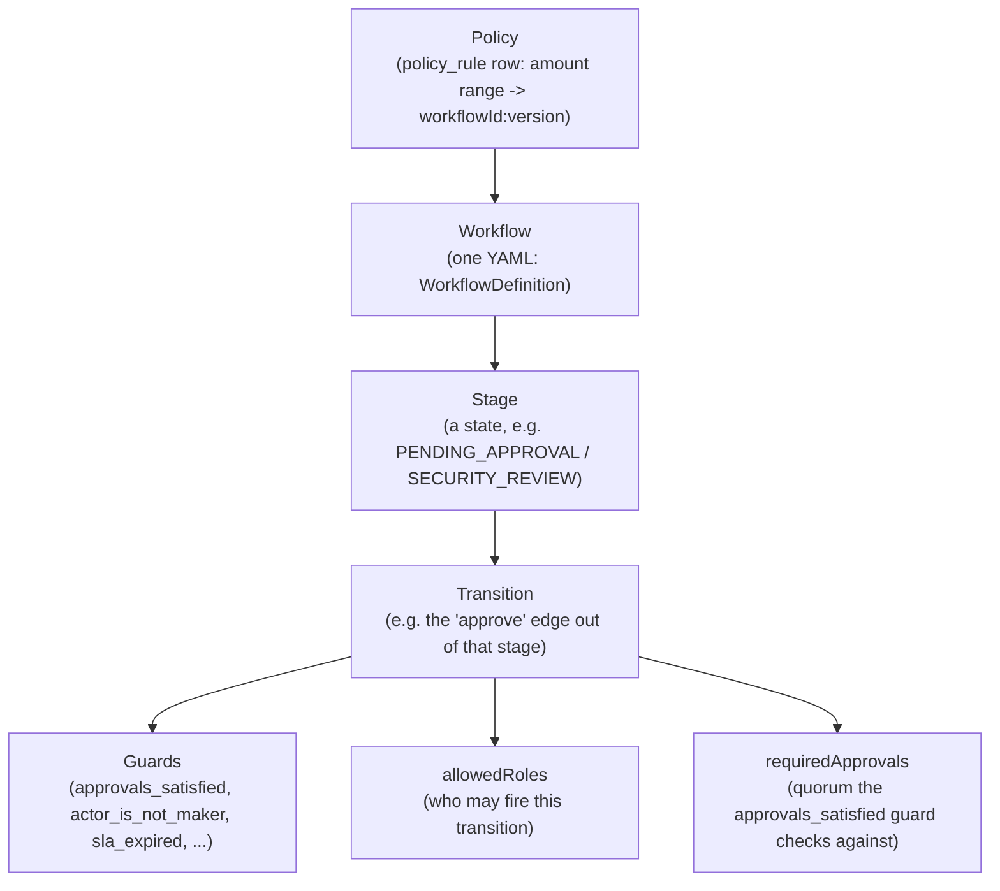
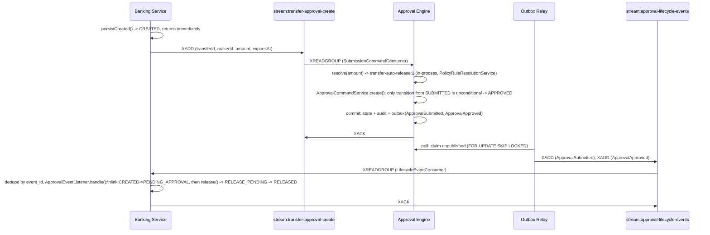
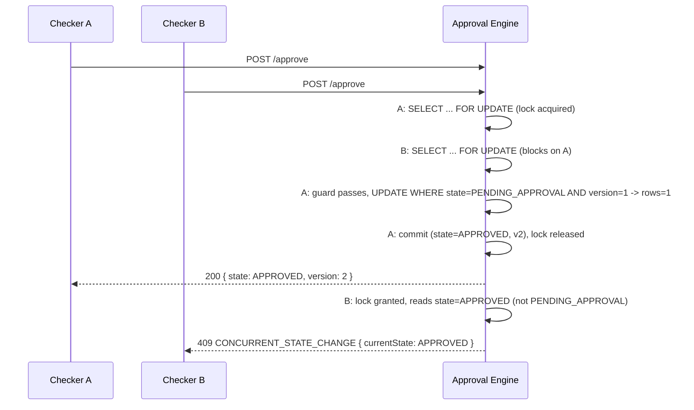

# Low-Level Design — Transfer Approval System

## Approval State Machine (Engine)

`APPROVED` means the approval requirement is satisfied — not that money has moved.



Shown merged for readability; `transfer-auto-release` only has the top edge,
`transfer-single-checker`/`transfer-high-value` only have the bottom five — no single workflow
contains both (see Workflow Definitions below). `privileged-access:2` does not fit this merge at
all: it
has its own 3-stage chain, each stage its own role and quorum, shown separately below since it's
now the live routing target for the highest transfer tier.



`privileged-access:2` — the workflow ≥ AED 100,000 transfers route to (see Policy Contract). Each
stage is its own `PENDING_APPROVAL`-equivalent: Transfer's own lifecycle below still only sees
generic `PENDING_APPROVAL` throughout — it has no visibility into which of the three review
stages the engine is currently on, only whether it's still pending or has reached a terminal
state. `cancel` has no edge here (unlike the transfer workflows) since a privileged-access
request has no maker in the transfer sense to withdraw it.

## Transfer Release Lifecycle (Banking Service)



`PENDING_APPROVAL` mirrors the engine's own `PENDING_APPROVAL` but is not shared state --
each event applies only if Transfer is still in the expected state (a lost race is a logged
no-op).

**The `CREATED` window.** `CREATED` is the transfer's state for the brief async gap between
`POST /transfers` returning and its creation command being consumed off
`stream:transfer-approval-create` (`approvalRequestId` still `null`) — normally sub-second to a
few seconds, longer only if Approval Engine is down, in which case the command simply waits in
the stream (see HLD's Consistency Model) rather than the request failing. `FAILED` is not
necessarily terminal: resuming with the same
`Idempotency-Key` (`TransferSubmissionService.resumeIfNeeded`) republishes the creation command,
and `ApprovalEventListener` links the resulting workflow exactly as it would from `CREATED`. No
`RELEASE_FAILED`: a transient core-banking failure retries in place.

`FAILED` is deliberately generic for its one current cause (workflow creation giving up); if a
second failure mode ever needs a terminal state, split by cause (e.g. add `RELEASE_FAILED`)
rather than overload this one with a reason code.

## Approval Lifecycle ↔ Transfer Lifecycle — How They Correspond

These are two independent state machines, not one shared one: Approval Engine never queries
Transfer's state, and Transfer never queries the engine's beyond consuming its events. The table
below is the explicit mapping a reader would otherwise have to reconstruct by cross-referencing
the two diagrams above against the event names in the Redis Stream Delivery section:

| Approval Engine transition | Event(s) emitted | Transfer reacts (`ApprovalEventListener`) |
|---|---|---|
| Workflow created, lands on `PENDING_APPROVAL` (single-checker / high-value / privileged-access) | `ApprovalSubmitted` | `CREATED` → `PENDING_APPROVAL` (links `approvalRequestId`) |
| Workflow created, lands on `APPROVED` directly (`transfer-auto-release`'s only transition) | `ApprovalSubmitted`, then `ApprovalApproved` — both from the same creation | `CREATED` → `PENDING_APPROVAL` → `RELEASE_PENDING` → (core banking confirms) → `RELEASED` |
| `PENDING_APPROVAL` → `APPROVED` (quorum met) | `ApprovalApproved` | `PENDING_APPROVAL` → `RELEASE_PENDING` → `RELEASED` |
| `PENDING_APPROVAL` → `REJECTED` | `ApprovalRejected` | `PENDING_APPROVAL` → `REJECTED`; maker notified |
| `PENDING_APPROVAL` → `CANCELLED` | `ApprovalCancelled` | `PENDING_APPROVAL` → `CANCELLED` (no notification — the maker caused it) |
| `PENDING_APPROVAL` → `EXPIRED` (`ExpirySweeper`) | `ApprovalExpired` | `PENDING_APPROVAL` → `EXPIRED`; maker notified |
| Workflow never created (`SubmissionCommandReconciler` gives up) | `ApprovalCreationFailed` | `CREATED` → `FAILED`; maker notified |

Notably, `ApprovalCommandService.create()` writes `ApprovalSubmitted` unconditionally on every
creation — even `transfer-auto-release`, whose YAML only declares an `APPROVED` event — which is
why Transfer always sees `CREATED → PENDING_APPROVAL` before `RELEASE_PENDING`; there is no code
path straight from `CREATED` to `RELEASE_PENDING`. Every reaction above is also conditional on
Transfer still being in the expected state, so at-least-once redelivery is always a no-op, never
a duplicate state change or notification.

## Workflow Definitions (one fixed-shape YAML per tier, not guard-branching in one workflow)

Every workflow YAML under `approval-engine/src/main/resources/workflow/definitions/` declares
its own states, transitions, and per-transition `allowedRoles`/`requiredApprovals` — routing
between tiers happens *before* the engine, by picking which workflow to instantiate (see Policy
Contract below), not by a guard branching inside one shared workflow. The five concepts this
section and the next both lean on nest strictly, top to bottom:



A **Policy** row only ever picks a `(workflowId, workflowVersion)` pair — it has no opinion on
stages, transitions, guards, or quorum. Everything below **Workflow** in this hierarchy is that
workflow's own business, declared once in its YAML and looked up by name at runtime, never
computed from the policy that routed to it. `requiredApprovals` in particular is a field on
`Transition` itself (Java: `Transition.requiredApprovals(): Integer`; YAML: `requiredApprovals:`
under the transition) — not a workflow-level or policy-level setting. Absent/`null` means the
transition is unconditional (`transfer-auto-release`'s only transition has none); any positive
integer N means the `approvals_satisfied` guard (`ctx.currentApprovalCount() >=
ctx.requiredApprovals()`) blocks that transition until N decisions matching `allowedRoles` have
been recorded for the *current* stage. Because it's per-transition, not per-workflow, a single
workflow can demand a different N at each stage — `privileged-access` requires 2 at
`SECURITY_REVIEW` but only 1 at each of `MANAGER_APPROVAL` and `COMPLIANCE_REVIEW` — with no
special-casing anywhere in the engine.

| Workflow (`workflowId:version`) | Amount tier (AED) | States | `approve` requires |
|---|---|---|---|
| `transfer-auto-release:1` | < 5,000 | SUBMITTED → APPROVED | 0 approvals (unconditional transition) |
| `transfer-single-checker:1` | 5,000 – 49,999.99 | + PENDING_APPROVAL, REJECTED, CANCELLED, EXPIRED | 1 × `TRANSFER_CHECKER` |
| `transfer-high-value:1` | 50,000 – 99,999.99 | same shape as single-checker | 2 × `TRANSFER_CHECKER` |
| `privileged-access:2` | ≥ 100,000 | SUBMITTED → SECURITY_REVIEW → MANAGER_APPROVAL → COMPLIANCE_REVIEW → APPROVED | 2 × `SECURITY_CHECKER`, then 1 × `MANAGER_CHECKER`, then 1 × `COMPLIANCE_CHECKER` |

All definitions load once at startup into a `WorkflowRegistry` keyed by `(workflowId, version)`;
guards (`approvals_satisfied`, `actor_is_maker`, `actor_is_not_maker`, `sla_expired`) are a small
fixed Java registry looked up by name — no expression language, no runtime reconfiguration. Role
eligibility is declarative (`allowedRoles` on the transition), not a guard function.

## Policy Contract

`policy_rule(id PK, min_amount_minor_units, max_amount_minor_units nullable, workflow_id,
workflow_version)` — an editable table in Approval Engine, not a formula in Banking. `GET
/policy-rules/resolve?amountMinorUnits=N` returns the first row covering `N` as `{workflowId,
workflowVersion}` (404 `POLICY_RULE_NOT_FOUND` if none covers it). Seeded once from
`application.yml`'s three ceiling values (AED 5,000 / 50,000 / 100,000 minor units) into the four
rows in the table above — the last of which points at `privileged-access:2` instead of another
transfer-shaped workflow; editable afterward via `PUT /policy-rules`, no redeploy.

Policy resolution now happens in-process inside Approval Engine's `SubmissionCommandConsumer`
(via `PolicyRuleResolutionService`) when it consumes the creation command off
`stream:transfer-approval-create` — not a synchronous call out of Banking Service. Banking's
`PolicyResolver`/`ApprovalEngineClient.resolvePolicy()` classes still exist in source but have
zero callers (dead code, left in place). Required-approvals count and eligible role aren't a
separate policy object on the wire; they're the resolved workflow's own `approve` transition
(`requiredApprovals`, `allowedRoles`), frozen into `policy_snapshot` (embeds the full
`WorkflowDefinition`) at creation and never re-resolved.

## API Contracts

**`GET /policy-rules/resolve?amountMinorUnits=N`** (Engine) → `{ "workflowId": "transfer-single-checker", "workflowVersion": 1 }`, or `404 POLICY_RULE_NOT_FOUND`.

**`POST /approvals`** (Engine; header `Idempotency-Key`) — caller names the already-resolved workflow, not a policy shape.
```json
// Request
{
  "requestId": "abc123", "requestType": "TRANSFER_APPROVAL", "makerId": "maker-1",
  "workflowId": "transfer-single-checker", "workflowVersion": 1, "policyVersion": "v1",
  "payloadJson": "{\"transferId\":\"abc123\",\"amount\":500000}",
  "expiresAt": "2026-08-26T10:00:00Z"
}
// 200 Response
{ "requestId": "abc123", "state": "PENDING_APPROVAL", "version": 1 }
```

**`POST /approvals/{id}/approve`** (no `Idempotency-Key` — idempotent per `(request_id,
actor_id, state)`). `id` here is the same value as `requestId` above — for a transfer, that's
literally the transfer's own `transferId` (`TransferSubmissionService` passes it straight
through as the engine's `requestId`; the engine never adds a prefix).
```json
// Request                         // 200 Response
{ "actorId": "checker-1",          { "requestId": "abc123",
  "actorRole": "TRANSFER_CHECKER" }  "state": "APPROVED", "version": 2 }
```
```json
// 409 CONCURRENT_STATE_CHANGE           // 409 INVALID_STATE_TRANSITION
{ "code": "CONCURRENT_STATE_CHANGE",     { "code": "INVALID_STATE_TRANSITION",
  "requestId": "abc123",                   "requestId": "abc123",
  "currentState": "APPROVED",              "currentState": "APPROVED",
  "requestedAction": null }                "requestedAction": "approve" }
```
`reject`/`cancel` share this shape (`ActorCommandDto`/`ApprovalResponseDto`/`ErrorResponseDto`);
`GET /approvals/{id}` returns `ApprovalResponseDto`. `GET /approvals?status={all|pending|
completed}&mine={bool}` (header `X-Actor-Role`, required when `mine=true`, else `400
INVALID_REQUEST`) lists `ApprovalRequestSummaryDto`s, server-side filtered to what that role can
currently act on — the `mine=true` row in the error table below refers to this endpoint.

| Error `code` | HTTP | When |
|---|---|---|
| `CONCURRENT_STATE_CHANGE` | 409 | Guarded UPDATE lost the race; action was legal, someone else won it first |
| `INVALID_STATE_TRANSITION` | 409 | Action was never legal from any state that could reach the current one |
| `IDEMPOTENCY_CONFLICT` | 409 | Same `Idempotency-Key`/`requestId` replayed with a different body |
| `FORBIDDEN_ACTION` | 403 | Actor role not eligible for this transition (or maker self-approving) |
| `NOT_FOUND` / `WORKFLOW_NOT_FOUND` / `POLICY_RULE_NOT_FOUND` | 404 | Unknown request / workflow / no policy rule covers the amount |
| `INVALID_REQUEST` | 400 | e.g. `mine=true` without `X-Actor-Role` |

**`POST /transfers`** (Banking; header `Idempotency-Key`) — creates and submits in one call;
submission itself is asynchronous (see Redis Stream Delivery below), so the response reflects
only that the row was created, not that a workflow exists yet.
```json
// Request
{ "makerId": "maker-1", "fromAccount": "ACC-1", "toAccount": "ACC-2",
  "amountMinorUnits": 500000, "currency": "AED" }
// 200 Response
{ "transferId": "abc123", "state": "CREATED" }
```
`GET /transfers/{id}` returns `TransferResponseDto`; poll it to observe `state` progress past
`CREATED` once the creation command is consumed off `stream:transfer-approval-create`.

## Data Model

```
-- approval DB
approval_request(request_id PK, request_type, state, version, maker_id,
                  workflow_id, workflow_version, policy_snapshot jsonb, payload jsonb,
                  created_at, expires_at)
approval_decision(decision_id PK, request_id, actor_id, actor_role, state, decision,
                   created_at, UNIQUE(request_id, actor_id, state))
audit_log(audit_id PK, request_id, actor_id, actor_role, action,
          previous_state, new_state, created_at, metadata)
idempotency_key(idem_key PK, command_type, request_id, request_hash, result jsonb, created_at)
outbox(event_id PK, request_id, event_type, event_version, payload jsonb,
       created_at, published_at, claimed_at)
policy_rule(id PK, min_amount_minor_units, max_amount_minor_units nullable,
            workflow_id, workflow_version)

-- transfer DB
transfer(transfer_id PK, maker_id, from_account, to_account, amount_minor_units,
         currency, state, approval_request_id, idempotency_key UNIQUE,
         expires_at, created_at)
processed_event(event_id PK, processed_at)
```

## Sequence Diagrams

**Auto-release (0 approvals required)**



**Multi-approver — quorum accumulation** (`transfer-high-value`, `required=2`; two *different*
checkers approve in sequence, no race — this is the actual dual-control path the assignment
names; ground truth: `ApprovalCommandServiceApproveTest.
firstOfTwoRequiredApprovalsRecordsWithoutTransitioning` +
`secondOfTwoRequiredApprovalsTransitionsToApproved`)

```mermaid
sequenceDiagram
    participant A as Checker A
    participant B as Checker B
    participant E as Approval Engine
    A->>E: POST /approve
    E->>E: SELECT ... FOR UPDATE; count=0 < required=2 -> guard fails, no state UPDATE
    E->>E: record decision (A, APPROVE); commit; count is now 1
    E-->>A: 200 { state: PENDING_APPROVAL, version: 1 }
    Note over E: still PENDING_APPROVAL -- quorum not yet met
    B->>E: POST /approve
    E->>E: SELECT ... FOR UPDATE; count=1 < required=2 still true at read time...
    E->>E: record decision (B, APPROVE); count is now 2 -> guard now passes
    E->>E: UPDATE WHERE state=PENDING_APPROVAL AND version=1 -> rows=1 (state=APPROVED, v2)
    E-->>B: 200 { state: APPROVED, version: 2 }
```

This is the path that actually exercises the `SELECT ... FOR UPDATE` quorum-counting lock
discussed below — a single approval never trips it alone, only the vote that completes quorum
does.

**Concurrent-approve race** (`required=1`; Checker A and Checker B race for the *same* single
slot; ground truth: `ApprovalConcurrencyTest.twoCheckersApprovingSimultaneously_exactlyOneWins`)



The row lock serializes quorum *counting* (needed for N>1, shown in the quorum diagram above);
the guarded UPDATE's version check is what actually decides the winner here and is what the
sweeper below races against with no lock.

**Expiry vs. approve** (optimistic race, no row lock on the sweeper's path; ground truth:
`ExpiryVersusApproveConcurrencyTest.approveVersusExpire_exactlyOneWins`)

```mermaid
sequenceDiagram
    participant S as Expiry Sweeper
    participant C as Checker
    participant E as Approval Engine
    S->>E: expireOne(id, expectedVersion=1)
    C->>E: POST /approve
    par concurrently
        E->>E: UPDATE WHERE state=PENDING_APPROVAL AND version=1 -> EXPIRED
    and
        E->>E: UPDATE WHERE state=PENDING_APPROVAL AND version=1 -> APPROVED
    end
    Note over E: exactly one UPDATE affects rows=1; the other rows=0 -> no-op / 409
```

## Concurrency / Race Handling

Every competing transition resolves through one guarded conditional UPDATE:

```sql
UPDATE approval_request
   SET state = :new_state, version = version + 1
 WHERE request_id = :id AND state = :expected_state AND version = :expected_version;
-- rows = 1 -> won ; rows = 0 -> lost race or illegal transition
```

On `rows = 0` the whole transaction rolls back (decision insert, audit, outbox — all of it);
re-reading current state then classifies the failure: `409 CONCURRENT_STATE_CHANGE` if it was a
legal predecessor, `409 INVALID_STATE_TRANSITION` if it could never have led here. Quorum
counting additionally takes a `SELECT ... FOR UPDATE` row lock (`ApprovalCommandService.
loadOrThrow`) — a deliberate exception to "no explicit locks," since counting committed
decisions is an aggregate read the guarded UPDATE alone can't protect: without it, two
checkers can each count only their own still-uncommitted vote, both see quorum unmet, and a
request that actually has enough approvals is stranded in `PENDING_APPROVAL` forever. Evidence:
`ApprovalConcurrencyTest`, `ExpiryVersusApproveConcurrencyTest`.

**Why a lock, not a lock-free alternative:** considered and rejected for this contention shape
(at most `requiredApprovals` actors, one row, a millisecond-scale critical section):
*atomic counter column* (`UPDATE ... SET approvals_count = approvals_count + 1 RETURNING`) drops
the explicit lock but denormalizes the count against `approval_decision` as a second source of
truth that can drift; *`SERIALIZABLE` isolation + retry* trades a short wait for a full
abort-and-redo plus retry code, for contention this shallow; *splitting "record vote" from
"evaluate quorum" into two transactions* (the outbox philosophy used elsewhere here) closes the
race without a lock but turns a synchronous decision eventually-consistent for no real gain at
this scale. A `PESSIMISTIC_WRITE` held for one short cycle, on one row, contended by a handful
of actors, is the simplest option that's actually correct.

The same guarded UPDATE covers every other competing pair for free, with no special-casing per
transition — including the maker-cancel-vs-checker-approve race: `cancel` and `approve` are both
guarded transitions out of `PENDING_APPROVAL`, so whichever `UPDATE ... WHERE state =
'PENDING_APPROVAL' AND version = ?` commits first wins; the other affects 0 rows and is classified
the same way as any other lost race. Evidence: `ApprovalConcurrencyTest.
cancelVersusApprove_exactlyOneWins`. The console additionally hides an actor's own approve/reject
buttons once they've already decided the active stage (checked client-side against
`activeStage.approvals`) — a UX nicety, not a control: the server-side `UNIQUE(request_id,
actor_id, state)` constraint is what actually blocks a double decision (a second, contradictory
decision from the same actor gets `409 IDEMPOTENCY_CONFLICT`); the client guard just avoids
surfacing that as an error to someone who already knows they voted.

## Redis Stream Delivery

Two streams, one consumer group each: `stream:transfer-approval-create` (`approval-engine-workers`)
and `stream:approval-lifecycle-events` (`banking-service-workers`). Both are at-least-once —
a message stays in the group's pending-entries list until `XACK`'d; `SubmissionCommandReconciler`
/ `LifecycleEventReconciler` reclaim anything idle past 30s via `XPENDING` + `XCLAIM` (the Redis-native
equivalent of `OutboxClaimService`'s `claimed_at` staleness window) and retry it. The submission
side additionally gives up after 3 delivery attempts, publishing `ApprovalCreationFailed` onto
the lifecycle stream so banking-service can move the transfer to `FAILED` and notify the maker —
the lifecycle side has no equivalent failure state to move to, so it logs loudly past 5 attempts
rather than silently dropping the message (a full dead-letter mechanism is out of scope).

Redelivery is safe everywhere it can happen because every consumer here was already idempotent
before Redis existed: `ApprovalCommandService.create()` by `(Idempotency-Key, body hash)`,
`ApprovalEventListener.handle()` by `processed_event.event_id`.

## Failure Semantics

| Failure | Behavior |
|---|---|
| Engine unreachable during `submit()` | Transfer still reaches `CREATED` immediately; the creation command persists in `stream:transfer-approval-create` and `SubmissionCommandReconciler` retries it until Engine comes back, giving up only after `MAX_DELIVERY_ATTEMPTS` (3) — at which point the transfer moves to `FAILED` and the maker is notified |
| Banking Service unreachable during approve/reject/cancel | Engine still transitions/audits; only delivery delays |
| Relay crashes mid-publish | Row stays `claimed_at`-set; reclaimed after 30s |
| Duplicate event delivery | `processed_event(event_id)` dedupe — no-op replay |
| Core banking release fails | Stays `RELEASE_PENDING`, retried with same `transferId` |
| Lost race (approve/reject/cancel/expire) | Transaction rolls back; `409` or logged sweeper no-op |
