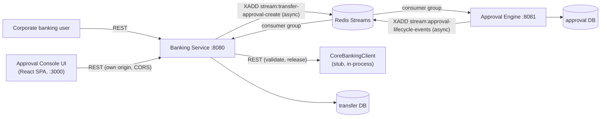

# Redis Messaging Broker Implementation Plan

> **For agentic workers:** REQUIRED SUB-SKILL: Use superpowers:subagent-driven-development (recommended) or superpowers:executing-plans to implement this plan task-by-task. Steps use checkbox (`- [ ]`) syntax for tracking.

**Goal:** Replace the synchronous HTTP calls that carry the two async-shaped flows between `banking-service` and `approval-engine` — submission (banking → engine) and lifecycle notification (engine → banking) — with Redis Streams, so `POST /transfers` never blocks on Approval Engine's availability or latency, and both directions get durable, redeliverable, horizontally-scalable delivery for free.

**Architecture:** Two Redis Streams, each with one consumer group, each carrying exactly one direction: `stream:transfer-approval-create` (banking-service publishes, approval-engine consumes and calls its own `ApprovalCommandService.create()` in-process — no HTTP loopback) and `stream:approval-lifecycle-events` (approval-engine publishes from its existing outbox relay, banking-service consumes and calls its existing `ApprovalEventListener.handle()` unchanged). Redis Streams' consumer-group semantics are at-least-once (a message stays pending until acknowledged, reclaimable via `XAUTOCLAIM` after a timeout) — this is safe here specifically because every consumer this plan wires up is already idempotent: `ApprovalCommandService.create()` by `Idempotency-Key`+body-hash, `ApprovalEventListener.handle()` by `processed_event.event_id`. No new idempotency mechanism is invented; the plan only changes *how a message gets delivered*, never *what happens when it arrives twice*.

**Tech Stack:** Spring Boot 4.1.x, Java 21, `spring-boot-starter-data-redis` (Lettuce client, `StreamMessageListenerContainer`), Redis 7 (`redis:7-alpine`, AOF persistence), Testcontainers `GenericContainer` for Redis in tests (no new Testcontainers module needed — `GenericContainer` ships in `org.testcontainers:testcontainers`, already pulled in transitively by the `postgresql` module both services already depend on).

**Spec:** `docs/superpowers/specs/2026-08-27-async-messaging-design.md` — this plan supersedes that spec's `InMemoryMessageBroker` with Redis Streams as the actual cross-process transport, keeps its `CreateTransferApprovalCommand`/`ApprovalEvent` record shapes, and folds in the two gaps identified reviewing it: the idempotency insert race (Tasks 1–2, now a hard prerequisite) and the durability/reconciliation gap (Task 10, now solved via `XAUTOCLAIM` instead of a bespoke sweeper).

## Global Constraints

- Java 21 toolchain, Spring Boot 4.1.1, Gradle Kotlin DSL — match `build.gradle.kts` exactly as it exists in both services today.
- No shared module between `banking-service` and `approval-engine` — each service gets its own copy of any messaging config class, same as the spec's own `MessagePublisher`/`MessageConsumer` duplication.
- Integration tests use `@Testcontainers` + `@SpringBootTest`, matching every existing test in both services (`ApprovalConcurrencyTest`, `TransferSubmissionServiceTest`, etc.) — no Mockito-only tests for anything touching Redis or the DB, only for pure logic in isolation (matches the existing `PolicyResolverTest`/`ApprovalEventListenerNotificationTest` precedent).
- Every new consumer must be idempotent-safe under redelivery — never assume exactly-once.
- `docker compose up --build` remains the one-command start; nothing in this plan requires a manual setup step outside that command.

---

### Task 1: Fix the idempotency insert race in `ApprovalCommandService.create()`

**Files:**
- Modify: `approval-engine/src/main/java/com/visionbank/approval/service/ApprovalCommandService.java:58-129` (the `create()` method)
- Test: `approval-engine/src/test/java/com/visionbank/approval/service/ApprovalCommandServiceCreateTest.java`

**Interfaces:**
- Consumes: `IdempotencyRecordRepository.save(IdempotencyRecord)` (existing), `org.springframework.dao.DataIntegrityViolationException` (Spring's translated exception for a unique-constraint violation)
- Produces: `create()`'s existing signature and return type (`ApprovalRequestView create(CreateApprovalRequest cmd, String idempotencyKey)`) is unchanged — this is a behavior fix, not an API change.

This closes the gap where two truly concurrent calls with the same `Idempotency-Key` both pass the `idempotency.findById(idempotencyKey)` check (neither committed yet), both proceed to insert, and the loser hits a raw `DataIntegrityViolationException` on the `idem_key` primary key instead of getting a clean replay. This matters more once Task 9 exists, because a Redis redelivery (the same command reprocessed by `XAUTOCLAIM` after a timeout) can now race against an in-flight first attempt in a way the old single-threaded HTTP call never could.

- [ ] **Step 1: Write the failing test**

```java
// Add to ApprovalCommandServiceCreateTest.java
@Test
void concurrentCreateWithSameIdempotencyKeyNeverThrowsRawConstraintViolation() throws Exception {
    String idemKey = UUID.randomUUID().toString();
    CreateApprovalRequest cmd = new CreateApprovalRequest("req-race", "TRANSFER_APPROVAL", "maker-1",
            "transfer-single-checker", 1, "v1", "{}", Instant.now().plusSeconds(86400));

    CountDownLatch startGate = new CountDownLatch(1);
    ExecutorService pool = Executors.newFixedThreadPool(2);
    Callable<Object> attempt = () -> {
        startGate.await();
        try {
            return service.create(cmd, idemKey);
        } catch (Exception e) {
            return e;
        }
    };
    Future<Object> a = pool.submit(attempt);
    Future<Object> b = pool.submit(attempt);
    startGate.countDown();

    Object resultA = a.get(10, TimeUnit.SECONDS);
    Object resultB = b.get(10, TimeUnit.SECONDS);
    pool.shutdown();

    assertThat(resultA).isInstanceOf(ApprovalRequestView.class);
    assertThat(resultB).isInstanceOf(ApprovalRequestView.class);
    assertThat(((ApprovalRequestView) resultA).requestId()).isEqualTo(((ApprovalRequestView) resultB).requestId());
}
```

Add these imports to the test file if not already present: `java.util.concurrent.*`, `org.junit.jupiter.api.Test` (already there).

- [ ] **Step 2: Run test to verify it fails**

Run: `cd approval-engine && ./gradlew test --tests "*ApprovalCommandServiceCreateTest*" --console=plain`
Expected: FAIL — one of the two futures resolves to a `DataIntegrityViolationException` (or a wrapped `org.springframework.orm.jpa.JpaSystemException`) instead of an `ApprovalRequestView`.

- [ ] **Step 3: Write minimal implementation**

Wrap the insert path in `create()` to catch the race and replay instead of propagating it:

```java
@Transactional
public ApprovalRequestView create(CreateApprovalRequest cmd, String idempotencyKey) {
    String hash = hash(cmd);
    Optional<IdempotencyRecord> existing = idempotency.findById(idempotencyKey);
    if (existing.isPresent()) {
        if (!existing.get().getRequestHash().equals(hash)) {
            throw new IdempotencyConflictException(idempotencyKey);
        }
        ApprovalRequest replayed = requests.findByRequestId(existing.get().getRequestId()).orElseThrow();
        return toView(replayed);
    }

    if (requests.findByRequestId(cmd.requestId()).isPresent()) {
        throw new IdempotencyConflictException(cmd.requestId());
    }

    try {
        return doCreate(cmd, idempotencyKey, hash);
    } catch (DataIntegrityViolationException e) {
        // Lost the race: the other concurrent caller's insert committed first (same
        // idempotencyKey, same requestId is impossible here since requestId is the PK
        // on approval_request and idempotencyKey is the PK on idempotency_key -- either
        // constraint firing means someone else just finished creating this exact request).
        // Re-read and replay rather than propagate a raw constraint violation to the caller.
        Optional<IdempotencyRecord> winner = idempotency.findById(idempotencyKey);
        if (winner.isPresent()) {
            ApprovalRequest replayed = requests.findByRequestId(winner.get().getRequestId()).orElseThrow();
            return toView(replayed);
        }
        // idempotencyKey wasn't the constraint that fired -- must have been requestId
        // (a fresh idempotency key reused for an already-existing requestId, racing with
        // itself). Same non-recoverable case create() already rejects above; surface it
        // the same way rather than swallowing it.
        throw new IdempotencyConflictException(cmd.requestId());
    }
}

private ApprovalRequestView doCreate(CreateApprovalRequest cmd, String idempotencyKey, String hash) {
    WorkflowDefinition resolvedWorkflow;
    try {
        resolvedWorkflow = workflowRegistry.get(cmd.workflowId(), cmd.workflowVersion());
    } catch (IllegalStateException e) {
        throw new InvalidRequestException("Unknown workflow " + cmd.workflowId() + ":" + cmd.workflowVersion());
    }

    PolicySnapshot policy = new PolicySnapshot(cmd.policyVersion(), resolvedWorkflow);

    ApprovalRequest request = new ApprovalRequest();
    request.setRequestId(cmd.requestId());
    request.setRequestType(cmd.requestType());
    request.setWorkflowId(resolvedWorkflow.name());
    request.setWorkflowVersion(resolvedWorkflow.version());
    request.setMakerId(cmd.makerId());
    request.setPolicySnapshot(policy);
    request.setPayload(cmd.payloadJson());
    request.setCreatedAt(Instant.now());
    request.setExpiresAt(cmd.expiresAt());
    request.setVersion(0L);
    request.setState("SUBMITTED");

    GuardContext ctx = new GuardContext(cmd.makerId(), 0, null, null, false, "SUBMITTED", null);
    Transition initial = resolvedWorkflow.transitionsFrom("SUBMITTED").stream()
            .filter(t -> t.guards().stream().allMatch(g -> guards.get(g).evaluate(ctx)))
            .findFirst()
            .orElseThrow(() -> new InvalidRequestException(
                    "No transition from SUBMITTED satisfied for workflow " + resolvedWorkflow.name()));

    request.setState(initial.to());
    request.setVersion(1L);
    requests.save(request);

    writeAudit(cmd.requestId(), null, null, "SUBMITTED", "SUBMITTED", initial.to());
    writeOutbox(cmd.requestId(), "ApprovalSubmitted");
    fireEvents(resolvedWorkflow, cmd.requestId(), initial.to());

    IdempotencyRecord record = new IdempotencyRecord();
    record.setKey(idempotencyKey);
    record.setCommandType("CREATE");
    record.setRequestId(cmd.requestId());
    record.setRequestHash(hash);
    record.setResult("{\"state\":\"" + initial.to() + "\"}");
    record.setCreatedAt(Instant.now());
    idempotency.save(record);
    requests.flush(); // force the constraint violation to surface HERE, inside this try, not on transaction commit after the method returns
    idempotency.flush();

    return toView(request);
}
```

Add the import: `import org.springframework.dao.DataIntegrityViolationException;`

Note the two `flush()` calls at the end of `doCreate` — without them, the unique-constraint check only happens at transaction commit time, which is *after* `@Transactional` has already returned control past the `catch` block in `create()`. Flushing inside the try body is what makes the violation catchable here instead of surfacing as an opaque failure after the method has already returned.

- [ ] **Step 4: Run test to verify it passes**

Run: `cd approval-engine && ./gradlew test --tests "*ApprovalCommandServiceCreateTest*" --console=plain`
Expected: PASS

- [ ] **Step 5: Run the full approval-engine suite to confirm no regression**

Run: `cd approval-engine && ./gradlew test --console=plain`
Expected: BUILD SUCCESSFUL, all existing tests (67 before this task) still pass.

- [ ] **Step 6: Commit**

```bash
git add approval-engine/src/main/java/com/visionbank/approval/service/ApprovalCommandService.java approval-engine/src/test/java/com/visionbank/approval/service/ApprovalCommandServiceCreateTest.java
git commit -m "fix: replay instead of throwing on concurrent create() with the same idempotency key"
```

---

### Task 2: Fix the idempotency insert race in `TransferSubmissionService.submit()`

**Files:**
- Modify: `banking-service/src/main/java/com/visionbank/banking/service/TransferSubmissionService.java:39-52` (the `submit()` method's insert path)
- Test: `banking-service/src/test/java/com/visionbank/banking/service/TransferSubmissionServiceTest.java`

**Interfaces:**
- Consumes: `TransferRepository.findByIdempotencyKey(String)` (existing), `org.springframework.dao.DataIntegrityViolationException`
- Produces: `submit()`'s signature unchanged.

Same race, same fix shape, one layer up: `transfers.findByIdempotencyKey(idempotencyKey)` then `persistenceService.persistCreated(...)` is a check-then-insert with no protection against two truly concurrent callers both passing the check.

- [ ] **Step 1: Write the failing test**

```java
// Add to TransferSubmissionServiceTest.java
@Test
void concurrentSubmitWithSameIdempotencyKeyNeverThrowsRawConstraintViolation() throws Exception {
    engineStub.stubFor(post(urlEqualTo("/approvals"))
            .willReturn(okJson("{\"requestId\":\"whatever\",\"state\":\"PENDING_APPROVAL\",\"version\":1}")));
    String key = UUID.randomUUID().toString();

    CountDownLatch startGate = new CountDownLatch(1);
    ExecutorService pool = Executors.newFixedThreadPool(2);
    Callable<Object> attempt = () -> {
        startGate.await();
        try {
            return service.submit(smallTransfer(), key);
        } catch (Exception e) {
            return e;
        }
    };
    Future<Object> a = pool.submit(attempt);
    Future<Object> b = pool.submit(attempt);
    startGate.countDown();

    Object resultA = a.get(10, TimeUnit.SECONDS);
    Object resultB = b.get(10, TimeUnit.SECONDS);
    pool.shutdown();

    assertThat(resultA).isInstanceOf(TransferView.class);
    assertThat(resultB).isInstanceOf(TransferView.class);
    assertThat(((TransferView) resultA).transferId()).isEqualTo(((TransferView) resultB).transferId());
}
```

Add imports: `java.util.concurrent.*`.

- [ ] **Step 2: Run test to verify it fails**

Run: `cd banking-service && ./gradlew test --tests "*TransferSubmissionServiceTest*" --console=plain`
Expected: FAIL — one branch throws a `DataIntegrityViolationException` on the `idempotency_key` unique column.

- [ ] **Step 3: Write minimal implementation**

```java
public TransferView submit(SubmitTransferCommand cmd, String idempotencyKey) {
    Optional<Transfer> existing = transfers.findByIdempotencyKey(idempotencyKey);
    if (existing.isPresent()) {
        Transfer t = existing.get();
        if (t.getApprovalRequestId() != null) {
            return new TransferView(t.getTransferId(), t.getState());
        }
        return completeWorkflowCreation(t, cmd);
    }

    ValidationResult validation = coreBanking.validate(cmd.fromAccount(), cmd.amountMinorUnits(), idempotencyKey);
    if (!validation.isValid()) {
        throw new ValidationFailedException(
                "sufficientBalance=" + validation.sufficientBalance()
                + " withinLimit=" + validation.withinLimit()
                + " duplicate=" + validation.duplicate());
    }

    String transferId = UUID.randomUUID().toString();
    Instant expiresAt = Instant.now().plusSeconds(approvalSlaSeconds);
    Transfer created;
    try {
        created = persistenceService.persistCreated(transferId, cmd, idempotencyKey, expiresAt);
    } catch (DataIntegrityViolationException e) {
        // Lost the race: another concurrent call with the same idempotencyKey committed
        // first. Re-read and continue from wherever that winning row actually is, rather
        // than propagate a raw constraint violation for what is, from the caller's
        // perspective, a perfectly legitimate retry.
        Transfer winner = transfers.findByIdempotencyKey(idempotencyKey).orElseThrow();
        if (winner.getApprovalRequestId() != null) {
            return new TransferView(winner.getTransferId(), winner.getState());
        }
        return completeWorkflowCreation(winner, cmd);
    }

    return completeWorkflowCreation(created, cmd);
}
```

- [ ] **Step 4: Run test to verify it passes**

Run: `cd banking-service && ./gradlew test --tests "*TransferSubmissionServiceTest*" --console=plain`
Expected: PASS

- [ ] **Step 5: Run the full banking-service suite to confirm no regression**

Run: `cd banking-service && ./gradlew test --console=plain`
Expected: BUILD SUCCESSFUL, all existing tests still pass.

- [ ] **Step 6: Commit**

```bash
git add banking-service/src/main/java/com/visionbank/banking/service/TransferSubmissionService.java banking-service/src/test/java/com/visionbank/banking/service/TransferSubmissionServiceTest.java
git commit -m "fix: replay instead of throwing on concurrent submit() with the same idempotency key"
```

---

### Task 3: Add `TransferState.FAILED` and `TransferPersistenceService.markFailed()`

**Files:**
- Modify: `banking-service/src/main/java/com/visionbank/banking/domain/TransferState.java`
- Modify: `banking-service/src/main/java/com/visionbank/banking/service/TransferPersistenceService.java`
- Test: `banking-service/src/test/java/com/visionbank/banking/service/TransferPersistenceServiceTest.java` (new file)

**Interfaces:**
- Produces: `TransferPersistenceService.markFailed(String transferId) -> Transfer` — used by Task 9's consumer when approval-engine reports it could never create the workflow, and by Task 7's event consumer when it receives an `ApprovalCreationFailed` lifecycle event.

`FAILED` is distinct from `REJECTED`/`CANCELLED`/`EXPIRED`: those mean the approval workflow was created and something decided against it. `FAILED` means the workflow was never successfully created at all.

- [ ] **Step 1: Write the failing test**

```java
package com.visionbank.banking.service;

import com.visionbank.banking.domain.Transfer;
import com.visionbank.banking.domain.TransferState;
import com.visionbank.banking.repository.TransferRepository;
import org.junit.jupiter.api.Test;
import org.springframework.beans.factory.annotation.Autowired;
import org.springframework.boot.test.context.SpringBootTest;
import org.springframework.test.context.DynamicPropertyRegistry;
import org.springframework.test.context.DynamicPropertySource;
import org.testcontainers.containers.PostgreSQLContainer;
import org.testcontainers.junit.jupiter.Container;
import org.testcontainers.junit.jupiter.Testcontainers;

import java.time.Instant;

import static org.assertj.core.api.Assertions.assertThat;

@Testcontainers
@SpringBootTest
class TransferPersistenceServiceTest {

    @Container
    static PostgreSQLContainer<?> postgres = new PostgreSQLContainer<>("postgres:16-alpine");

    @DynamicPropertySource
    static void props(DynamicPropertyRegistry registry) {
        registry.add("spring.datasource.url", postgres::getJdbcUrl);
        registry.add("spring.datasource.username", postgres::getUsername);
        registry.add("spring.datasource.password", postgres::getPassword);
    }

    @Autowired TransferPersistenceService persistenceService;
    @Autowired TransferRepository transfers;

    @Test
    void markFailedTransitionsToFailedState() {
        SubmitTransferCommand cmd = new SubmitTransferCommand("maker-1", "ACC-FUNDED", "ACC-DEST", 1000_00L, "AED");
        Transfer created = persistenceService.persistCreated("t-fail-1", cmd, "idem-fail-1", Instant.now().plusSeconds(300));

        Transfer failed = persistenceService.markFailed(created.getTransferId());

        assertThat(failed.getState()).isEqualTo(TransferState.FAILED);
        assertThat(transfers.findById("t-fail-1").get().getState()).isEqualTo(TransferState.FAILED);
    }
}
```

- [ ] **Step 2: Run test to verify it fails**

Run: `cd banking-service && ./gradlew test --tests "*TransferPersistenceServiceTest*" --console=plain`
Expected: FAIL — compile error, `markFailed` doesn't exist yet.

- [ ] **Step 3: Write minimal implementation**

```java
// TransferState.java
package com.visionbank.banking.domain;

public enum TransferState {
    CREATED, PENDING_APPROVAL, RELEASE_PENDING, RELEASED, REJECTED, CANCELLED, EXPIRED, FAILED
}
```

```java
// Add to TransferPersistenceService.java
@Transactional
public Transfer markFailed(String transferId) {
    Transfer transfer = transfers.findById(transferId).orElseThrow();
    transfer.setState(TransferState.FAILED);
    return transfers.save(transfer);
}
```

- [ ] **Step 4: Run test to verify it passes**

Run: `cd banking-service && ./gradlew test --tests "*TransferPersistenceServiceTest*" --console=plain`
Expected: PASS

- [ ] **Step 5: Commit**

```bash
git add banking-service/src/main/java/com/visionbank/banking/domain/TransferState.java banking-service/src/main/java/com/visionbank/banking/service/TransferPersistenceService.java banking-service/src/test/java/com/visionbank/banking/service/TransferPersistenceServiceTest.java
git commit -m "feat: add TransferState.FAILED for workflows that never got created"
```

---

### Task 4: Extract `PolicyRuleResolutionService` out of `PolicyRuleController`

**Files:**
- Create: `approval-engine/src/main/java/com/visionbank/approval/policy/PolicyRuleResolutionService.java`
- Modify: `approval-engine/src/main/java/com/visionbank/approval/policy/PolicyRuleController.java`
- Test: `approval-engine/src/test/java/com/visionbank/approval/policy/PolicyRuleResolutionServiceTest.java` (new file)

**Interfaces:**
- Produces: `PolicyRuleResolutionService.resolve(long amountMinorUnits) -> PolicyResolutionDto` — called by both `PolicyRuleController` (HTTP, unchanged contract) and Task 9's `SubmissionCommandConsumer` (in-process, no HTTP loopback).

Today `PolicyRuleController.resolve()` has the resolution logic inline in the controller method — fine when the only caller is HTTP, but Task 9's Redis consumer needs the exact same logic without going through a servlet. Extract it once, call it from both places.

- [ ] **Step 1: Write the failing test**

```java
package com.visionbank.approval.policy;

import org.junit.jupiter.api.Test;
import org.springframework.beans.factory.annotation.Autowired;
import org.springframework.boot.test.context.SpringBootTest;
import org.springframework.test.context.DynamicPropertyRegistry;
import org.springframework.test.context.DynamicPropertySource;
import org.testcontainers.containers.PostgreSQLContainer;
import org.testcontainers.junit.jupiter.Container;
import org.testcontainers.junit.jupiter.Testcontainers;

import static org.assertj.core.api.Assertions.assertThat;
import static org.assertj.core.api.Assertions.assertThatThrownBy;

@Testcontainers
@SpringBootTest
class PolicyRuleResolutionServiceTest {

    @Container
    static PostgreSQLContainer<?> postgres = new PostgreSQLContainer<>("postgres:16-alpine");

    @DynamicPropertySource
    static void props(DynamicPropertyRegistry registry) {
        registry.add("spring.datasource.url", () -> postgres.getJdbcUrl() + "&stringtype=unspecified");
        registry.add("spring.datasource.username", postgres::getUsername);
        registry.add("spring.datasource.password", postgres::getPassword);
    }

    @Autowired PolicyRuleResolutionService service;

    @Test
    void resolvesAutoReleaseTierForASmallAmount() {
        PolicyResolutionDto resolution = service.resolve(100_00L);

        assertThat(resolution.workflowId()).isEqualTo("transfer-auto-release");
        assertThat(resolution.workflowVersion()).isEqualTo(1);
    }

    @Test
    void throwsWhenNoRuleCoversTheAmount() {
        assertThatThrownBy(() -> service.resolve(-1L)).isInstanceOf(PolicyRuleNotFoundException.class);
    }
}
```

- [ ] **Step 2: Run test to verify it fails**

Run: `cd approval-engine && ./gradlew test --tests "*PolicyRuleResolutionServiceTest*" --console=plain`
Expected: FAIL — compile error, class doesn't exist.

- [ ] **Step 3: Write minimal implementation**

```java
package com.visionbank.approval.policy;

import org.springframework.stereotype.Service;

@Service
public class PolicyRuleResolutionService {

    private final PolicyRuleRepository rules;

    public PolicyRuleResolutionService(PolicyRuleRepository rules) {
        this.rules = rules;
    }

    public PolicyResolutionDto resolve(long amountMinorUnits) {
        return rules.findAllByOrderByMinAmountMinorUnitsAsc().stream()
                .filter(r -> r.covers(amountMinorUnits))
                .findFirst()
                .map(r -> new PolicyResolutionDto(r.getWorkflowId(), r.getWorkflowVersion()))
                .orElseThrow(() -> new PolicyRuleNotFoundException(amountMinorUnits));
    }
}
```

```java
// PolicyRuleController.java -- replace the resolve() method body, keep everything else unchanged
@RestController
@RequestMapping("/policy-rules")
public class PolicyRuleController {

    private final PolicyRuleRepository rules;
    private final PolicyRuleResolutionService resolutionService;

    public PolicyRuleController(PolicyRuleRepository rules, PolicyRuleResolutionService resolutionService) {
        this.rules = rules;
        this.resolutionService = resolutionService;
    }

    @GetMapping
    public List<PolicyRuleDto> list() {
        return rules.findAllByOrderByMinAmountMinorUnitsAsc().stream().map(this::toDto).toList();
    }

    @PutMapping
    @Transactional
    public List<PolicyRuleDto> replaceAll(@RequestBody List<PolicyRuleDto> body) {
        rules.deleteAllInBatch();
        List<PolicyRule> saved = rules.saveAll(body.stream()
                .map(d -> new PolicyRule(null, d.minAmountMinorUnits(), d.maxAmountMinorUnits(), d.workflowId(), d.workflowVersion()))
                .toList());
        return saved.stream().map(this::toDto).toList();
    }

    @GetMapping("/resolve")
    public PolicyResolutionDto resolve(@RequestParam long amountMinorUnits) {
        return resolutionService.resolve(amountMinorUnits);
    }

    private PolicyRuleDto toDto(PolicyRule r) {
        return new PolicyRuleDto(r.getId(), r.getMinAmountMinorUnits(), r.getMaxAmountMinorUnits(),
                r.getWorkflowId(), r.getWorkflowVersion());
    }
}
```

- [ ] **Step 4: Run test to verify it passes**

Run: `cd approval-engine && ./gradlew test --tests "*PolicyRuleResolutionServiceTest*" --console=plain`
Expected: PASS

- [ ] **Step 5: Run the full approval-engine suite (confirms `PolicyRuleControllerTest` still passes unchanged)**

Run: `cd approval-engine && ./gradlew test --console=plain`
Expected: BUILD SUCCESSFUL

- [ ] **Step 6: Commit**

```bash
git add approval-engine/src/main/java/com/visionbank/approval/policy/PolicyRuleResolutionService.java approval-engine/src/main/java/com/visionbank/approval/policy/PolicyRuleController.java approval-engine/src/test/java/com/visionbank/approval/policy/PolicyRuleResolutionServiceTest.java
git commit -m "refactor: extract policy resolution logic so it's callable without an HTTP round-trip"
```

---

### Task 5: Redis infrastructure — dependency, docker-compose, config, stream/group constants

**Files:**
- Modify: `banking-service/build.gradle.kts`
- Modify: `approval-engine/build.gradle.kts`
- Modify: `docker-compose.yml`
- Modify: `banking-service/src/main/resources/application.yml`
- Modify: `approval-engine/src/main/resources/application.yml`
- Create: `banking-service/src/main/java/com/visionbank/banking/messaging/RedisStreamNames.java`
- Create: `banking-service/src/main/java/com/visionbank/banking/messaging/RedisStreamConfig.java`
- Create: `approval-engine/src/main/java/com/visionbank/approval/messaging/RedisStreamNames.java`
- Create: `approval-engine/src/main/java/com/visionbank/approval/messaging/RedisStreamConfig.java`
- Test: `banking-service/src/test/java/com/visionbank/banking/messaging/RedisStreamConfigTest.java` (new file — a smoke test proving the container starts and a group can be created; the two real messaging tests in Tasks 6–9 exercise the actual publish/consume path)

**Interfaces:**
- Produces (both services, identical shape, separate copies): `RedisStreamConfig.streamMessageListenerContainer(RedisConnectionFactory) -> StreamMessageListenerContainer<String, MapRecord<String, String, String>>` (a started, injectable bean). `RedisStreamNames` — a small constants holder per service (each only needs the two stream/group names relevant to what it publishes/consumes).

- [ ] **Step 1: Add the dependency to both `build.gradle.kts` files**

```kotlin
// banking-service/build.gradle.kts and approval-engine/build.gradle.kts -- add this line
// alongside the existing implementation(...) lines
implementation("org.springframework.boot:spring-boot-starter-data-redis")
```

- [ ] **Step 2: Add the Redis service to `docker-compose.yml`**

```yaml
# Add as a new top-level service, alongside postgres
  redis:
    image: redis:7-alpine
    command: redis-server --appendonly yes
    ports: ["6379:6379"]
    volumes:
      - redis-data:/data
    healthcheck:
      test: ["CMD", "redis-cli", "ping"]
      interval: 5s
      timeout: 3s
      retries: 10
```

```yaml
# Add to approval-engine's and banking-service's existing service blocks
    environment:
      SPRING_DATA_REDIS_HOST: redis
      SPRING_DATA_REDIS_PORT: 6379
    depends_on:
      redis:
        condition: service_healthy
      # (keep the existing postgres/approval-engine depends_on entries alongside this)
```

```yaml
# Add at the bottom, alongside any existing top-level volumes key (add the key if it doesn't exist yet)
volumes:
  redis-data:
```

- [ ] **Step 3: Add Redis config to both `application.yml` files**

```yaml
# banking-service/src/main/resources/application.yml -- add at the top level
spring:
  data:
    redis:
      host: localhost
      port: 6379
```

```yaml
# approval-engine/src/main/resources/application.yml -- add at the top level
spring:
  data:
    redis:
      host: localhost
      port: 6379
```

(These `localhost` defaults are for running each service standalone against a local `docker run -p 6379:6379 redis:7-alpine`; the compose environment variables in Step 2 override them to `redis` inside the compose network, matching the existing pattern for `SPRING_DATASOURCE_URL`.)

- [ ] **Step 4: Create `RedisStreamNames` in banking-service**

```java
package com.visionbank.banking.messaging;

public final class RedisStreamNames {
    public static final String SUBMISSION_COMMAND_STREAM = "stream:transfer-approval-create";
    public static final String LIFECYCLE_EVENT_STREAM = "stream:approval-lifecycle-events";
    public static final String LIFECYCLE_EVENT_CONSUMER_GROUP = "banking-service-workers";

    private RedisStreamNames() {}
}
```

- [ ] **Step 5: Create `RedisStreamNames` in approval-engine**

```java
package com.visionbank.approval.messaging;

public final class RedisStreamNames {
    public static final String SUBMISSION_COMMAND_STREAM = "stream:transfer-approval-create";
    public static final String SUBMISSION_COMMAND_CONSUMER_GROUP = "approval-engine-workers";
    public static final String LIFECYCLE_EVENT_STREAM = "stream:approval-lifecycle-events";

    private RedisStreamNames() {}
}
```

(Stream name strings are identical across both copies — they're the two ends of the same wire. Each service only declares the consumer-group constant for the stream *it* consumes.)

- [ ] **Step 6: Create `RedisStreamConfig` in banking-service**

```java
package com.visionbank.banking.messaging;

import org.springframework.context.annotation.Bean;
import org.springframework.context.annotation.Configuration;
import org.springframework.data.redis.connection.RedisConnectionFactory;
import org.springframework.data.redis.connection.stream.MapRecord;
import org.springframework.data.redis.stream.StreamMessageListenerContainer;

import java.time.Duration;

@Configuration
public class RedisStreamConfig {

    @Bean(initMethod = "start", destroyMethod = "stop")
    public StreamMessageListenerContainer<String, MapRecord<String, String, String>> streamMessageListenerContainer(
            RedisConnectionFactory connectionFactory) {
        StreamMessageListenerContainer.StreamMessageListenerContainerOptions<String, MapRecord<String, String, String>> options =
                StreamMessageListenerContainer.StreamMessageListenerContainerOptions.builder()
                        .pollTimeout(Duration.ofSeconds(1))
                        .build();
        return StreamMessageListenerContainer.create(connectionFactory, options);
    }
}
```

- [ ] **Step 7: Create the identical `RedisStreamConfig` in approval-engine** (same code, `com.visionbank.approval.messaging` package)

- [ ] **Step 8: Write the smoke test**

```java
package com.visionbank.banking.messaging;

import org.junit.jupiter.api.Test;
import org.springframework.beans.factory.annotation.Autowired;
import org.springframework.boot.test.context.SpringBootTest;
import org.springframework.data.redis.core.StringRedisTemplate;
import org.springframework.data.redis.connection.stream.StreamOffset;
import org.springframework.test.context.DynamicPropertyRegistry;
import org.springframework.test.context.DynamicPropertySource;
import org.testcontainers.containers.GenericContainer;
import org.testcontainers.containers.PostgreSQLContainer;
import org.testcontainers.junit.jupiter.Container;
import org.testcontainers.junit.jupiter.Testcontainers;
import org.testcontainers.utility.DockerImageName;

import java.util.Map;

import static org.assertj.core.api.Assertions.assertThat;

@Testcontainers
@SpringBootTest
class RedisStreamConfigTest {

    @Container
    static PostgreSQLContainer<?> postgres = new PostgreSQLContainer<>("postgres:16-alpine");

    @Container
    static GenericContainer<?> redis = new GenericContainer<>(DockerImageName.parse("redis:7-alpine"))
            .withExposedPorts(6379);

    @DynamicPropertySource
    static void props(DynamicPropertyRegistry registry) {
        registry.add("spring.datasource.url", postgres::getJdbcUrl);
        registry.add("spring.datasource.username", postgres::getUsername);
        registry.add("spring.datasource.password", postgres::getPassword);
        registry.add("spring.data.redis.host", redis::getHost);
        registry.add("spring.data.redis.port", () -> redis.getMappedPort(6379));
    }

    @Autowired StringRedisTemplate redisTemplate;

    @Test
    void canWriteAndReadARecordFromAStream() {
        String streamKey = "stream:smoke-test";
        redisTemplate.opsForStream().add(streamKey, Map.of("hello", "world"));

        var records = redisTemplate.opsForStream().read(StreamOffset.fromStart(streamKey));

        assertThat(records).hasSize(1);
        assertThat(records.get(0).getValue()).containsEntry("hello", "world");
    }
}
```

- [ ] **Step 9: Run test to verify it passes**

Run: `cd banking-service && ./gradlew test --tests "*RedisStreamConfigTest*" --console=plain`
Expected: PASS (this will pull the `redis:7-alpine` image on first run, same as `postgres:16-alpine` already does)

- [ ] **Step 10: Commit**

```bash
git add banking-service/build.gradle.kts approval-engine/build.gradle.kts docker-compose.yml \
        banking-service/src/main/resources/application.yml approval-engine/src/main/resources/application.yml \
        banking-service/src/main/java/com/visionbank/banking/messaging/ \
        approval-engine/src/main/java/com/visionbank/approval/messaging/ \
        banking-service/src/test/java/com/visionbank/banking/messaging/
git commit -m "feat: add Redis infrastructure (dependency, compose service, stream listener container)"
```

---

### Task 6: `approval-engine` publishes lifecycle events to Redis instead of calling `banking-service` over HTTP

**Files:**
- Create: `approval-engine/src/main/java/com/visionbank/approval/messaging/ApprovalEvent.java`
- Create: `approval-engine/src/main/java/com/visionbank/approval/messaging/LifecycleEventPublisher.java`
- Modify: `approval-engine/src/main/java/com/visionbank/approval/service/OutboxRelay.java`
- Modify: `approval-engine/src/main/resources/application.yml` (remove now-unused `banking-service.webhook-url`)
- Test: `approval-engine/src/test/java/com/visionbank/approval/messaging/LifecycleEventPublisherTest.java` (new)
- Test: Modify `approval-engine/src/test/java/com/visionbank/approval/service/OutboxRelayTest.java`

**Interfaces:**
- Produces: `LifecycleEventPublisher.publish(ApprovalEvent event)` (throws on failure, matching `OutboxRelay`'s existing try/catch-and-log-and-leave-unpublished contract). `ApprovalEvent` record: `(String eventId, String eventType, String requestId, String payload)`.
- Consumes: Task 5's `StringRedisTemplate` (auto-configured by `spring-boot-starter-data-redis` once `spring.data.redis.*` properties are set — no separate bean needed).

The outbox table stays exactly as it is — this task only changes what `OutboxRelay.publish()` does with a claimed event, from an HTTP POST to an `XADD`.

- [ ] **Step 1: Write `ApprovalEvent`**

```java
package com.visionbank.approval.messaging;

public record ApprovalEvent(String eventId, String eventType, String requestId, String payload) {}
```

- [ ] **Step 2: Write the failing test for `LifecycleEventPublisher`**

```java
package com.visionbank.approval.messaging;

import org.junit.jupiter.api.Test;
import org.springframework.beans.factory.annotation.Autowired;
import org.springframework.boot.test.context.SpringBootTest;
import org.springframework.data.redis.core.StringRedisTemplate;
import org.springframework.data.redis.connection.stream.StreamOffset;
import org.springframework.test.context.DynamicPropertyRegistry;
import org.springframework.test.context.DynamicPropertySource;
import org.testcontainers.containers.GenericContainer;
import org.testcontainers.containers.PostgreSQLContainer;
import org.testcontainers.junit.jupiter.Container;
import org.testcontainers.junit.jupiter.Testcontainers;
import org.testcontainers.utility.DockerImageName;

import static org.assertj.core.api.Assertions.assertThat;

@Testcontainers
@SpringBootTest
class LifecycleEventPublisherTest {

    @Container
    static PostgreSQLContainer<?> postgres = new PostgreSQLContainer<>("postgres:16-alpine");

    @Container
    static GenericContainer<?> redis = new GenericContainer<>(DockerImageName.parse("redis:7-alpine"))
            .withExposedPorts(6379);

    @DynamicPropertySource
    static void props(DynamicPropertyRegistry registry) {
        registry.add("spring.datasource.url", () -> postgres.getJdbcUrl() + "&stringtype=unspecified");
        registry.add("spring.datasource.username", postgres::getUsername);
        registry.add("spring.datasource.password", postgres::getPassword);
        registry.add("spring.data.redis.host", redis::getHost);
        registry.add("spring.data.redis.port", () -> redis.getMappedPort(6379));
    }

    @Autowired LifecycleEventPublisher publisher;
    @Autowired StringRedisTemplate redisTemplate;

    @Test
    void publishAddsARecordToTheLifecycleEventStream() {
        ApprovalEvent event = new ApprovalEvent("evt-1", "ApprovalApproved", "req-1", "{\"requestId\":\"req-1\"}");

        publisher.publish(event);

        var records = redisTemplate.opsForStream().read(StreamOffset.fromStart(RedisStreamNames.LIFECYCLE_EVENT_STREAM));
        assertThat(records).hasSize(1);
        assertThat(records.get(0).getValue())
                .containsEntry("eventId", "evt-1")
                .containsEntry("eventType", "ApprovalApproved")
                .containsEntry("requestId", "req-1")
                .containsEntry("payload", "{\"requestId\":\"req-1\"}");
    }
}
```

- [ ] **Step 3: Run test to verify it fails**

Run: `cd approval-engine && ./gradlew test --tests "*LifecycleEventPublisherTest*" --console=plain`
Expected: FAIL — compile error, `LifecycleEventPublisher` doesn't exist.

- [ ] **Step 4: Write minimal implementation**

```java
package com.visionbank.approval.messaging;

import org.springframework.data.redis.core.StringRedisTemplate;
import org.springframework.stereotype.Component;

import java.util.Map;

@Component
public class LifecycleEventPublisher {

    private final StringRedisTemplate redisTemplate;

    public LifecycleEventPublisher(StringRedisTemplate redisTemplate) {
        this.redisTemplate = redisTemplate;
    }

    public void publish(ApprovalEvent event) {
        redisTemplate.opsForStream().add(RedisStreamNames.LIFECYCLE_EVENT_STREAM, Map.of(
                "eventId", event.eventId(),
                "eventType", event.eventType(),
                "requestId", event.requestId(),
                "payload", event.payload()));
    }
}
```

- [ ] **Step 5: Run test to verify it passes**

Run: `cd approval-engine && ./gradlew test --tests "*LifecycleEventPublisherTest*" --console=plain`
Expected: PASS

- [ ] **Step 6: Wire `LifecycleEventPublisher` into `OutboxRelay`, replacing the `RestClient`**

```java
package com.visionbank.approval.service;

import com.visionbank.approval.domain.OutboxEvent;
import com.visionbank.approval.messaging.ApprovalEvent;
import com.visionbank.approval.messaging.LifecycleEventPublisher;
import org.slf4j.Logger;
import org.slf4j.LoggerFactory;
import org.springframework.scheduling.annotation.Scheduled;
import org.springframework.stereotype.Service;

import java.util.List;

@Service
public class OutboxRelay {

    private static final Logger log = LoggerFactory.getLogger(OutboxRelay.class);

    private final OutboxClaimService claimService;
    private final LifecycleEventPublisher publisher;

    public OutboxRelay(OutboxClaimService claimService, LifecycleEventPublisher publisher) {
        this.claimService = claimService;
        this.publisher = publisher;
    }

    @Scheduled(fixedDelay = 2000)
    public int relayOnce() {
        List<OutboxEvent> claimed = claimService.claimBatch();
        int published = 0;
        for (OutboxEvent event : claimed) {
            if (publish(event)) {
                claimService.markPublished(event.getEventId());
                published++;
            }
            // On failure, claimedAt stays set — it becomes reclaimable once
            // it's older than the claim service's stale-claim window, so a
            // crash mid-publish doesn't strand the event forever.
        }
        return published;
    }

    private boolean publish(OutboxEvent event) {
        try {
            publisher.publish(new ApprovalEvent(event.getEventId(), event.getEventType(), event.getRequestId(), event.getPayload()));
            return true;
        } catch (Exception e) {
            log.warn("Failed to relay event {} ({}): {}", event.getEventId(), event.getEventType(), e.getMessage());
            return false;
        }
    }
}
```

- [ ] **Step 7: Update `OutboxRelayTest` — replace WireMock assertions with Redis stream assertions**

```java
package com.visionbank.approval.service;

import com.visionbank.approval.messaging.RedisStreamNames;
import com.visionbank.approval.domain.OutboxEvent;
import com.visionbank.approval.repository.OutboxEventRepository;
import org.junit.jupiter.api.Test;
import org.springframework.beans.factory.annotation.Autowired;
import org.springframework.boot.test.context.SpringBootTest;
import org.springframework.data.redis.core.StringRedisTemplate;
import org.springframework.data.redis.connection.stream.StreamOffset;
import org.springframework.test.context.DynamicPropertyRegistry;
import org.springframework.test.context.DynamicPropertySource;
import org.testcontainers.containers.GenericContainer;
import org.testcontainers.containers.PostgreSQLContainer;
import org.testcontainers.junit.jupiter.Container;
import org.testcontainers.junit.jupiter.Testcontainers;
import org.testcontainers.utility.DockerImageName;

import java.time.Instant;

import static org.assertj.core.api.Assertions.assertThat;

@Testcontainers
@SpringBootTest
class OutboxRelayTest {

    @Container
    static PostgreSQLContainer<?> postgres = new PostgreSQLContainer<>("postgres:16-alpine");

    @Container
    static GenericContainer<?> redis = new GenericContainer<>(DockerImageName.parse("redis:7-alpine"))
            .withExposedPorts(6379);

    @DynamicPropertySource
    static void props(DynamicPropertyRegistry registry) {
        registry.add("spring.datasource.url", () -> postgres.getJdbcUrl() + "&stringtype=unspecified");
        registry.add("spring.datasource.username", postgres::getUsername);
        registry.add("spring.datasource.password", postgres::getPassword);
        registry.add("spring.data.redis.host", redis::getHost);
        registry.add("spring.data.redis.port", () -> redis.getMappedPort(6379));
    }

    @Autowired OutboxRelay relay;
    @Autowired OutboxEventRepository outbox;
    @Autowired StringRedisTemplate redisTemplate;

    private OutboxEvent unpublishedEvent(String requestId) {
        OutboxEvent event = new OutboxEvent();
        event.setRequestId(requestId);
        event.setEventType("ApprovalApproved");
        event.setEventVersion(1);
        event.setPayload("{\"requestId\":\"" + requestId + "\"}");
        event.setCreatedAt(Instant.now());
        return outbox.save(event);
    }

    @Test
    void publishesUnpublishedEventToRedisAndMarksItPublished() {
        OutboxEvent event = unpublishedEvent("relay-1");

        int published = relay.relayOnce();

        assertThat(published).isGreaterThanOrEqualTo(1);
        var records = redisTemplate.opsForStream().read(StreamOffset.fromStart(RedisStreamNames.LIFECYCLE_EVENT_STREAM));
        assertThat(records).anyMatch(r -> "relay-1".equals(r.getValue().get("requestId")));
        assertThat(outbox.findById(event.getEventId()).get().getPublishedAt()).isNotNull();
    }
}
```

Note: `leavesEventUnpublishedWhenBankingServiceIsDown` is dropped — there's no "banking-service is down" failure mode for an `XADD` to a Redis stream (Redis being down is a different, infrastructure-level failure this test can't easily simulate without stopping the container mid-test; `publish()`'s try/catch in `OutboxRelay` already covers "the call to `LifecycleEventPublisher.publish()` threw," which is exercised structurally, not scenario-by-scenario).

- [ ] **Step 8: Run test to verify it passes**

Run: `cd approval-engine && ./gradlew test --tests "*OutboxRelayTest*" --console=plain`
Expected: PASS

- [ ] **Step 9: Remove the now-unused `banking-service.webhook-url` property**

Delete this line from `approval-engine/src/main/resources/application.yml`:
```yaml
banking-service:
  webhook-url: http://localhost:8080/internal/events
```

- [ ] **Step 10: Run the full approval-engine suite**

Run: `cd approval-engine && ./gradlew test --console=plain`
Expected: BUILD SUCCESSFUL

- [ ] **Step 11: Commit**

```bash
git add approval-engine/src/main/java/com/visionbank/approval/messaging/ApprovalEvent.java \
        approval-engine/src/main/java/com/visionbank/approval/messaging/LifecycleEventPublisher.java \
        approval-engine/src/main/java/com/visionbank/approval/service/OutboxRelay.java \
        approval-engine/src/main/resources/application.yml \
        approval-engine/src/test/java/com/visionbank/approval/messaging/LifecycleEventPublisherTest.java \
        approval-engine/src/test/java/com/visionbank/approval/service/OutboxRelayTest.java
git commit -m "feat: relay outbox events to Redis instead of an HTTP webhook call"
```

---

### Task 7: `banking-service` consumes lifecycle events from Redis, replacing `EventWebhookController`

**Files:**
- Create: `banking-service/src/main/java/com/visionbank/banking/messaging/LifecycleEventConsumer.java`
- Modify: `banking-service/src/main/java/com/visionbank/banking/approval/ApprovalEventListener.java` (one new `case` for `ApprovalCreationFailed`)
- Delete: `banking-service/src/main/java/com/visionbank/banking/web/EventWebhookController.java`
- Delete: `banking-service/src/main/java/com/visionbank/banking/web/dto/IncomingEventDto.java`
- Test: `banking-service/src/test/java/com/visionbank/banking/messaging/LifecycleEventConsumerTest.java` (new)
- Test: Delete or repurpose any test referencing `EventWebhookController` directly (none currently exist per the codebase's test list — `ApprovalEventListenerTest` and `ApprovalEventListenerNotificationTest` call `listener.handle(...)` directly and are unaffected by this task)

**Interfaces:**
- Consumes: `ApprovalEventListener.handle(IncomingEvent event)` (existing, unchanged signature) — this task only changes *what calls it*.
- Produces: a running `@Component` that self-subscribes via `RedisStreamConfig`'s `StreamMessageListenerContainer` bean (Task 5) on construction.

This is the direct replacement for `EventWebhookController` — same downstream call (`ApprovalEventListener.handle`), different adapter in front of it. It also handles a new event type, `ApprovalCreationFailed`, published by Task 9's consumer when approval-engine gives up creating a workflow.

- [ ] **Step 1: Add the `ApprovalCreationFailed` case to `ApprovalEventListener` first (small, testable on its own)**

```java
// ApprovalEventListener.java -- add one case to the existing switch in handle()
if (transfer.getState() == TransferState.PENDING_APPROVAL) {
    switch (event.eventType()) {
        case "ApprovalApproved" -> {
            releaseService.release(transfer);
            notifications.notifyMaker(transfer.getMakerId(), transfer.getTransferId(),
                    "Your transfer was approved and is " + transfer.getState() + ".");
        }
        case "ApprovalRejected" -> {
            setState(transfer, TransferState.REJECTED);
            notifications.notifyMaker(transfer.getMakerId(), transfer.getTransferId(),
                    "Your transfer was rejected by a checker.");
        }
        case "ApprovalCancelled" -> setState(transfer, TransferState.CANCELLED);
        case "ApprovalExpired" -> {
            setState(transfer, TransferState.EXPIRED);
            notifications.notifyMaker(transfer.getMakerId(), transfer.getTransferId(),
                    "Your transfer expired without a decision within the approval SLA.");
        }
        case "ApprovalSubmitted" -> { /* no-op — transfer already PENDING_APPROVAL */ }
        default -> { /* unknown event type — ignore rather than fail the whole delivery */ }
    }
}
```

Wait — `ApprovalCreationFailed` arrives when the transfer is still `CREATED` (the workflow was never created), not `PENDING_APPROVAL`. It needs its own branch outside the `PENDING_APPROVAL`-gated switch:

```java
@Transactional
public void handle(IncomingEvent event) {
    if (processedEvents.existsById(event.eventId())) {
        return;
    }

    Transfer transfer = transfers.findById(event.requestId())
            .orElseThrow(() -> new TransferNotYetVisibleException(event.requestId()));

    if ("ApprovalCreationFailed".equals(event.eventType()) && transfer.getState() == TransferState.CREATED) {
        transfer.setState(TransferState.FAILED);
        transfers.save(transfer);
        notifications.notifyMaker(transfer.getMakerId(), transfer.getTransferId(),
                "Your transfer submission could not be processed. Please contact support or try again.");
        markProcessed(event.eventId());
        return;
    }

    if (transfer.getState() == TransferState.CREATED) {
        throw new TransferNotYetVisibleException(event.requestId());
    }

    if (transfer.getState() == TransferState.PENDING_APPROVAL) {
        switch (event.eventType()) {
            case "ApprovalApproved" -> {
                releaseService.release(transfer);
                notifications.notifyMaker(transfer.getMakerId(), transfer.getTransferId(),
                        "Your transfer was approved and is " + transfer.getState() + ".");
            }
            case "ApprovalRejected" -> {
                setState(transfer, TransferState.REJECTED);
                notifications.notifyMaker(transfer.getMakerId(), transfer.getTransferId(),
                        "Your transfer was rejected by a checker.");
            }
            case "ApprovalCancelled" -> setState(transfer, TransferState.CANCELLED);
            case "ApprovalExpired" -> {
                setState(transfer, TransferState.EXPIRED);
                notifications.notifyMaker(transfer.getMakerId(), transfer.getTransferId(),
                        "Your transfer expired without a decision within the approval SLA.");
            }
            case "ApprovalSubmitted" -> { /* no-op — transfer already PENDING_APPROVAL */ }
            default -> { /* unknown event type — ignore rather than fail the whole delivery */ }
        }
    }

    markProcessed(event.eventId());
}

private void markProcessed(String eventId) {
    ProcessedEvent processed = new ProcessedEvent();
    processed.setEventId(eventId);
    processed.setProcessedAt(Instant.now());
    processedEvents.save(processed);
}

private void setState(Transfer transfer, TransferState state) {
    transfer.setState(state);
    transfers.save(transfer);
}
```

(This replaces the whole method body — the trailing `processedEvents.save(...)` inline block from the original is now the extracted `markProcessed` helper, called from both the new early-return branch and the original end-of-method path.)

- [ ] **Step 2: Write the failing test for the new event type**

```java
// Add to ApprovalEventListenerNotificationTest.java
@Test
void creationFailedMarksTransferFailedAndNotifiesTheMaker() {
    Transfer t = new Transfer();
    t.setTransferId("t-created-fail");
    t.setMakerId("maker-1");
    t.setState(TransferState.CREATED);
    t.setExpiresAt(Instant.now().plusSeconds(300));
    t.setCreatedAt(Instant.now());
    when(transfers.findById("t-created-fail")).thenReturn(Optional.of(t));

    listener().handle(new IncomingEvent(UUID.randomUUID().toString(), "ApprovalCreationFailed", "t-created-fail"));

    verify(notifications).notifyMaker(eq("maker-1"), eq("t-created-fail"), anyString());
}
```

- [ ] **Step 3: Run test to verify it fails, then implement Step 1's code, then verify it passes**

Run: `cd banking-service && ./gradlew test --tests "*ApprovalEventListener*" --console=plain`
Expected: fails first (no `ApprovalCreationFailed` handling → falls through and no-ops silently, `notifyMaker` never called), then passes after Step 1's implementation is in place.

- [ ] **Step 4: Create `LifecycleEventConsumer`**

```java
package com.visionbank.banking.messaging;

import com.visionbank.banking.approval.ApprovalEventListener;
import com.visionbank.banking.approval.IncomingEvent;
import org.slf4j.Logger;
import org.slf4j.LoggerFactory;
import org.springframework.data.redis.connection.stream.Consumer;
import org.springframework.data.redis.connection.stream.MapRecord;
import org.springframework.data.redis.connection.stream.ReadOffset;
import org.springframework.data.redis.connection.stream.StreamOffset;
import org.springframework.data.redis.core.StringRedisTemplate;
import org.springframework.data.redis.stream.StreamListener;
import org.springframework.data.redis.stream.StreamMessageListenerContainer;
import org.springframework.stereotype.Component;
import org.springframework.data.redis.connection.stream.StreamReadOptions;

import jakarta.annotation.PostConstruct;

@Component
public class LifecycleEventConsumer implements StreamListener<String, MapRecord<String, String, String>> {

    private static final Logger log = LoggerFactory.getLogger(LifecycleEventConsumer.class);
    private static final String CONSUMER_NAME = "banking-service-1"; // one fixed logical consumer per instance is enough at this scale

    private final StreamMessageListenerContainer<String, MapRecord<String, String, String>> container;
    private final StringRedisTemplate redisTemplate;
    private final ApprovalEventListener eventListener;

    public LifecycleEventConsumer(StreamMessageListenerContainer<String, MapRecord<String, String, String>> container,
                                   StringRedisTemplate redisTemplate, ApprovalEventListener eventListener) {
        this.container = container;
        this.redisTemplate = redisTemplate;
        this.eventListener = eventListener;
    }

    @PostConstruct
    public void subscribe() {
        try {
            redisTemplate.opsForStream().createGroup(RedisStreamNames.LIFECYCLE_EVENT_STREAM,
                    RedisStreamNames.LIFECYCLE_EVENT_CONSUMER_GROUP);
        } catch (Exception e) {
            // BUSYGROUP: group already exists from a previous run against this Redis instance -- fine, continue.
        }
        container.receive(Consumer.from(RedisStreamNames.LIFECYCLE_EVENT_CONSUMER_GROUP, CONSUMER_NAME),
                StreamOffset.create(RedisStreamNames.LIFECYCLE_EVENT_STREAM, ReadOffset.lastConsumed()), this);
    }

    @Override
    public void onMessage(MapRecord<String, String, String> record) {
        try {
            var fields = record.getValue();
            eventListener.handle(new IncomingEvent(fields.get("eventId"), fields.get("eventType"), fields.get("requestId")));
            redisTemplate.opsForStream().acknowledge(RedisStreamNames.LIFECYCLE_EVENT_STREAM,
                    RedisStreamNames.LIFECYCLE_EVENT_CONSUMER_GROUP, record.getId());
        } catch (Exception e) {
            // Deliberately NOT acknowledged: the message stays in the consumer group's
            // pending-entries list. Task 10's reconciler reclaims and retries it after a
            // timeout via XAUTOCLAIM. ApprovalEventListener.handle() is idempotent by
            // processed_event.event_id, so redelivery is always safe, never a double-apply.
            log.warn("Failed to handle lifecycle event {}: {}", record.getId(), e.getMessage());
        }
    }
}
```

- [ ] **Step 5: Write the integration test**

```java
package com.visionbank.banking.messaging;

import com.visionbank.banking.domain.Transfer;
import com.visionbank.banking.domain.TransferState;
import com.visionbank.banking.repository.TransferRepository;
import org.junit.jupiter.api.Test;
import org.springframework.beans.factory.annotation.Autowired;
import org.springframework.boot.test.context.SpringBootTest;
import org.springframework.data.redis.core.StringRedisTemplate;
import org.springframework.test.context.DynamicPropertyRegistry;
import org.springframework.test.context.DynamicPropertySource;
import org.testcontainers.containers.GenericContainer;
import org.testcontainers.containers.PostgreSQLContainer;
import org.testcontainers.junit.jupiter.Container;
import org.testcontainers.junit.jupiter.Testcontainers;
import org.testcontainers.utility.DockerImageName;

import java.time.Instant;
import java.util.Map;
import java.util.UUID;

import static org.assertj.core.api.Assertions.assertThat;
import static org.awaitility.Awaitility.await;
import java.time.Duration;

@Testcontainers
@SpringBootTest
class LifecycleEventConsumerTest {

    @Container
    static PostgreSQLContainer<?> postgres = new PostgreSQLContainer<>("postgres:16-alpine");

    @Container
    static GenericContainer<?> redis = new GenericContainer<>(DockerImageName.parse("redis:7-alpine"))
            .withExposedPorts(6379);

    @DynamicPropertySource
    static void props(DynamicPropertyRegistry registry) {
        registry.add("spring.datasource.url", postgres::getJdbcUrl);
        registry.add("spring.datasource.username", postgres::getUsername);
        registry.add("spring.datasource.password", postgres::getPassword);
        registry.add("spring.data.redis.host", redis::getHost);
        registry.add("spring.data.redis.port", () -> redis.getMappedPort(6379));
    }

    @Autowired StringRedisTemplate redisTemplate;
    @Autowired TransferRepository transfers;

    private Transfer pendingTransfer(String id) {
        Transfer t = new Transfer();
        t.setTransferId(id);
        t.setMakerId("maker-1");
        t.setFromAccount("ACC-FUNDED");
        t.setToAccount("ACC-DEST");
        t.setAmountMinorUnits(1000_00L);
        t.setCurrency("AED");
        t.setState(TransferState.PENDING_APPROVAL);
        t.setApprovalRequestId(id);
        t.setIdempotencyKey(UUID.randomUUID().toString());
        t.setExpiresAt(Instant.now().plusSeconds(300));
        t.setCreatedAt(Instant.now());
        return transfers.save(t);
    }

    @Test
    void anEventPublishedToTheStreamEventuallyUpdatesTheTransfer() {
        pendingTransfer("t-consumed-1");

        redisTemplate.opsForStream().add(RedisStreamNames.LIFECYCLE_EVENT_STREAM, Map.of(
                "eventId", UUID.randomUUID().toString(),
                "eventType", "ApprovalRejected",
                "requestId", "t-consumed-1",
                "payload", "{}"));

        await().atMost(Duration.ofSeconds(5)).untilAsserted(() ->
                assertThat(transfers.findById("t-consumed-1").get().getState()).isEqualTo(TransferState.REJECTED));
    }
}
```

This test needs Awaitility, which isn't a dependency yet — add it:
```kotlin
// banking-service/build.gradle.kts
testImplementation("org.awaitility:awaitility:4.2.2")
```
(Unlike the manual `Thread.sleep` poll loops used elsewhere in this codebase, this is the first genuinely asynchronous consumer — the container dispatches on its own background thread, so there's no method call to synchronously await the way `ApprovalEventListenerTest` awaits `listener.handle(...)` directly. Awaitility is the standard tool for exactly this, and it isn't overkill here the way it would have been for the earlier polling helpers.)

- [ ] **Step 6: Run test to verify it passes**

Run: `cd banking-service && ./gradlew test --tests "*LifecycleEventConsumerTest*" --console=plain`
Expected: PASS

- [ ] **Step 7: Delete `EventWebhookController` and `IncomingEventDto`**

```bash
rm banking-service/src/main/java/com/visionbank/banking/web/EventWebhookController.java
rm banking-service/src/main/java/com/visionbank/banking/web/dto/IncomingEventDto.java
```

- [ ] **Step 8: Run the full banking-service suite**

Run: `cd banking-service && ./gradlew test --console=plain`
Expected: BUILD SUCCESSFUL — confirm no leftover reference to `EventWebhookController`/`IncomingEventDto` breaks compilation.

- [ ] **Step 9: Commit**

```bash
git add banking-service/src/main/java/com/visionbank/banking/messaging/LifecycleEventConsumer.java \
        banking-service/src/main/java/com/visionbank/banking/approval/ApprovalEventListener.java \
        banking-service/src/test/java/com/visionbank/banking/messaging/LifecycleEventConsumerTest.java \
        banking-service/src/test/java/com/visionbank/banking/approval/ApprovalEventListenerNotificationTest.java \
        banking-service/build.gradle.kts
git rm banking-service/src/main/java/com/visionbank/banking/web/EventWebhookController.java \
       banking-service/src/main/java/com/visionbank/banking/web/dto/IncomingEventDto.java
git commit -m "feat: consume lifecycle events from Redis; retire the /internal/events webhook"
```

---

### Task 8: `banking-service` publishes the submission command instead of calling Approval Engine synchronously

**Files:**
- Create: `banking-service/src/main/java/com/visionbank/banking/messaging/CreateTransferApprovalCommand.java`
- Create: `banking-service/src/main/java/com/visionbank/banking/messaging/SubmissionCommandPublisher.java`
- Modify: `banking-service/src/main/java/com/visionbank/banking/service/TransferSubmissionService.java`
- Modify: `banking-service/src/test/java/com/visionbank/banking/service/TransferSubmissionServiceTest.java`
- Modify: `banking-service/src/test/java/com/visionbank/banking/web/TransferControllerTest.java`

**Interfaces:**
- Produces: `SubmissionCommandPublisher.publish(CreateTransferApprovalCommand command)`. `CreateTransferApprovalCommand` record: `(String transferId, String makerId, long amountMinorUnits, Instant expiresAt)`.
- This is the visible API contract change: `POST /transfers` now returns `{transferId, state: "CREATED"}` instead of `{transferId, state: "PENDING_APPROVAL"}` — the workflow link happens asynchronously (Task 9 consumes the command and eventually calls `markPendingApproval`).

`TransferSubmissionService` loses its dependency on `ApprovalEngineClient`/`PolicyResolver`/`CreateWorkflowRequest`/`WorkflowResponse` entirely — it only needs `SubmissionCommandPublisher` now.

- [ ] **Step 1: Write `CreateTransferApprovalCommand`**

```java
package com.visionbank.banking.messaging;

import java.time.Instant;

public record CreateTransferApprovalCommand(String transferId, String makerId, long amountMinorUnits, Instant expiresAt) {}
```

- [ ] **Step 2: Write `SubmissionCommandPublisher`**

```java
package com.visionbank.banking.messaging;

import org.springframework.data.redis.core.StringRedisTemplate;
import org.springframework.stereotype.Component;

import java.util.Map;

@Component
public class SubmissionCommandPublisher {

    private final StringRedisTemplate redisTemplate;

    public SubmissionCommandPublisher(StringRedisTemplate redisTemplate) {
        this.redisTemplate = redisTemplate;
    }

    public void publish(CreateTransferApprovalCommand command) {
        redisTemplate.opsForStream().add(RedisStreamNames.SUBMISSION_COMMAND_STREAM, Map.of(
                "transferId", command.transferId(),
                "makerId", command.makerId(),
                "amountMinorUnits", String.valueOf(command.amountMinorUnits()),
                "expiresAt", command.expiresAt().toString()));
    }
}
```

- [ ] **Step 3: Update the failing tests first — `TransferSubmissionServiceTest` no longer needs WireMock at all**

Replace the entire file:

```java
package com.visionbank.banking.service;

import com.visionbank.banking.domain.Transfer;
import com.visionbank.banking.domain.TransferState;
import com.visionbank.banking.messaging.RedisStreamNames;
import com.visionbank.banking.repository.TransferRepository;
import org.junit.jupiter.api.Test;
import org.springframework.beans.factory.annotation.Autowired;
import org.springframework.boot.test.context.SpringBootTest;
import org.springframework.data.redis.core.StringRedisTemplate;
import org.springframework.data.redis.connection.stream.StreamOffset;
import org.springframework.test.context.DynamicPropertyRegistry;
import org.springframework.test.context.DynamicPropertySource;
import org.testcontainers.containers.GenericContainer;
import org.testcontainers.containers.PostgreSQLContainer;
import org.testcontainers.junit.jupiter.Container;
import org.testcontainers.junit.jupiter.Testcontainers;
import org.testcontainers.utility.DockerImageName;

import java.time.Instant;
import java.util.UUID;
import java.util.concurrent.*;

import static org.assertj.core.api.Assertions.assertThat;
import static org.assertj.core.api.Assertions.assertThatThrownBy;

@Testcontainers
@SpringBootTest
class TransferSubmissionServiceTest {

    @Container
    static PostgreSQLContainer<?> postgres = new PostgreSQLContainer<>("postgres:16-alpine");

    @Container
    static GenericContainer<?> redis = new GenericContainer<>(DockerImageName.parse("redis:7-alpine"))
            .withExposedPorts(6379);

    @DynamicPropertySource
    static void props(DynamicPropertyRegistry registry) {
        registry.add("spring.datasource.url", postgres::getJdbcUrl);
        registry.add("spring.datasource.username", postgres::getUsername);
        registry.add("spring.datasource.password", postgres::getPassword);
        registry.add("spring.data.redis.host", redis::getHost);
        registry.add("spring.data.redis.port", () -> redis.getMappedPort(6379));
    }

    @Autowired TransferSubmissionService service;
    @Autowired TransferPersistenceService persistenceService;
    @Autowired TransferRepository transfers;
    @Autowired StringRedisTemplate redisTemplate;

    private SubmitTransferCommand smallTransfer() {
        return new SubmitTransferCommand("maker-1", "ACC-FUNDED", "ACC-DEST", 1000_00L, "AED");
    }

    @Test
    void submitReturnsCreatedImmediatelyAndPublishesTheCommand() {
        TransferView view = service.submit(smallTransfer(), UUID.randomUUID().toString());

        assertThat(view.state()).isEqualTo(TransferState.CREATED);
        assertThat(transfers.findById(view.transferId()).get().getState()).isEqualTo(TransferState.CREATED);

        var records = redisTemplate.opsForStream().read(StreamOffset.fromStart(RedisStreamNames.SUBMISSION_COMMAND_STREAM));
        assertThat(records).anyMatch(r -> view.transferId().equals(r.getValue().get("transferId")));
    }

    @Test
    void insufficientBalanceFailsValidationBeforePublishingAnything() {
        SubmitTransferCommand huge = new SubmitTransferCommand("maker-1", "ACC-FUNDED", "ACC-DEST", 999_999_999_00L, "AED");

        assertThatThrownBy(() -> service.submit(huge, UUID.randomUUID().toString()))
                .isInstanceOf(ValidationFailedException.class);
    }

    @Test
    void replayingSameIdempotencyKeyReturnsSameTransferIdWithoutPublishingTwice() {
        String key = UUID.randomUUID().toString();

        TransferView first = service.submit(smallTransfer(), key);
        TransferView second = service.submit(smallTransfer(), key);

        assertThat(second.transferId()).isEqualTo(first.transferId());
    }

    @Test
    void resumingAFailedRowRePublishesTheCommand() {
        Instant fixedExpiresAt = Instant.parse("2030-01-01T00:00:00Z");
        Transfer created = persistenceService.persistCreated("resume-1", smallTransfer(), "resume-key", fixedExpiresAt);
        assertThat(created.getState()).isEqualTo(TransferState.CREATED);
        persistenceService.markFailed("resume-1");

        TransferView view = service.submit(smallTransfer(), "resume-key");

        assertThat(view.transferId()).isEqualTo("resume-1");
        var records = redisTemplate.opsForStream().read(StreamOffset.fromStart(RedisStreamNames.SUBMISSION_COMMAND_STREAM));
        assertThat(records).anyMatch(r -> "resume-1".equals(r.getValue().get("transferId"))
                && "2030-01-01T00:00:00Z".equals(r.getValue().get("expiresAt")));
    }

    @Test
    void concurrentSubmitWithSameIdempotencyKeyNeverThrowsRawConstraintViolation() throws Exception {
        String key = UUID.randomUUID().toString();

        CountDownLatch startGate = new CountDownLatch(1);
        ExecutorService pool = Executors.newFixedThreadPool(2);
        Callable<Object> attempt = () -> {
            startGate.await();
            try {
                return service.submit(smallTransfer(), key);
            } catch (Exception e) {
                return e;
            }
        };
        Future<Object> a = pool.submit(attempt);
        Future<Object> b = pool.submit(attempt);
        startGate.countDown();

        Object resultA = a.get(10, TimeUnit.SECONDS);
        Object resultB = b.get(10, TimeUnit.SECONDS);
        pool.shutdown();

        assertThat(resultA).isInstanceOf(TransferView.class);
        assertThat(resultB).isInstanceOf(TransferView.class);
        assertThat(((TransferView) resultA).transferId()).isEqualTo(((TransferView) resultB).transferId());
    }
}
```

Note `resumingAFailedRowRePublishesTheCommand` replaces the old crash-resume test: the old test simulated "row exists, no `approvalRequestId` yet" and expected the *same inline HTTP call* to be retried; the new resume path re-publishes instead — same effect (another attempt), same idempotency-key/transferId reuse, now async. It resumes from `FAILED` specifically (the resume branch's target state after Task 3), rather than from a bare `CREATED` row that never got published the first time — since `submit()` always publishes right after `persistCreated()` now (no gap where a `CREATED` row exists without ever having been published), `FAILED` is the realistic "something went wrong, try again" state a resume actually needs to handle. The old "concurrent-race" test from Task 2 also moves into this rewritten file rather than living in a separate diff.

- [ ] **Step 4: Rewrite `TransferSubmissionService`**

```java
package com.visionbank.banking.service;

import com.visionbank.banking.corebanking.CoreBankingClient;
import com.visionbank.banking.corebanking.ValidationResult;
import com.visionbank.banking.domain.Transfer;
import com.visionbank.banking.domain.TransferState;
import com.visionbank.banking.messaging.CreateTransferApprovalCommand;
import com.visionbank.banking.messaging.SubmissionCommandPublisher;
import com.visionbank.banking.repository.TransferRepository;
import org.springframework.beans.factory.annotation.Value;
import org.springframework.dao.DataIntegrityViolationException;
import org.springframework.stereotype.Service;

import java.time.Instant;
import java.util.Optional;
import java.util.UUID;

// Deliberately NOT @Transactional -- publish() and validate() are both external calls
// (Redis, the core banking stub) that must never sit inside an open DB transaction.
// TransferPersistenceService owns the one commit point this method has left.
@Service
public class TransferSubmissionService {

    private final TransferRepository transfers;
    private final CoreBankingClient coreBanking;
    private final TransferPersistenceService persistenceService;
    private final SubmissionCommandPublisher publisher;
    private final long approvalSlaSeconds;

    public TransferSubmissionService(TransferRepository transfers, CoreBankingClient coreBanking,
                                      TransferPersistenceService persistenceService, SubmissionCommandPublisher publisher,
                                      @Value("${transfer.approval-sla-seconds}") long approvalSlaSeconds) {
        this.transfers = transfers;
        this.coreBanking = coreBanking;
        this.persistenceService = persistenceService;
        this.publisher = publisher;
        this.approvalSlaSeconds = approvalSlaSeconds;
    }

    public TransferView submit(SubmitTransferCommand cmd, String idempotencyKey) {
        Optional<Transfer> existing = transfers.findByIdempotencyKey(idempotencyKey);
        if (existing.isPresent()) {
            return resumeIfNeeded(existing.get(), cmd);
        }

        ValidationResult validation = coreBanking.validate(cmd.fromAccount(), cmd.amountMinorUnits(), idempotencyKey);
        if (!validation.isValid()) {
            throw new ValidationFailedException(
                    "sufficientBalance=" + validation.sufficientBalance()
                    + " withinLimit=" + validation.withinLimit()
                    + " duplicate=" + validation.duplicate());
        }

        String transferId = UUID.randomUUID().toString();
        Instant expiresAt = Instant.now().plusSeconds(approvalSlaSeconds);
        Transfer created;
        try {
            created = persistenceService.persistCreated(transferId, cmd, idempotencyKey, expiresAt);
        } catch (DataIntegrityViolationException e) {
            Transfer winner = transfers.findByIdempotencyKey(idempotencyKey).orElseThrow();
            return resumeIfNeeded(winner, cmd);
        }

        publishCreationCommand(created);
        return new TransferView(created.getTransferId(), created.getState());
    }

    private TransferView resumeIfNeeded(Transfer t, SubmitTransferCommand cmd) {
        if (t.getApprovalRequestId() != null) {
            return new TransferView(t.getTransferId(), t.getState()); // fully completed already
        }
        // Deliberately re-publishes even if t.getState() is FAILED -- a replayed
        // idempotency key means "try this again," and a prior permanent failure
        // (Approval Engine down, say) may no longer apply; same transferId either
        // way, so this never double-creates on approval-engine's side.
        publishCreationCommand(t);
        return new TransferView(t.getTransferId(), t.getState());
    }

    private void publishCreationCommand(Transfer transfer) {
        publisher.publish(new CreateTransferApprovalCommand(
                transfer.getTransferId(), transfer.getMakerId(), transfer.getAmountMinorUnits(), transfer.getExpiresAt()));
    }
}
```

- [ ] **Step 5: Update `TransferControllerTest`**

```java
// TransferControllerTest.java -- submitReturnsPendingApproval becomes submitReturnsCreated
@Test
void submitReturnsCreated() throws Exception {
    // ... existing MockMvc setup for POST /transfers ...
    mockMvc.perform(post("/transfers")
                    .header("Idempotency-Key", UUID.randomUUID().toString())
                    .contentType(MediaType.APPLICATION_JSON)
                    .content(/* existing request body */))
            .andExpect(status().isOk())
            .andExpect(jsonPath("$.state").value("CREATED"));
}
```

Any test in this file that fetches state via a separate `GET /transfers/{id}` immediately after submission and asserts `approvalRequestId` is present needs Awaitility now (that field is only populated once Task 9's consumer runs), matching the pattern from Task 7's `LifecycleEventConsumerTest`:
```java
await().atMost(Duration.ofSeconds(5)).untilAsserted(() ->
        mockMvc.perform(get("/transfers/{id}", transferId))
                .andExpect(jsonPath("$.approvalRequestId").isNotEmpty()));
```

- [ ] **Step 6: Run both test files**

Run: `cd banking-service && ./gradlew test --tests "*TransferSubmissionServiceTest*" --tests "*TransferControllerTest*" --console=plain`
Expected: PASS (note: `TransferControllerTest`'s updated assertions will only fully pass once Task 9 exists and is running against the same compose network in a real end-to-end run; in isolation without approval-engine's consumer present, `approvalRequestId` will never populate and the Awaitility assertion will time out and fail — this is expected and acceptable at this point in the plan. If you want this test green before Task 9 lands, remove the `approvalRequestId`-polling assertions in this step and restore them in Task 9's own verification step instead.)

- [ ] **Step 7: Commit**

```bash
git add banking-service/src/main/java/com/visionbank/banking/messaging/CreateTransferApprovalCommand.java \
        banking-service/src/main/java/com/visionbank/banking/messaging/SubmissionCommandPublisher.java \
        banking-service/src/main/java/com/visionbank/banking/service/TransferSubmissionService.java \
        banking-service/src/test/java/com/visionbank/banking/service/TransferSubmissionServiceTest.java \
        banking-service/src/test/java/com/visionbank/banking/web/TransferControllerTest.java
git commit -m "feat: publish transfer submission to Redis instead of calling Approval Engine synchronously"
```

---

### Task 9: `approval-engine` consumes the submission command and creates the workflow in-process

**Files:**
- Create: `approval-engine/src/main/java/com/visionbank/approval/messaging/SubmissionCommandConsumer.java`
- Test: `approval-engine/src/test/java/com/visionbank/approval/messaging/SubmissionCommandConsumerTest.java` (new)

**Interfaces:**
- Consumes: `PolicyRuleResolutionService.resolve(long)` (Task 4), `ApprovalCommandService.create(CreateApprovalRequest, String)` (existing), `LifecycleEventPublisher.publish(ApprovalEvent)` (Task 6) — used only for the `ApprovalCreationFailed` give-up path, since a successful `create()` already writes its own outbox row that `OutboxRelay` will relay in the normal course of things.
- Produces: nothing new downstream — this is the consumer that closes the loop Task 8 opened.

Same reasoning as Task 7: this replaces an HTTP-triggered path (`ApprovalController.create()`) with a Redis-triggered one, calling the exact same service method.

- [ ] **Step 1: Write the failing test**

```java
package com.visionbank.approval.messaging;

import com.visionbank.approval.repository.ApprovalRequestRepository;
import org.junit.jupiter.api.Test;
import org.springframework.beans.factory.annotation.Autowired;
import org.springframework.boot.test.context.SpringBootTest;
import org.springframework.data.redis.core.StringRedisTemplate;
import org.springframework.test.context.DynamicPropertyRegistry;
import org.springframework.test.context.DynamicPropertySource;
import org.testcontainers.containers.GenericContainer;
import org.testcontainers.containers.PostgreSQLContainer;
import org.testcontainers.junit.jupiter.Container;
import org.testcontainers.junit.jupiter.Testcontainers;
import org.testcontainers.utility.DockerImageName;

import java.time.Duration;
import java.time.Instant;
import java.util.Map;
import java.util.UUID;

import static org.assertj.core.api.Assertions.assertThat;
import static org.awaitility.Awaitility.await;

@Testcontainers
@SpringBootTest
class SubmissionCommandConsumerTest {

    @Container
    static PostgreSQLContainer<?> postgres = new PostgreSQLContainer<>("postgres:16-alpine");

    @Container
    static GenericContainer<?> redis = new GenericContainer<>(DockerImageName.parse("redis:7-alpine"))
            .withExposedPorts(6379);

    @DynamicPropertySource
    static void props(DynamicPropertyRegistry registry) {
        registry.add("spring.datasource.url", () -> postgres.getJdbcUrl() + "&stringtype=unspecified");
        registry.add("spring.datasource.username", postgres::getUsername);
        registry.add("spring.datasource.password", postgres::getPassword);
        registry.add("spring.data.redis.host", redis::getHost);
        registry.add("spring.data.redis.port", () -> redis.getMappedPort(6379));
    }

    @Autowired StringRedisTemplate redisTemplate;
    @Autowired ApprovalRequestRepository requests;

    @Test
    void aPublishedCommandEventuallyCreatesAnApprovalRequest() {
        String transferId = UUID.randomUUID().toString();
        redisTemplate.opsForStream().add(RedisStreamNames.SUBMISSION_COMMAND_STREAM, Map.of(
                "transferId", transferId,
                "makerId", "maker-1",
                "amountMinorUnits", "100000",
                "expiresAt", Instant.now().plusSeconds(300).toString()));

        await().atMost(Duration.ofSeconds(5)).untilAsserted(() ->
                assertThat(requests.findByRequestId(transferId)).isPresent());
    }
}
```

Add Awaitility to approval-engine too:
```kotlin
// approval-engine/build.gradle.kts
testImplementation("org.awaitility:awaitility:4.2.2")
```

- [ ] **Step 2: Run test to verify it fails**

Run: `cd approval-engine && ./gradlew test --tests "*SubmissionCommandConsumerTest*" --console=plain`
Expected: FAIL (times out — nothing consumes the stream yet)

- [ ] **Step 3: Write `SubmissionCommandConsumer`**

```java
package com.visionbank.approval.messaging;

import com.visionbank.approval.policy.PolicyResolutionDto;
import com.visionbank.approval.policy.PolicyRuleResolutionService;
import com.visionbank.approval.service.ApprovalCommandService;
import com.visionbank.approval.service.CreateApprovalRequest;
import jakarta.annotation.PostConstruct;
import org.slf4j.Logger;
import org.slf4j.LoggerFactory;
import org.springframework.data.redis.connection.stream.Consumer;
import org.springframework.data.redis.connection.stream.MapRecord;
import org.springframework.data.redis.connection.stream.ReadOffset;
import org.springframework.data.redis.connection.stream.StreamOffset;
import org.springframework.data.redis.core.StringRedisTemplate;
import org.springframework.data.redis.stream.StreamListener;
import org.springframework.data.redis.stream.StreamMessageListenerContainer;
import org.springframework.stereotype.Component;

import java.time.Instant;
import java.util.UUID;

@Component
public class SubmissionCommandConsumer implements StreamListener<String, MapRecord<String, String, String>> {

    private static final Logger log = LoggerFactory.getLogger(SubmissionCommandConsumer.class);
    private static final String CONSUMER_NAME = "approval-engine-1";

    private final StreamMessageListenerContainer<String, MapRecord<String, String, String>> container;
    private final StringRedisTemplate redisTemplate;
    private final PolicyRuleResolutionService policyRuleResolutionService;
    private final ApprovalCommandService commandService;
    private final LifecycleEventPublisher lifecycleEventPublisher;

    public SubmissionCommandConsumer(StreamMessageListenerContainer<String, MapRecord<String, String, String>> container,
                                      StringRedisTemplate redisTemplate,
                                      PolicyRuleResolutionService policyRuleResolutionService,
                                      ApprovalCommandService commandService,
                                      LifecycleEventPublisher lifecycleEventPublisher) {
        this.container = container;
        this.redisTemplate = redisTemplate;
        this.policyRuleResolutionService = policyRuleResolutionService;
        this.commandService = commandService;
        this.lifecycleEventPublisher = lifecycleEventPublisher;
    }

    @PostConstruct
    public void subscribe() {
        try {
            redisTemplate.opsForStream().createGroup(RedisStreamNames.SUBMISSION_COMMAND_STREAM,
                    RedisStreamNames.SUBMISSION_COMMAND_CONSUMER_GROUP);
        } catch (Exception e) {
            // BUSYGROUP: already exists from a previous run -- fine.
        }
        container.receive(Consumer.from(RedisStreamNames.SUBMISSION_COMMAND_CONSUMER_GROUP, CONSUMER_NAME),
                StreamOffset.create(RedisStreamNames.SUBMISSION_COMMAND_STREAM, ReadOffset.lastConsumed()), this);
    }

    @Override
    public void onMessage(MapRecord<String, String, String> record) {
        var fields = record.getValue();
        String transferId = fields.get("transferId");
        try {
            PolicyResolutionDto resolution = policyRuleResolutionService.resolve(Long.parseLong(fields.get("amountMinorUnits")));
            CreateApprovalRequest cmd = new CreateApprovalRequest(
                    transferId, "TRANSFER_APPROVAL", fields.get("makerId"),
                    resolution.workflowId(), resolution.workflowVersion(), "v1",
                    "{\"transferId\":\"" + transferId + "\",\"amount\":" + fields.get("amountMinorUnits") + "}",
                    Instant.parse(fields.get("expiresAt")));
            commandService.create(cmd, transferId); // transferId doubles as the idempotency key, same as the old HTTP call did
            redisTemplate.opsForStream().acknowledge(RedisStreamNames.SUBMISSION_COMMAND_STREAM,
                    RedisStreamNames.SUBMISSION_COMMAND_CONSUMER_GROUP, record.getId());
        } catch (Exception e) {
            // Not acknowledged: Task 10's reconciler retries via XAUTOCLAIM after a timeout,
            // up to a delivery-count limit, before giving up and publishing ApprovalCreationFailed.
            log.warn("Failed to create approval request for transfer {}: {}", transferId, e.getMessage());
        }
    }
}
```

Note: a successful `create()` already writes an `ApprovalSubmitted` (and, for auto-release, also `ApprovalApproved`) row into the `outbox` table as part of its own transaction — `OutboxRelay` picks that up and relays it via `LifecycleEventPublisher` in the normal course of things (Task 6). This consumer does **not** need to publish anything on success; `lifecycleEventPublisher` here is used only by Task 10's give-up path.

- [ ] **Step 4: Run test to verify it passes**

Run: `cd approval-engine && ./gradlew test --tests "*SubmissionCommandConsumerTest*" --console=plain`
Expected: PASS

- [ ] **Step 5: Run the full approval-engine suite**

Run: `cd approval-engine && ./gradlew test --console=plain`
Expected: BUILD SUCCESSFUL

- [ ] **Step 6: Commit**

```bash
git add approval-engine/src/main/java/com/visionbank/approval/messaging/SubmissionCommandConsumer.java \
        approval-engine/src/test/java/com/visionbank/approval/messaging/SubmissionCommandConsumerTest.java \
        approval-engine/build.gradle.kts
git commit -m "feat: consume transfer-approval-create commands from Redis and create the workflow in-process"
```

---

### Task 10: Reconciliation — reclaim stuck pending entries and give up after N attempts

**Files:**
- Create: `approval-engine/src/main/java/com/visionbank/approval/messaging/SubmissionCommandReconciler.java`
- Create: `banking-service/src/main/java/com/visionbank/banking/messaging/LifecycleEventReconciler.java`
- Test: `approval-engine/src/test/java/com/visionbank/approval/messaging/SubmissionCommandReconcilerTest.java` (new)

**Interfaces:**
- Produces: two `@Scheduled` beans, one per service, each targeting its own stream/group. This is the Redis-native equivalent of `OutboxClaimService`'s 30-second stale-claim reclaim — same idea (a message claimed but never finished gets picked back up), different primitive (`XAUTOCLAIM` instead of a `claimed_at` timestamp column).

Approval-engine's reconciler additionally enforces a delivery-count ceiling and gives up via `ApprovalCreationFailed`, closing the loop Task 7 already knows how to handle. Banking-service's reconciler has no equivalent "give up" state to move to — an approval outcome that can't be applied after repeated attempts is logged loudly rather than silently dropped, matching the "explicitly out of scope: a full dead-letter mechanism" boundary this plan draws deliberately, the same way the design spec drew its own boundaries.

- [ ] **Step 1: Write the failing test (approval-engine's reconciler, since it has the more interesting give-up behavior)**

```java
package com.visionbank.approval.messaging;

import com.visionbank.approval.policy.PolicyRuleResolutionService;
import com.visionbank.approval.service.ApprovalCommandService;
import org.junit.jupiter.api.Test;
import org.springframework.beans.factory.annotation.Autowired;
import org.springframework.boot.test.context.SpringBootTest;
import org.springframework.data.redis.connection.stream.*;
import org.springframework.data.redis.core.StringRedisTemplate;
import org.springframework.test.context.DynamicPropertyRegistry;
import org.springframework.test.context.DynamicPropertySource;
import org.testcontainers.containers.GenericContainer;
import org.testcontainers.containers.PostgreSQLContainer;
import org.testcontainers.junit.jupiter.Container;
import org.testcontainers.junit.jupiter.Testcontainers;
import org.testcontainers.utility.DockerImageName;

import java.time.Instant;
import java.util.Map;
import java.util.UUID;

import static org.assertj.core.api.Assertions.assertThat;

@Testcontainers
@SpringBootTest
class SubmissionCommandReconcilerTest {

    @Container
    static PostgreSQLContainer<?> postgres = new PostgreSQLContainer<>("postgres:16-alpine");

    @Container
    static GenericContainer<?> redis = new GenericContainer<>(DockerImageName.parse("redis:7-alpine"))
            .withExposedPorts(6379);

    @DynamicPropertySource
    static void props(DynamicPropertyRegistry registry) {
        registry.add("spring.datasource.url", () -> postgres.getJdbcUrl() + "&stringtype=unspecified");
        registry.add("spring.datasource.username", postgres::getUsername);
        registry.add("spring.datasource.password", postgres::getPassword);
        registry.add("spring.data.redis.host", redis::getHost);
        registry.add("spring.data.redis.port", () -> redis.getMappedPort(6379));
    }

    @Autowired StringRedisTemplate redisTemplate;
    @Autowired SubmissionCommandReconciler reconciler;

    @Test
    void reclaimsAnEntryThatWasReadButNeverAcknowledged() {
        String transferId = UUID.randomUUID().toString();
        try {
            redisTemplate.opsForStream().createGroup(RedisStreamNames.SUBMISSION_COMMAND_STREAM,
                    RedisStreamNames.SUBMISSION_COMMAND_CONSUMER_GROUP);
        } catch (Exception ignored) {}

        redisTemplate.opsForStream().add(RedisStreamNames.SUBMISSION_COMMAND_STREAM, Map.of(
                "transferId", transferId, "makerId", "maker-1",
                "amountMinorUnits", "999999999900", // deliberately invalid amount -- no policy rule covers it, guarantees a processing failure
                "expiresAt", Instant.now().plusSeconds(300).toString()));

        // Read it into the group under a consumer that will never ack it, simulating a crashed consumer.
        redisTemplate.opsForStream().read(Consumer.from(RedisStreamNames.SUBMISSION_COMMAND_CONSUMER_GROUP, "crashed-consumer"),
                StreamReadOptions.empty().count(1),
                StreamOffset.create(RedisStreamNames.SUBMISSION_COMMAND_STREAM, ReadOffset.lastConsumed()));

        PendingMessages before = redisTemplate.opsForStream().pending(RedisStreamNames.SUBMISSION_COMMAND_STREAM,
                RedisStreamNames.SUBMISSION_COMMAND_CONSUMER_GROUP, Range.unbounded(), 10);
        assertThat(before).isNotEmpty();

        reconciler.reconcileOnceForcingImmediateClaim(); // test-only entry point, see Step 2

        PendingMessages after = redisTemplate.opsForStream().pending(RedisStreamNames.SUBMISSION_COMMAND_STREAM,
                RedisStreamNames.SUBMISSION_COMMAND_CONSUMER_GROUP, Range.unbounded(), 10);
        assertThat(after).isEmpty(); // acknowledged after giving up (deliveryCount exceeded MAX_ATTEMPTS)
    }
}
```

- [ ] **Step 2: Run test to verify it fails**

Run: `cd approval-engine && ./gradlew test --tests "*SubmissionCommandReconcilerTest*" --console=plain`
Expected: FAIL — compile error, `SubmissionCommandReconciler` doesn't exist.

- [ ] **Step 3: Write `SubmissionCommandReconciler`**

```java
package com.visionbank.approval.messaging;

import com.visionbank.approval.policy.PolicyResolutionDto;
import com.visionbank.approval.policy.PolicyRuleResolutionService;
import com.visionbank.approval.service.ApprovalCommandService;
import com.visionbank.approval.service.CreateApprovalRequest;
import org.slf4j.Logger;
import org.slf4j.LoggerFactory;
import org.springframework.data.redis.connection.stream.*;
import org.springframework.data.redis.core.StringRedisTemplate;
import org.springframework.scheduling.annotation.Scheduled;
import org.springframework.stereotype.Service;

import java.time.Duration;
import java.time.Instant;
import java.util.List;
import java.util.UUID;

@Service
public class SubmissionCommandReconciler {

    private static final Logger log = LoggerFactory.getLogger(SubmissionCommandReconciler.class);
    private static final Duration CLAIM_AFTER_IDLE = Duration.ofSeconds(30);
    private static final int MAX_DELIVERY_ATTEMPTS = 3;
    private static final String RECONCILER_CONSUMER_NAME = "approval-engine-reconciler";

    private final StringRedisTemplate redisTemplate;
    private final PolicyRuleResolutionService policyRuleResolutionService;
    private final ApprovalCommandService commandService;
    private final LifecycleEventPublisher lifecycleEventPublisher;

    public SubmissionCommandReconciler(StringRedisTemplate redisTemplate, PolicyRuleResolutionService policyRuleResolutionService,
                                        ApprovalCommandService commandService, LifecycleEventPublisher lifecycleEventPublisher) {
        this.redisTemplate = redisTemplate;
        this.policyRuleResolutionService = policyRuleResolutionService;
        this.commandService = commandService;
        this.lifecycleEventPublisher = lifecycleEventPublisher;
    }

    @Scheduled(fixedDelay = 30000)
    public void reconcileOnce() {
        reclaimAndProcess(CLAIM_AFTER_IDLE);
    }

    // Test-only: bypasses the 30s idle threshold so a test doesn't have to sleep 30s
    // to prove the reclaim mechanism works.
    void reconcileOnceForcingImmediateClaim() {
        reclaimAndProcess(Duration.ZERO);
    }

    private void reclaimAndProcess(Duration minIdleTime) {
        PendingMessagesSummary summary = redisTemplate.opsForStream().pending(
                RedisStreamNames.SUBMISSION_COMMAND_STREAM, RedisStreamNames.SUBMISSION_COMMAND_CONSUMER_GROUP);
        if (summary == null || summary.getTotalPendingMessages() == 0) {
            return;
        }
        PendingMessages pending = redisTemplate.opsForStream().pending(RedisStreamNames.SUBMISSION_COMMAND_STREAM,
                RedisStreamNames.SUBMISSION_COMMAND_CONSUMER_GROUP, Range.unbounded(), 50);

        for (PendingMessage message : pending) {
            if (message.getElapsedTimeSinceLastDelivery().compareTo(minIdleTime) < 0) {
                continue;
            }
            if (message.getTotalDeliveryCount() > MAX_DELIVERY_ATTEMPTS) {
                giveUp(message.getId());
                continue;
            }
            List<MapRecord<String, String, String>> claimed = redisTemplate.opsForStream().claim(
                    RedisStreamNames.SUBMISSION_COMMAND_STREAM, RedisStreamNames.SUBMISSION_COMMAND_CONSUMER_GROUP,
                    RECONCILER_CONSUMER_NAME, RedisStreamCommands.XClaimOptions.minIdle(minIdleTime).ids(message.getId()));
            for (MapRecord<String, String, String> record : claimed) {
                process(record);
            }
        }
    }

    private void process(MapRecord<String, String, String> record) {
        var fields = record.getValue();
        String transferId = fields.get("transferId");
        try {
            PolicyResolutionDto resolution = policyRuleResolutionService.resolve(Long.parseLong(fields.get("amountMinorUnits")));
            CreateApprovalRequest cmd = new CreateApprovalRequest(
                    transferId, "TRANSFER_APPROVAL", fields.get("makerId"),
                    resolution.workflowId(), resolution.workflowVersion(), "v1",
                    "{\"transferId\":\"" + transferId + "\",\"amount\":" + fields.get("amountMinorUnits") + "}",
                    Instant.parse(fields.get("expiresAt")));
            commandService.create(cmd, transferId);
            redisTemplate.opsForStream().acknowledge(RedisStreamNames.SUBMISSION_COMMAND_STREAM,
                    RedisStreamNames.SUBMISSION_COMMAND_CONSUMER_GROUP, record.getId());
        } catch (Exception e) {
            log.warn("Reconciler retry failed for transfer {}: {}", transferId, e.getMessage());
            // Left un-acked again -- either reclaimed once more next tick, or given up on
            // once its delivery count exceeds MAX_DELIVERY_ATTEMPTS.
        }
    }

    private void giveUp(RecordId recordId) {
        // Re-read the record's fields by claiming it one last time (claim also returns the payload).
        List<MapRecord<String, String, String>> claimed = redisTemplate.opsForStream().claim(
                RedisStreamNames.SUBMISSION_COMMAND_STREAM, RedisStreamNames.SUBMISSION_COMMAND_CONSUMER_GROUP,
                RECONCILER_CONSUMER_NAME, RedisStreamCommands.XClaimOptions.minIdle(Duration.ZERO).ids(recordId));
        for (MapRecord<String, String, String> record : claimed) {
            String transferId = record.getValue().get("transferId");
            log.error("Giving up creating approval request for transfer {} after {} delivery attempts",
                    transferId, MAX_DELIVERY_ATTEMPTS);
            lifecycleEventPublisher.publish(new ApprovalEvent(
                    UUID.randomUUID().toString(), "ApprovalCreationFailed", transferId, "{}"));
            redisTemplate.opsForStream().acknowledge(RedisStreamNames.SUBMISSION_COMMAND_STREAM,
                    RedisStreamNames.SUBMISSION_COMMAND_CONSUMER_GROUP, record.getId());
        }
    }
}
```

- [ ] **Step 4: Run test to verify it passes**

Run: `cd approval-engine && ./gradlew test --tests "*SubmissionCommandReconcilerTest*" --console=plain`
Expected: PASS

- [ ] **Step 5: Write the equivalent (simpler — no give-up state) reconciler for banking-service**

```java
package com.visionbank.banking.messaging;

import com.visionbank.banking.approval.ApprovalEventListener;
import com.visionbank.banking.approval.IncomingEvent;
import org.slf4j.Logger;
import org.slf4j.LoggerFactory;
import org.springframework.data.redis.connection.stream.*;
import org.springframework.data.redis.core.StringRedisTemplate;
import org.springframework.scheduling.annotation.Scheduled;
import org.springframework.stereotype.Service;

import java.time.Duration;
import java.util.List;

@Service
public class LifecycleEventReconciler {

    private static final Logger log = LoggerFactory.getLogger(LifecycleEventReconciler.class);
    private static final Duration CLAIM_AFTER_IDLE = Duration.ofSeconds(30);
    private static final int MAX_DELIVERY_ATTEMPTS = 5; // higher than the submission side: no give-up state to move to, so lean toward more retries before just logging loudly
    private static final String RECONCILER_CONSUMER_NAME = "banking-service-reconciler";

    private final StringRedisTemplate redisTemplate;
    private final ApprovalEventListener eventListener;

    public LifecycleEventReconciler(StringRedisTemplate redisTemplate, ApprovalEventListener eventListener) {
        this.redisTemplate = redisTemplate;
        this.eventListener = eventListener;
    }

    @Scheduled(fixedDelay = 30000)
    public void reconcileOnce() {
        PendingMessagesSummary summary = redisTemplate.opsForStream().pending(
                RedisStreamNames.LIFECYCLE_EVENT_STREAM, RedisStreamNames.LIFECYCLE_EVENT_CONSUMER_GROUP);
        if (summary == null || summary.getTotalPendingMessages() == 0) {
            return;
        }
        PendingMessages pending = redisTemplate.opsForStream().pending(RedisStreamNames.LIFECYCLE_EVENT_STREAM,
                RedisStreamNames.LIFECYCLE_EVENT_CONSUMER_GROUP, Range.unbounded(), 50);

        for (PendingMessage message : pending) {
            if (message.getElapsedTimeSinceLastDelivery().compareTo(CLAIM_AFTER_IDLE) < 0) {
                continue;
            }
            if (message.getTotalDeliveryCount() > MAX_DELIVERY_ATTEMPTS) {
                log.error("Giving up on lifecycle event {} after {} delivery attempts -- leaving it unacknowledged for manual investigation",
                        message.getId(), MAX_DELIVERY_ATTEMPTS);
                continue; // deliberately NOT acknowledged: this is the dead-letter boundary this plan draws -- surfaced loudly, not silently dropped, and not auto-acked away
            }
            List<MapRecord<String, String, String>> claimed = redisTemplate.opsForStream().claim(
                    RedisStreamNames.LIFECYCLE_EVENT_STREAM, RedisStreamNames.LIFECYCLE_EVENT_CONSUMER_GROUP,
                    RECONCILER_CONSUMER_NAME, RedisStreamCommands.XClaimOptions.minIdle(CLAIM_AFTER_IDLE).ids(message.getId()));
            for (MapRecord<String, String, String> record : claimed) {
                var fields = record.getValue();
                try {
                    eventListener.handle(new IncomingEvent(fields.get("eventId"), fields.get("eventType"), fields.get("requestId")));
                    redisTemplate.opsForStream().acknowledge(RedisStreamNames.LIFECYCLE_EVENT_STREAM,
                            RedisStreamNames.LIFECYCLE_EVENT_CONSUMER_GROUP, record.getId());
                } catch (Exception e) {
                    log.warn("Reconciler retry failed for lifecycle event {}: {}", record.getId(), e.getMessage());
                }
            }
        }
    }
}
```

- [ ] **Step 6: Run the full suite on both services**

Run: `cd approval-engine && ./gradlew test --console=plain`
Run: `cd banking-service && ./gradlew test --console=plain`
Expected: BUILD SUCCESSFUL on both

- [ ] **Step 7: Commit**

```bash
git add approval-engine/src/main/java/com/visionbank/approval/messaging/SubmissionCommandReconciler.java \
        approval-engine/src/test/java/com/visionbank/approval/messaging/SubmissionCommandReconcilerTest.java \
        banking-service/src/main/java/com/visionbank/banking/messaging/LifecycleEventReconciler.java
git commit -m "feat: reclaim and retry stuck stream entries via XAUTOCLAIM; give up after N attempts"
```

---

### Task 11: docker-compose end-to-end verification and doc updates

**Files:**
- Modify: `README.md`
- Modify: `docs/hld.md`
- Modify: `docs/lld.md`

**Interfaces:** none (documentation + manual verification only).

- [ ] **Step 1: Bring the full stack up**

```bash
docker compose down -v
docker compose up --build
```

- [ ] **Step 2: Submit a transfer and watch it move through states asynchronously**

```bash
curl -X POST http://localhost:8080/transfers \
  -H "Idempotency-Key: $(uuidgen)" \
  -H "Content-Type: application/json" \
  -H "X-Actor-Id: maker-1" -H "X-Actor-Role: MAKER" \
  -d '{"makerId":"maker-1","fromAccount":"ACC-FUNDED","toAccount":"ACC-DEST","amountMinorUnits":100000,"currency":"AED"}'
```
Expected immediate response: `{"transferId": "...", "state": "CREATED"}`. Within a couple seconds:
```bash
curl http://localhost:8080/transfers/<transferId>
```
should show `"state": "PENDING_APPROVAL"` (or `RELEASED` for an auto-release-tier amount) with `approvalRequestId` populated.

- [ ] **Step 3: Inspect the streams directly to confirm the wiring**

```bash
docker exec -it vision-hld-redis-1 redis-cli XLEN stream:transfer-approval-create
docker exec -it vision-hld-redis-1 redis-cli XLEN stream:approval-lifecycle-events
docker exec -it vision-hld-redis-1 redis-cli XINFO GROUPS stream:transfer-approval-create
```
Expected: non-zero stream lengths, and `XINFO GROUPS` showing the consumer group with `pending: 0` after processing settles.

- [ ] **Step 4: Update `README.md`**

Replace the "Key design decisions" bullet about the outbox/relay mechanism and add a new one:

```markdown
- Submission (banking-service → approval-engine) and lifecycle notification
  (approval-engine → banking-service) both go through Redis Streams
  (`stream:transfer-approval-create`, `stream:approval-lifecycle-events`),
  each with one consumer group. `POST /transfers` now returns `CREATED`
  immediately — the workflow link happens asynchronously, typically within
  a couple seconds. At-least-once delivery (a message stays pending until
  acknowledged, reclaimable via `XAUTOCLAIM` after 30s) is safe here
  because every consumer is already idempotent: `ApprovalCommandService.
  create()` by `Idempotency-Key`+body-hash, `ApprovalEventListener.handle()`
  by `processed_event.event_id`.
```

Update the `curl` example's expected response to `{"transferId": "...", "state": "CREATED"}` and add a note that `GET /transfers/{id}` needs to be polled to observe the subsequent state.

- [ ] **Step 5: Update `docs/hld.md`**

In the Context/Deployment mermaid diagram, replace the two HTTP arrows between Banking Service and Approval Engine with Redis Stream arrows:



In the Communication & Failure Behavior table, update the two Banking↔Engine rows:

```markdown
| Banking → Engine (submission) | Redis Stream, at-least-once | Message persists in Redis; `POST /transfers` never blocks on Engine's availability |
| Engine → Banking (lifecycle events) | Redis Stream, at-least-once | Message persists in Redis; reclaimed via `XAUTOCLAIM` if a consumer crashes mid-handling |
```

This also reverses a previously-documented asymmetry — note it explicitly:

```markdown
**Updated:** Engine being down no longer breaks `submit()` synchronously — that was true when
submission was a blocking HTTP call; it no longer is. A transfer now always reaches `CREATED`
immediately, and the workflow-creation step retries against Redis until Engine comes back,
giving up only after `SubmissionCommandReconciler`'s delivery-attempt ceiling (§ see LLD),
at which point the transfer moves to `FAILED` and the maker is notified.
```

- [ ] **Step 6: Update `docs/lld.md`**

Add a short new subsection after "Concurrency / Race Handling":

```markdown
## Redis Stream Delivery

Two streams, one consumer group each: `stream:transfer-approval-create` (`approval-engine-workers`)
and `stream:approval-lifecycle-events` (`banking-service-workers`). Both are at-least-once —
a message stays in the group's pending-entries list until `XACK`'d; `SubmissionCommandReconciler`
/ `LifecycleEventReconciler` reclaim anything idle past 30s via `XAUTOCLAIM` (the Redis-native
equivalent of `OutboxClaimService`'s `claimed_at` staleness window) and retry it. The submission
side additionally gives up after 3 delivery attempts, publishing `ApprovalCreationFailed` onto
the lifecycle stream so banking-service can move the transfer to `FAILED` and notify the maker —
the lifecycle side has no equivalent failure state to move to, so it logs loudly past 5 attempts
rather than silently dropping the message (a full dead-letter mechanism is out of scope).

Redelivery is safe everywhere it can happen because every consumer here was already idempotent
before Redis existed: `ApprovalCommandService.create()` by `(Idempotency-Key, body hash)`,
`ApprovalEventListener.handle()` by `processed_event.event_id`.
```

- [ ] **Step 7: Commit**

```bash
git add README.md docs/hld.md docs/lld.md
git commit -m "docs: update HLD/LLD/README for Redis Streams replacing the direct HTTP hops"
```

---

### Task 12: `approval-console-ui` — tolerate the async gap and stop hanging on an unwritten workflow

**Files:**
- Modify: `approval-console-ui/src/api/types.ts`
- Modify: `approval-console-ui/src/components/StatusChip.tsx`
- Modify: `approval-console-ui/src/pages/RequestDetailPage.tsx`
- Modify: `banking-service/src/main/java/com/visionbank/banking/ui/UiController.java`

**Interfaces:** none new — this task only changes behavior inside existing components/handlers, no new exported functions or types beyond the `FAILED` enum member.

There is no automated test runner in `approval-console-ui` today (no Vitest/Jest/RTL in `package.json`, no existing `*.test.*` files) — this task follows the project's own established verification approach for the frontend: `tsc -b` for type-check, then manual verification against the running compose stack, matching how the rest of this UI has been built and checked so far. Introducing a new test framework unilaterally for one bug fix is out of scope here (see "In existing codebases, follow established patterns").

- [ ] **Step 1: Add `FAILED` to the `TransferState` union**

```ts
// approval-console-ui/src/api/types.ts
export type TransferState =
  | 'CREATED' | 'PENDING_APPROVAL' | 'RELEASE_PENDING' | 'RELEASED'
  | 'REJECTED' | 'CANCELLED' | 'EXPIRED' | 'FAILED';
```

- [ ] **Step 2: Add a `FAILED` color to `StatusChip`**

```tsx
// approval-console-ui/src/components/StatusChip.tsx
const COLOR_MAP: Record<string, { bg: string; color: string }> = {
  PENDING: { bg: '#fef3c7', color: '#92400e' },
  PENDING_APPROVAL: { bg: '#fef3c7', color: '#92400e' },
  RELEASE_PENDING: { bg: '#fef3c7', color: '#92400e' },
  APPROVED: { bg: '#dcfce7', color: '#166534' },
  RELEASED: { bg: '#dcfce7', color: '#166534' },
  COMPLETED: { bg: '#dcfce7', color: '#166534' },
  REJECTED: { bg: '#fee2e2', color: '#991b1b' },
  FAILED: { bg: '#fee2e2', color: '#991b1b' },
  CANCELLED: { bg: '#f3f4f6', color: '#6b7280' },
  EXPIRED: { bg: '#f3f4f6', color: '#6b7280' },
};
```
(Same red as `REJECTED` — both mean "this transfer did not go through," just for different reasons; the Approval Timeline audit trail already shows *why*.)

- [ ] **Step 3: Fix `RequestDetailPage.tsx` — tolerate the workflow not existing yet, and poll until terminal**

Replace `load` and its effects:

```tsx
const load = useCallback(async () => {
  try {
    const [v, a] = await Promise.all([
      approvalsApi.workflowView(id),
      approvalsApi.audit(id),
    ]);
    setView(v);
    setAudit(a);
  } catch {
    // The approval workflow doesn't exist yet. Submission is asynchronous
    // (banking-service publishes to Redis; approval-engine's consumer creates
    // the workflow moments later) -- landing here before that consumer has
    // run is expected, not an error. The polling effect below retries until
    // it appears.
  }
  // Whether a Transfer record exists is a question for banking-service, not
  // something inferable from the workflow's name: policy config can route a
  // transfer's amount to ANY workflow (including a non-"transfer-*"-named
  // one, e.g. privileged-access), so a naming heuristic here would silently
  // hide real amount data the moment someone reconfigures the policy table.
  try {
    setTransfer(await transfersApi.get(id));
  } catch {
    setTransfer(null);
  }
}, [id]);

useEffect(() => { load(); }, [load]);

// Keep polling while there's nothing to show yet, or the workflow hasn't
// reached a terminal state -- there is no push mechanism (SSE exists in
// UiController but nothing in this app subscribes to it: EventSource can't
// carry the X-Actor-Id/X-Actor-Role headers every other endpoint requires,
// so plain polling reuses the same authenticated request() helper instead
// of carving out a header-auth exception for one endpoint).
useEffect(() => {
  if (view && view.terminalStates.includes(view.currentState)) return;
  const interval = setInterval(load, 1500);
  return () => clearInterval(interval);
}, [load, view]);
```

- [ ] **Step 4: Show a "still processing" state instead of an indefinite spinner**

```tsx
// Replace the existing `if (!view) { return <CircularProgress />; }` guard
if (!view) {
  return (
    <Box sx={{ p: 6, textAlign: 'center' }}>
      <CircularProgress />
      <Typography variant="body2" color="text.secondary" sx={{ mt: 2 }}>
        Processing your request...
      </Typography>
    </Box>
  );
}
```

- [ ] **Step 5: Type-check**

Run: `cd approval-console-ui && npm run build`
Expected: succeeds (`tsc -b` passes, `vite build` produces output) — this is the project's existing way of catching a type error, there being no separate `tsc --noEmit` script.

- [ ] **Step 6: Fix the backend's dead-but-latent-buggy `TERMINAL_STATES` while touching this state**

```java
// banking-service/src/main/java/com/visionbank/banking/ui/UiController.java
private static final Set<String> TERMINAL_STATES = Set.of("RELEASED", "REJECTED", "CANCELLED", "EXPIRED", "FAILED");
```

- [ ] **Step 7: Manual verification against the running stack**

```bash
docker compose up --build -d
```
In the UI (`http://localhost:3000`), submit a new transfer as a maker and immediately click through to its detail page. Expected: briefly shows "Processing your request..." (rather than hanging), then within a couple seconds shows the normal detail view with `PENDING_APPROVAL` (or `RELEASED` for an auto-release-tier amount). To see the `FAILED` path: stop the `approval-engine` container (`docker compose stop approval-engine`) before submitting, submit a transfer, wait for `SubmissionCommandReconciler`'s 3-attempt ceiling to be reached (~a few reconciler ticks), then restart `approval-engine` — the maker's detail page should settle on a red `FAILED` chip once the `ApprovalCreationFailed` event round-trips through `LifecycleEventConsumer`.

- [ ] **Step 8: Commit**

```bash
git add approval-console-ui/src/api/types.ts approval-console-ui/src/components/StatusChip.tsx \
        approval-console-ui/src/pages/RequestDetailPage.tsx \
        banking-service/src/main/java/com/visionbank/banking/ui/UiController.java
git commit -m "fix(ui): tolerate the async submission gap, poll until terminal, recognize FAILED"
```

---

## Summary of what changed, end to end

| Before | After |
|---|---|
| `POST /transfers` blocks on `GET /policy-rules/resolve` + `POST /approvals` over HTTP | `POST /transfers` does one `XADD`, returns `CREATED` immediately |
| `OutboxRelay` does a direct `RestClient` POST to `banking-service:8080/internal/events` | `OutboxRelay` does one `XADD` to `stream:approval-lifecycle-events` |
| `EventWebhookController` receives the POST, calls `ApprovalEventListener.handle()` | `LifecycleEventConsumer` reads the stream, calls the same `ApprovalEventListener.handle()` |
| A crashed JVM mid-flight loses in-memory work silently | Redis Stream entries persist (AOF); `XAUTOCLAIM`-based reconcilers pick up anything left pending |
| Each service instance only sees work published in its own process | Consumer groups distribute work across however many replicas of a service are running |
| `RequestDetailPage` assumed the workflow always exists by the time it loads | Tolerates the async gap, polls until the workflow reaches a terminal state |
