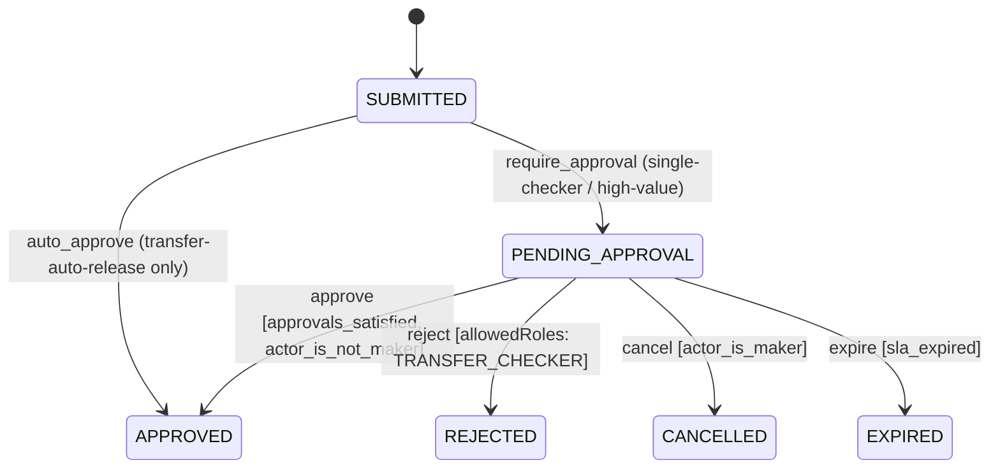
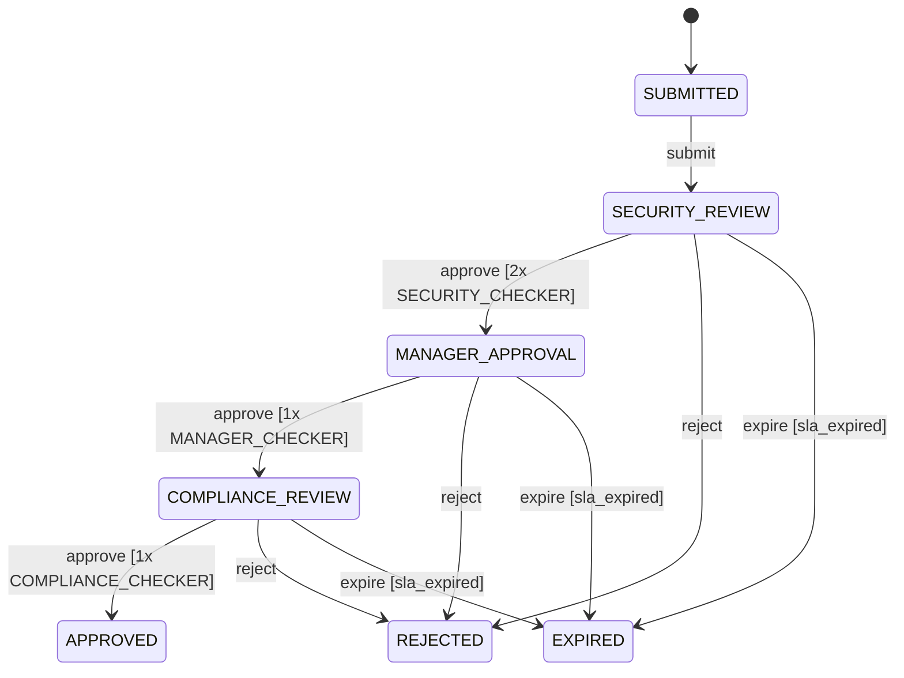
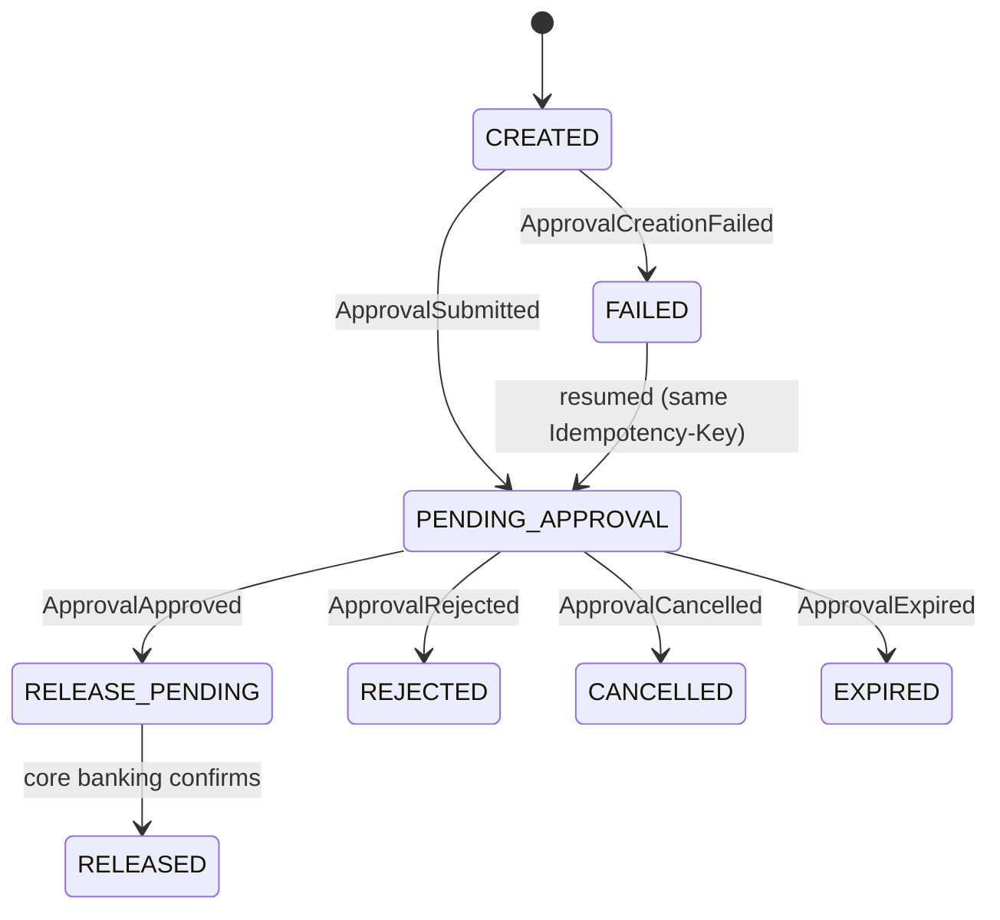

# Transfer Approval System — Design Brief

Vision Bank corporate transfers pass a maker-checker control before release. Two independently deployable services split ownership: **Banking Service** owns what a transfer *means* (submission, validation, release); **Approval Engine** owns how an approval *progresses* (workflow, policy, quorum, audit, expiry). Neither writes the other's database — they coordinate over the network. The mechanism is domain-independent, proven by a second workflow, `privileged-access`, running on the same engine unmodified.

---

# HLD

## 1. Context & Deployment

One `docker-compose` command runs one Postgres (two DBs), one Redis, and both services. Solid = sync REST; dashed = async Redis Streams.


## 2. Service Responsibilities & Data Ownership

| Concern | Owner |
|---|---|
| Transfer semantics, validation, duplicate detection | Banking |
| Policy rules, resolution, snapshot | Approval Engine |
| Workflow state, guards, quorum, concurrency | Approval Engine |
| Audit, SLA expiry, outbox | Approval Engine |
| Release orchestration + idempotency | Banking |
| Balance/limit authority, money movement | Core Banking (stub) |

Policy is data, not code: an editable `policy_rule` table, resolved in-process on the creation command. Required-approvals and eligible role are attributes of the resolved workflow's `approve` transition — one source of truth.

## 3. Communication Pattern

| Flow | Pattern | If down |
|---|---|---|
| Client → Banking | REST sync | Fails fast, retryable |
| Banking ↔ Engine | Redis Streams, at-least-once (2 streams, 1 consumer group each) | Message persists; reclaimed via `XPENDING`/`XCLAIM` on crash |
| Banking → Core Banking | REST sync, idempotent by `transferId` | Holds at `RELEASE_PENDING`, retried |

Each hop uses the pattern its failure mode demands. Neither service's uptime gates the other's — at-least-once is safe only because every consumer is already idempotent (§4).

## 4. Non-Functional

**Idempotency.** `Idempotency-Key` on create; `(request_id, actor_id, state)` on decisions; `transferId` on release. This is what makes at-least-once redelivery safe with no second correctness mechanism.

**Consistency.** ACID *within* each service (state + audit + outbox in one transaction); **eventually consistent across the boundary** — no distributed transaction. Either service's downtime only delays the other, never breaks it.

**Partial failure.** A crash between deciding and delivering never loses the decision — only delays discovery. A reconciler on each side closes the gap.

## 5. Trade-offs

| Decision | Why | Revisit when |
|---|---|---|
| **Redis Streams**, not Kafka/SQS | Durable at-least-once + consumer groups + crash-recovery is all this needs; one container, single-region volume | Multi-region, event-sourcing, throughput past one node |
| **Postgres**, both services | One local ACID txn covers state+audit+outbox; `FOR UPDATE` + guarded `UPDATE` is enough | Single-writer becomes a bottleneck (not at this volume) |
| **Hybrid lock** (OCC + row-lock for tally) | Single-row transitions need no lock; counting votes is read-then-write, needs a stable read | — |
| **3 idempotency keys**, not one | Each matches its call's real retry identity | — |
| **No funds hold** pre-release | Second stateful Core-Banking contract beyond time budget — a named gap, not silently absent | First thing to build next; concurrent transfers can overspend |

## 6. Assumptions & Out of Scope

| In scope | Out of scope |
|---|---|
| Two services, Postgres, Redis Streams, docker-compose | Managed/clustered broker, real core banking, real auth |
| REST sync commands, outbox + stream async events | Multi-region, multi-currency, delegation |
| OCC + row-lock concurrency, audit, expiry | Tenant registry, BPMN/Temporal/Camunda |
| Idempotent submission/create/release | Funds hold/reservation (named gap, §5) |
| Editable policy, versioned workflows; live ≥ AED 100,000 tier | Dead-letter queue, real notification channel |

Core banking, notifications, and auth are stubbed. The console forwards trusted `X-Actor-Id`/`X-Actor-Role` headers, standing in for real auth.

---

# LLD

## 7. Approval State Machine (Engine)

`APPROVED` means the approval requirement is satisfied — not that money has moved. Common shape below; `transfer-auto-release` uses only the top edge, single/high-value only the bottom five.



`privileged-access:2` (≥ AED 100,000, the live top tier) replaces the single `PENDING_APPROVAL` with a three-stage chain — same engine, no special-casing. It has no `cancel` edge: a privileged-access request has no maker in the transfer sense to withdraw it.



Each stage is its own `PENDING_APPROVAL`-equivalent — Transfer's own lifecycle (§8) still only ever sees the generic `PENDING_APPROVAL`, with no visibility into which review stage the engine is on.

## 8. Transfer Lifecycle (Banking) & Correspondence

`CREATED` is the brief async gap before the creation command is consumed. `FAILED` is resumable via the same `Idempotency-Key`, not terminal. No `RELEASE_FAILED` — a transient core-banking failure retries in place.



The two machines are independent: Transfer only reacts to Engine events, never queries its state — a duplicate/out-of-order delivery is a logged no-op.

| Engine transition | Event | Transfer reacts |
|---|---|---|
| Lands on `PENDING_APPROVAL` | `ApprovalSubmitted` | `CREATED → PENDING_APPROVAL` |
| Lands on `APPROVED` (auto-release) | `ApprovalSubmitted`, then `ApprovalApproved` | → `PENDING_APPROVAL → RELEASE_PENDING → RELEASED` |
| `APPROVED` (quorum met) | `ApprovalApproved` | → `RELEASE_PENDING → RELEASED` |
| `REJECTED` / `CANCELLED` / `EXPIRED` | matching event | same state; maker notified (except cancel — self-caused) |
| Workflow never created | `ApprovalCreationFailed` | `CREATED → FAILED`; maker notified |

## 9. Workflows & Policy

Routing between tiers happens *before* the engine, by picking which workflow to instantiate — not a guard branching inside one. `requiredApprovals` is per-transition, so one workflow demands a different quorum at each stage.

| Workflow | Tier (AED) | `approve` requires |
|---|---|---|
| `transfer-auto-release:1` | < 5,000 | 0 (unconditional) |
| `transfer-single-checker:1` | 5,000 – 49,999.99 | 1 × `TRANSFER_CHECKER` |
| `transfer-high-value:1` | 50,000 – 99,999.99 | 2 × `TRANSFER_CHECKER` |
| `privileged-access:2` | ≥ 100,000 | 2×SECURITY → 1×MANAGER → 1×COMPLIANCE |

`policy_rule` is editable via `PUT /policy-rules`, no redeploy. The resolved workflow freezes into `policy_snapshot` at creation — an in-flight request keeps its version even if the rule later changes.

## 10. API &amp; Data Model

`POST /transfers` and `POST /approvals` take `Idempotency-Key`; decisions key on `(request_id, actor_id, state)`; release keys on `transferId`.

| Error `code` | HTTP | When |
|---|---|---|
| `CONCURRENT_STATE_CHANGE` | 409 | Guarded UPDATE lost the race |
| `INVALID_STATE_TRANSITION` | 409 | Never legal from current state |
| `IDEMPOTENCY_CONFLICT` | 409 | Same key, different body |
| `FORBIDDEN_ACTION` | 403 | Role ineligible / maker self-approve |
| `NOT_FOUND` family | 404 | Unknown request / workflow / rule |

```
-- core tables, both DBs
approval_request(id, state, version, maker_id, workflow_id/version, policy_snapshot, expires_at)
approval_decision(request_id, actor_id, state, decision, UNIQUE(request_id, actor_id, state))
audit_log · idempotency_key · outbox · policy_rule

transfer(id, state, approval_request_id, idempotency_key UNIQUE, expires_at)
```

## 11. Representative Flows *(status path, not full sequence)*

| Scenario | Status path |
|---|---|
| Auto-release (0 approvals) | `CREATED → PENDING_APPROVAL → RELEASE_PENDING → RELEASED`, no human step — the Engine emits both submit and approve events from one creation |
| Dual control (required=2) | Checker A's vote records but quorum unmet, stays `PENDING_APPROVAL`; Checker B's vote satisfies quorum → `APPROVED → RELEASE_PENDING → RELEASED` |
| Concurrent race (required=1) | Two checkers approve at once; the guarded version-check UPDATE lets exactly one win → `APPROVED`; the loser gets `409 CONCURRENT_STATE_CHANGE` |
| Expiry vs. approve | Sweeper and checker race the identical guarded UPDATE with no lock between them; whichever commits first wins — `EXPIRED` or `APPROVED`, the other a no-op/409 |

## 12. Concurrency

Every competing transition resolves through one guarded conditional `UPDATE` — `rows=1` wins, `rows=0` rolls back and re-reads state to classify the `409`. Quorum counting additionally takes a `SELECT … FOR UPDATE` row lock: counting committed votes is an aggregate read the guarded UPDATE alone can't protect. A short `PESSIMISTIC_WRITE` beat an atomic counter (denormalizes a second source of truth) and `SERIALIZABLE`+retry (full abort/redo for shallow contention). The same UPDATE covers cancel-vs-approve for free.

**Evidence:** `ApprovalConcurrencyTest` (two-checkers, cancel-vs-approve), `ExpiryVersusApproveConcurrencyTest`.

## What I'd do with more time

| Priority | Item |
|---|---|
| High | **Funds hold/reservation** — closes the named concurrent-overspend gap |
| High | **Real authentication** — OIDC/JWT in place of trusted headers |
| Medium | **Reporting UI** over the audit trail — SLA breaches, per-checker history |
| Medium | **Workflow authoring UI** — edit stages/roles/quorum as data |
| Low | Finer-grained locking than `PESSIMISTIC_WRITE` at scale; dead-letter queue; physically separate the two Postgres DBs |
