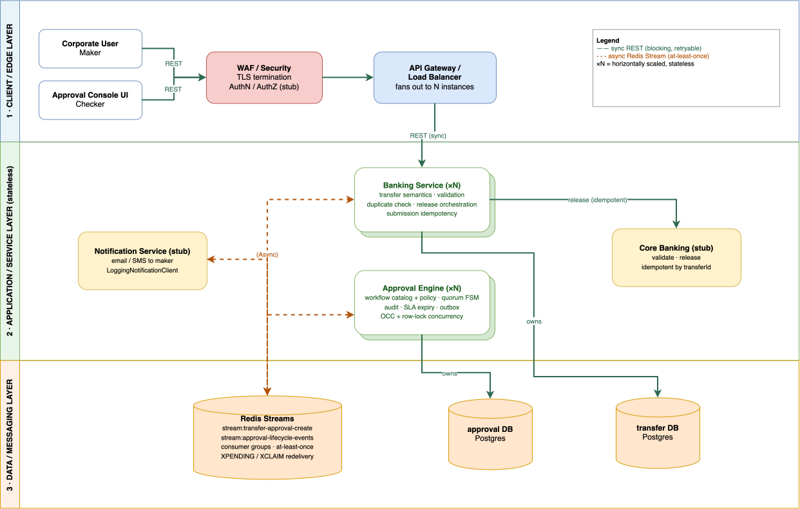

# Transfer Approval System — Architecture & Design (4-Page Brief)

One combined document, not a shortened HLD followed by a shortened LLD: the goal is that a reviewer
understands the whole system, the decisions that matter, and the mechanisms that make it correct — in
four pages. Full detail lives in `hld.md` / `lld.md`; this is deliberately not a summary of either, it's
the ~10% of both that actually proves the design works.

---

## 1. Context & Ownership — HLD

**Core architecture principle.** Vision Bank corporate customers submit domestic transfers that must
clear maker-checker approval before release. The system separates authorization from execution:
**Banking Service** owns the transfer lifecycle — submission, validation, release orchestration.
**Approval Engine** owns the approval lifecycle — policy selection, workflow execution, quorum, audit,
expiry. **Approval ≠ execution**: the engine only ever decides whether a transfer *may* proceed; Banking
and Core Banking are the only things that ever move money. The engine is generic — workflow stages,
transitions, roles, and quorum are configuration, not transfer-specific code — proven by a second,
unrelated approval domain (`privileged-access`) reusing it with zero engine changes.

**Context**




Banking and Approval Engine communicate only through Redis Streams; neither writes the other's
database. Core Banking is a stubbed interface, not a third deployable service.

**Ownership**

| Concern | Owner |
|---|---|
| Transfer semantics, validation | Banking |
| Policy + workflow + quorum | Approval Engine |
| Approval state, decisions, audit | Approval Engine |
| Release orchestration | Banking |
| Balance / money movement | Core Banking (stub) |

---

## 2. Policy, Workflow & Lifecycle — HLD + LLD

**Policy → Workflow → Transition** — the one abstraction everything else builds on:

```text
Policy       "What workflow applies?"        an amount range -> workflowId:version
   │
   ▼
Workflow     "How does approval progress?"   states + transitions, one YAML per tier
   │
   ▼
Transition   "Who may act, how many,         allowedRoles · requiredApprovals · guards
              what else must be true?"
```

Real tiers, seeded in `policy_rule` and editable at runtime, no redeploy:

```text
< AED 5,000            -> transfer-auto-release:1    (0 approvals)
AED 5,000 – 49,999.99   -> transfer-single-checker:1  (1 × TRANSFER_CHECKER)
AED 50,000 – 99,999.99  -> transfer-high-value:1      (2 × TRANSFER_CHECKER)
>= AED 100,000          -> privileged-access:2        (2×SECURITY, 1×MANAGER, 1×COMPLIANCE)
```

**One real multi-stage workflow** (the live top tier, `privileged-access:2`):

```text
SUBMITTED
    │
    ▼
SECURITY_REVIEW ──approve [2×SECURITY_CHECKER]──▶ MANAGER_APPROVAL
                                                        │
                     ┌──────────────────────────────────┘
                     ▼
              approve [1×MANAGER_CHECKER]
                     │
                     ▼
             COMPLIANCE_REVIEW ──approve [1×COMPLIANCE_CHECKER]──▶ APPROVED
```

Each transition owns its own eligible role and quorum; a request has no `cancel` path here (unlike the
transfer-shaped workflows) since a privileged-access request has no maker in the transfer sense to
withdraw it.

**Two independent lifecycles** — `APPROVED` and `RELEASED` are not the same fact:

```text
 APPROVAL ENGINE                          BANKING
 SUBMITTED                                CREATED
    │                                        │
    ▼                                        ▼
 (workflow's own review stages)          PENDING_APPROVAL
    │                                        │
    ▼                                        │  ApprovalApproved
 APPROVED  ──────────────────────────────────▶
                                              ▼
                                        RELEASE_PENDING ──▶ RELEASED
```

`APPROVED` means the approval requirement is satisfied; `RELEASED` means funds actually moved. Neither
service reads the other's state — only the event on the arrow crosses.

**End-to-end happy path:** maker submits → Banking persists `CREATED`, returns immediately → Banking
publishes to Redis → Engine resolves policy, snapshots the workflow, creates the request → checkers
complete the required stages → Engine reaches `APPROVED`, publishes the event → Banking moves to
`RELEASE_PENDING` → Core Banking confirms → `RELEASED`.

---

## 3. Correctness & Concurrency — LLD

**Command execution** (every approve/reject/cancel runs this shape):

```text
approve()
  → lock request row
  → find transition from current state
  → validate allowedRoles + guards
  → check duplicate decision (idempotent replay)
  → insert approval decision
  → count approvals for current stage
  → quorum met? guarded state UPDATE : stay put, audit the vote
  → audit + outbox
```

State changes use an optimistic, version-checked update; quorum counting takes a short row lock
separately, because tallying committed votes is an aggregate read the version check alone can't
protect — without it, two checkers can each see only their own uncommitted vote and a satisfied
request strands unmet.

**Concurrency**

| Race | Mechanism | Result |
|---|---|---|
| Checker A vs. Checker B | row lock (counting) + guarded update (transition) | exactly one transitions |
| Maker cancel vs. checker approve | version-checked update, no special-casing | whichever commits first wins |
| Approve vs. SLA expiry | version-checked update, no lock on the sweeper | whichever commits first wins |

```sql
UPDATE approval_request SET state = :new_state, version = version + 1
 WHERE request_id = :id AND state = :expected_state AND version = :expected_version;
```

`rows=1` wins; `rows=0` is classified as a lost race or an illegal transition, and the whole
transaction — decision, audit, outbox — rolls back. Never a partial write.

**Idempotency** — every write keyed to its own real retry identity:

```text
Transfer submission   -> Idempotency-Key
Approval creation      -> Idempotency-Key
Approval decision      -> (requestId, actorId, state)
Release                -> transferId
```

Redis delivery is at-least-once; idempotency is what makes redelivery safe without a second
correctness mechanism.

**Workflow versioning** — safe by construction, not by discipline:

```text
Workflow Registry              Request creation
  privileged-access:1              │
  privileged-access:2   ────▶  policy_snapshot (jsonb)
  transfer-high-value:1            │  embeds the FULL resolved
                                    ▼  WorkflowDefinition, frozen
                              never re-resolved
```

A request stores its own resolved workflow definition at creation; a later version change (v1 → v2:
`SECURITY_REVIEW`'s quorum going from 1 to 2) cannot alter a request already in flight.

---

## 4. Messaging, Failure & Trade-offs — HLD + LLD

**Async boundary**

```text
Banking ──XADD──▶ stream:transfer-approval-create ──▶ Approval Engine

Approval Engine ──(outbox → XADD)──▶ stream:approval-lifecycle-events ──▶ Banking
```

Both streams are at-least-once. A consumer acknowledges only after its local transaction commits, and
unacknowledged messages are reclaimed and retried — publishing never happens inside the transaction
that caused it, and acknowledging never happens outside the transaction that processed it.

**Failure semantics**

| Failure | Behavior |
|---|---|
| Approval Engine unavailable | Transfer stays `CREATED`; creation command retries against Redis until Engine returns |
| Banking unavailable after approval | Engine still transitions and audits; only event delivery waits |
| Duplicate event delivery | Consumer dedupes by event id — no-op replay |
| Core Banking unavailable | Transfer stays `RELEASE_PENDING`, retried with the same id |
| Concurrent approve/cancel/expire | Exactly one transition wins (§3) |

**Trade-offs**

- **No funds hold.** Balance is checked once at submission, not reserved through release — two large
  concurrent transfers against the same account can each pass validation and later both release,
  overspending the real balance. The fix is a hold/free protocol with Core Banking, named as the one
  gap deliberately left, not silently absent.
- **No real IAM or notifications.** Actor identity is a trusted header, not a verified token;
  maker notifications are logged, not sent — both are stubbed interfaces, a one-class swap each.
- **No managed broker or production HA.** Redis Streams over Kafka/SQS is right-sized for this volume;
  a gateway, load balancing, and horizontal scaling are production concerns this exercise omits, since
  none of them change the ownership or consistency model being demonstrated.

**In / out of scope**

| In scope | Out of scope |
|---|---|
| Two services, Postgres, Redis Streams | Managed broker, real core banking, real auth |
| Idempotent submit/create/release | Multi-region, multi-currency, delegation |
| OCC + row-lock concurrency, audit, expiry | Funds hold/reservation (named gap above) |
| Editable policy, versioned workflows, second live domain | Tenant registry, workflow designer UI |
