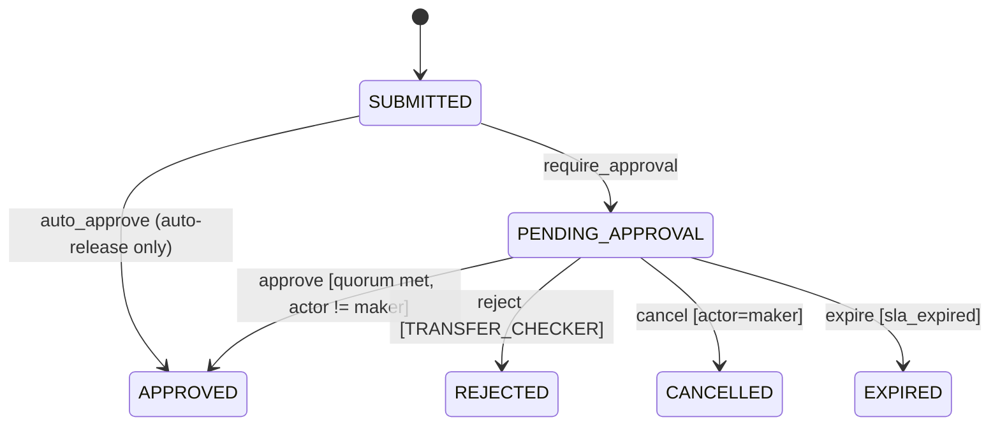
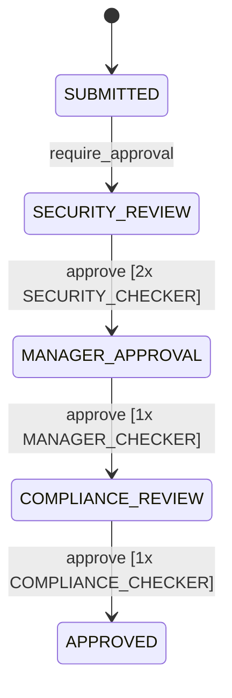
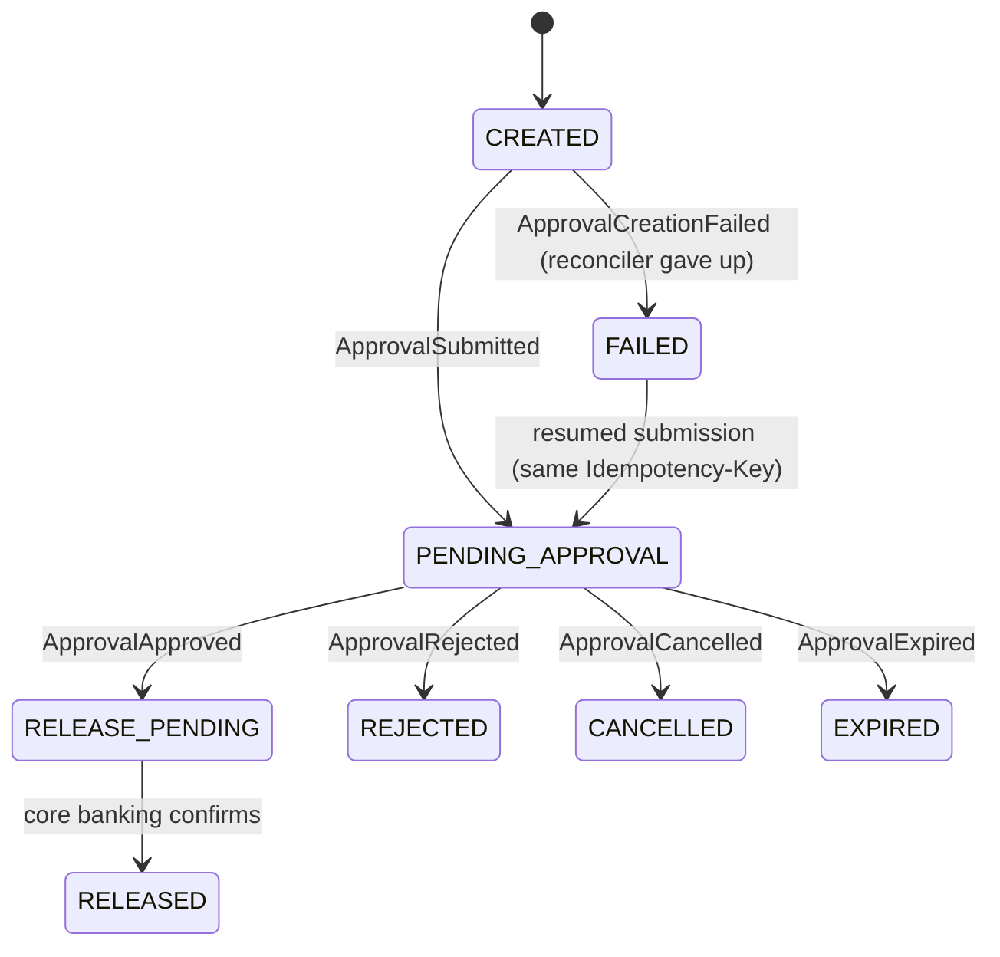
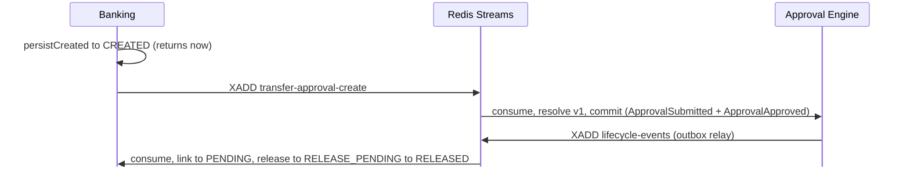
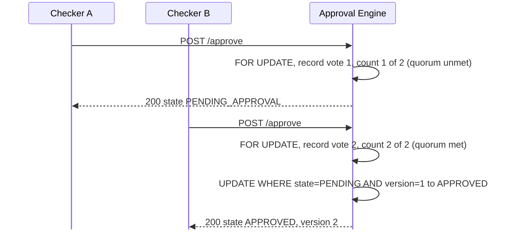
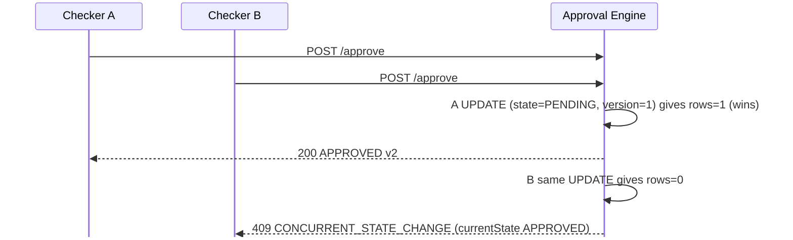
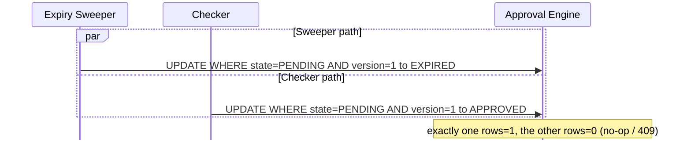

# Transfer Approval System — HLD + LLD

Vision Bank corporate fund transfers pass a maker-checker control before release. Two independently deployable services split on a hard ownership line: **Banking Service** owns what a transfer *means* (submission, validation, release); **Approval Engine** owns how an approval *progresses* (workflow, policy, state, quorum, audit, expiry). Neither writes the other's database; they coordinate over the network. The approval mechanism is domain-independent — proven by a second workflow (`privileged-access`) running on the same engine with zero code change.

---

# HLD

## 1. Context & Deployment

One `docker-compose` command runs: one Postgres (two DBs), one Redis, both services. Solid = sync REST; dashed = async Redis Streams. Dashed-border nodes are production topology, not in the local build.


## 2. Service Responsibilities & Data Ownership

| Concern | Owner |
|---|---|
| Transfer semantics, validation, duplicate detection | Banking |
| Policy rules (amount → workflow) + resolution + snapshot | Approval Engine |
| Workflow state, guards, quorum, concurrency | Approval Engine |
| Audit, SLA expiry, outbox | Approval Engine |
| Release orchestration + release idempotency | Banking |
| Balance/limit authority, money movement | Core Banking (stub) |

Policy is data, not code: an editable `policy_rule` table in the Engine, resolved in-process when it consumes the creation command. Required-approvals and eligible role are attributes of the resolved workflow's `approve` transition — one source of truth.

## 3. Communication Pattern

Each hop uses the pattern its failure mode demands, not one style uniformly.

| Flow | Pattern | If counterparty down |
|---|---|---|
| Client → Banking | REST sync | Fails fast, retryable — a human is waiting |
| Banking → Engine (submission) | Redis Stream, at-least-once | `POST /transfers` never blocks; command persists in Redis until Engine returns |
| Engine → Banking (lifecycle) | Redis Stream, at-least-once | Event persists; reclaimed via XPENDING/XCLAIM if a consumer crashes mid-handling |
| Banking → Core Banking (release) | REST sync, idempotent by `transferId` | Holds at `RELEASE_PENDING`, retried — retry can't double-release |

Neither service's uptime gates the other's. At-least-once is safe because every consumer was already idempotent (§4).

## 4. Non-Functional

**Idempotency.** `POST /transfers` and `POST /approvals` take an `Idempotency-Key`; same key + same body replays the result, same key + different body → `409 IDEMPOTENCY_CONFLICT`. Decisions (approve/reject/cancel) are idempotent per `(request_id, actor_id, state)` — a checker's intent is the natural key. Release is idempotent on `transferId`. This is what makes at-least-once redelivery safe with no second correctness mechanism.

**Consistency.** Strong/transactional *within* each service (one local ACID transaction per state change: state + audit + outbox commit atomically); **eventually consistent across the boundary** — no distributed transaction. Resilience is symmetric: Engine down doesn't break `submit()`; Banking down doesn't break approve/reject/cancel — only event *delivery* waits.

**Partial failure.** A crash between "decision recorded" and "event delivered" never loses the decision — it only delays the counterparty finding out; the reconciler on each side closes the gap.

## 5. Trade-offs (Decision · Why · Gave up · Revisit)

| Decision | Why | Gave up | Revisit when |
|---|---|---|---|
| **Redis Streams**, not Kafka/SQS | Needs exactly durable at-least-once + consumer groups + crash-recovery (XPENDING/XCLAIM); single-region volume. One running container. | Long retention, replay-from-genesis, partitioned fan-out | Multi-region, event-sourcing, throughput past one node — outbox already decouples persist/publish, so migration is contained |
| **Postgres** both services | Correctness rests on one local ACID txn (state+audit+outbox); needs `FOR UPDATE` + guarded `UPDATE`; JSONB for opaque payload | Horizontal write-scale, schema-free flexibility (neither needed) | Single-writer becomes a bottleneck (not at this volume) |
| **Hybrid lock**: OCC default, row-lock only for quorum tally | Single-row transitions need no lock; loser rolls back as clean 409. Counting votes is read-then-write → needs a stable read | Uniformity (two mechanisms) | — |
| **3 idempotency keys**, not one global | Header for create, `(request,actor,state)` for intent-based decisions, `transferId` for release — each matches its call's real retry identity | Slight extra surface | — |
| **No funds hold** between validate and release | Second stateful Core-Banking contract beyond time budget | Two concurrent transfers can each pass validation, both release, overspend | Named gap — first thing to build next |

## 6. Assumptions & Out of Scope

| In scope | Out of scope |
|---|---|
| Two services, Postgres, Redis Streams, docker-compose | Managed/clustered broker, real core banking, real auth |
| REST sync commands, outbox + stream async events | Multi-region, multi-currency, delegation |
| OCC + row-lock concurrency, audit, expiry | Tenant registry, BPMN/Temporal/Camunda |
| Idempotent submission/create/release | Funds hold/reservation (named gap, §5) |
| Editable policy rules, versioned workflows; second domain (`privileged-access`), live ≥ AED 100,000 tier | Dead-letter queue, real notification channel |

Core banking, notifications, and auth are stubbed per the assignment. The console forwards trusted `X-Actor-Id`/`X-Actor-Role` headers, standing in for real auth.

---

# LLD

## 7. Approval State Machine (Engine)

`APPROVED` means the approval requirement is satisfied — not that money has moved. Below is the common shape; `transfer-auto-release` has only the top edge, single/high-value only the bottom five.



`privileged-access:2` (≥ AED 100,000, the live top tier) replaces the single `PENDING_APPROVAL` with a three-stage chain — same engine, no special-casing (reject/cancel/expire apply from each stage, omitted for readability):



## 8. Transfer Lifecycle (Banking)

`CREATED` is the brief async gap between `POST /transfers` returning and its creation command being consumed (`approvalRequestId` is `null` throughout; `GET` reports it honestly). `FAILED` is generic-but-resumable: today its one trigger is `ApprovalCreationFailed`; a second failure mode should split by cause rather than add a reason code. No `RELEASE_FAILED` — a transient core-banking failure retries in place.



## 9. Approval ↔ Transfer Correspondence

Two independent machines; the Engine never queries Transfer's state, Transfer only consumes events. Every reaction is conditional on Transfer still being in the expected state — a duplicate/out-of-order delivery is a logged no-op.

| Engine transition | Event(s) | Transfer reacts |
|---|---|---|
| Created → `PENDING_APPROVAL` | `ApprovalSubmitted` | `CREATED` → `PENDING_APPROVAL` (links `approvalRequestId`) |
| Created → `APPROVED` (auto-release) | `ApprovalSubmitted`, then `ApprovalApproved` | `CREATED` → `PENDING_APPROVAL` → `RELEASE_PENDING` → `RELEASED` |
| `PENDING_APPROVAL` → `APPROVED` (quorum met) | `ApprovalApproved` | → `RELEASE_PENDING` → `RELEASED` |
| → `REJECTED` | `ApprovalRejected` | → `REJECTED`; maker notified |
| → `CANCELLED` | `ApprovalCancelled` | → `CANCELLED` (no notify — maker caused it) |
| → `EXPIRED` (sweeper) | `ApprovalExpired` | → `EXPIRED`; maker notified |
| Workflow never created | `ApprovalCreationFailed` | `CREATED` → `FAILED`; maker notified |

`ApprovalSubmitted` is always emitted on creation, so Transfer always sees `CREATED → PENDING_APPROVAL` before `RELEASE_PENDING` — even on auto-release, where the Engine itself never visits `PENDING_APPROVAL`.

## 10. Workflows & Policy

Routing between tiers happens *before* the engine, by picking which workflow to instantiate — not by a guard branching inside one workflow. `requiredApprovals` is per-transition, so one workflow can demand a different quorum at each stage.

| Workflow (`id:version`) | Tier (AED) | `approve` requires |
|---|---|---|
| `transfer-auto-release:1` | < 5,000 | 0 (unconditional) |
| `transfer-single-checker:1` | 5,000 – 49,999.99 | 1 × `TRANSFER_CHECKER` |
| `transfer-high-value:1` | 50,000 – 99,999.99 | 2 × `TRANSFER_CHECKER` |
| `privileged-access:2` | ≥ 100,000 | 2 × `SECURITY`, then 1 × `MANAGER`, then 1 × `COMPLIANCE` |

`policy_rule(min, max, workflow_id, workflow_version)` is editable via `PUT /policy-rules`, no redeploy. The resolved workflow is frozen into `policy_snapshot` at creation and never re-resolved, so an in-flight request keeps its version even if the rule changes.

## 11. API Contracts

**`POST /transfers`** (Banking; `Idempotency-Key`) — creates + submits; submission is async, so the response only reflects row creation.
```json
// → { "makerId":"maker-1","fromAccount":"ACC-1","toAccount":"ACC-2","amountMinorUnits":500000,"currency":"AED" }
// ← 200 { "transferId":"abc123","state":"CREATED" }
```
**`POST /approvals`** (Engine; `Idempotency-Key`) — caller names the resolved workflow.
```json
// → { "requestId":"abc123","workflowId":"transfer-single-checker","workflowVersion":1,"payloadJson":"...","expiresAt":"2026-08-26T10:00:00Z" }
// ← 200 { "requestId":"abc123","state":"PENDING_APPROVAL","version":1 }
```
**`POST /approvals/{id}/approve`** (idempotent per `(request_id, actor_id, state)`) — `reject`/`cancel` share the shape.
```json
// → { "actorId":"checker-1","actorRole":"TRANSFER_CHECKER" }
// ← 200 { "requestId":"abc123","state":"APPROVED","version":2 }
```

| Error `code` | HTTP | When |
|---|---|---|
| `CONCURRENT_STATE_CHANGE` | 409 | Guarded UPDATE lost the race; action was legal, someone won first |
| `INVALID_STATE_TRANSITION` | 409 | Action never legal from any state reaching current |
| `IDEMPOTENCY_CONFLICT` | 409 | Same key/`requestId` replayed with a different body |
| `FORBIDDEN_ACTION` | 403 | Role not eligible (or maker self-approving) |
| `NOT_FOUND` / `WORKFLOW_NOT_FOUND` / `POLICY_RULE_NOT_FOUND` | 404 | Unknown request / workflow / no rule covers amount |

## 12. Data Model

```
-- approval DB
approval_request(request_id PK, request_type, state, version, maker_id,
                 workflow_id, workflow_version, policy_snapshot jsonb, payload jsonb,
                 created_at, expires_at)
approval_decision(decision_id PK, request_id, actor_id, actor_role, state, decision,
                  created_at, UNIQUE(request_id, actor_id, state))
audit_log(audit_id PK, request_id, actor_id, actor_role, action,
          previous_state, new_state, created_at, metadata)
idempotency_key(idem_key PK, command_type, request_id, request_hash, result jsonb, created_at)
outbox(event_id PK, request_id, event_type, event_version, payload jsonb,
       created_at, published_at, claimed_at)
policy_rule(id PK, min_amount_minor_units, max_amount_minor_units, workflow_id, workflow_version)

-- transfer DB
transfer(transfer_id PK, maker_id, from_account, to_account, amount_minor_units, currency,
         state, approval_request_id, idempotency_key UNIQUE, expires_at, created_at)
processed_event(event_id PK, processed_at)
```

## 13. Sequence Diagrams

**(a) Auto-release (0 approvals)**


**(b) Multi-approver — dual control accumulates (`required=2`)**


**(b′) Concurrent-approve race (`required=1`, exactly one wins)**


**(c) Expiry vs approve (optimistic, no lock on sweeper)**


## 14. Concurrency / Race Handling

Every competing transition resolves through one guarded conditional UPDATE:

```sql
UPDATE approval_request SET state = :new_state, version = version + 1
 WHERE request_id = :id AND state = :expected_state AND version = :expected_version;
-- rows=1 → won ; rows=0 → lost race or illegal transition (whole txn rolls back)
```

On `rows=0` the whole transaction rolls back (decision, audit, outbox); re-reading state classifies it as `409 CONCURRENT_STATE_CHANGE` (legal predecessor) or `409 INVALID_STATE_TRANSITION` (never reachable). The same UPDATE covers cancel-vs-approve for free — whichever commits first wins.

Quorum counting additionally takes `SELECT … FOR UPDATE`: counting committed votes is an aggregate read the guarded UPDATE alone can't protect — without it, two checkers each see only their own uncommitted vote and a satisfied request strands in `PENDING_APPROVAL`. Alternatives rejected: atomic counter (denormalizes a second source of truth), `SERIALIZABLE`+retry (full abort/redo for shallow contention), split-transaction (turns a sync decision eventually-consistent for no gain). A short one-row `PESSIMISTIC_WRITE` is the simplest correct option. A server-side `UNIQUE(request_id, actor_id, state)` blocks a double decision from one actor.

Evidence: `ApprovalConcurrencyTest` (two-checkers, cancel-vs-approve), `ExpiryVersusApproveConcurrencyTest`.

## What I'd do with more time

- **Funds hold/reservation** between validate and release — the one named gap; a `hold()`/`free()` contract with Core Banking closes the concurrent-overspend window.
- **Real authentication** — replace the trusted `X-Actor-Id`/`X-Actor-Role` headers with proper token-based authN/Z (OIDC/JWT at the gateway, role claims verified server-side), so maker/checker identity and eligibility aren't caller-asserted.
- **Reporting UI** — a console view over the audit trail: transfers by state/tier/maker, SLA breaches, per-checker decision history — turning `audit_log` into an operational and compliance surface.
- **Workflow create/edit UI** — a screen to author and version workflow definitions (stages, transitions, `allowedRoles`, `requiredApprovals`) and edit `policy_rule` ranges, so tiers change without hand-editing YAML — the engine already treats these as data.
- **Better concurrency than `PESSIMISTIC_WRITE`** — the row lock is correct but coarse; under real load, evaluate a monotonic per-stage approval counter with a conditional guarded write, or advisory locks scoped to `request_id`, to shrink the held critical section.
- **Rate limiting** — per-maker and per-actor limits at the gateway (token-bucket) to protect against runaway retries and abuse, distinct from idempotency (which handles correctness, not volume).
- **Priority queue for high-value transfers** — a separate high-priority consumer group / stream so `high-value` and `privileged-access` approvals aren't stuck behind a backlog of low-tier auto-releases; time-sensitive money moves first.
- **Dead-letter queue** for messages past max delivery attempts, instead of logging loudly.
- **Physically separate the two Postgres DBs** so "neither service writes the other's DB" is enforced by infra, not convention.
